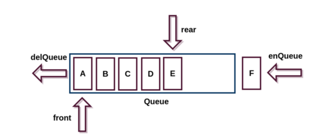
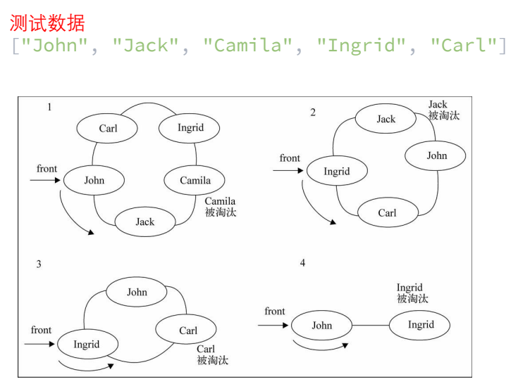
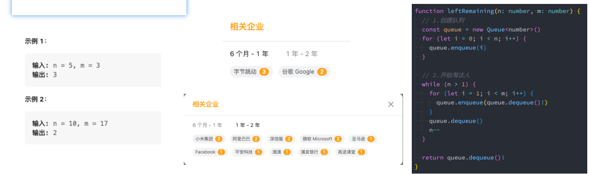

## 1、认识队列以及特性

### 1.1、认识队列

受限的线性结构:

- 我们已经学习了一种受限的线性结构:栈结构。
- 并且已经知道这种受限的数据结构对于解决某些特定问题,会有特别的效果。
- 下面,我们再来学习另外一个受限的数据结构: 队列。

队列(Queue),它是一种受限的线性表, 先进先出(FIFO First In First Out) 

- 受限之处在于它只允许在队列的前端 (front)进行删除操作;
- 而在队列的后端 (rear)进行插入操作;



### 1.2、生活中的队列

生活中类似的队列结构

- 生活中类似队列的场景就是非常多了
- 比如在电影院,商场,甚至是厕所排队。
- 优先排队的人,优先处理。 (买票,结账, WC)


### 1.3、开发中队列的应用

打印队列:

- 有五份文档需要打印,这些文档会按照次序放入到打印队列中。
- 打印机会依次从队列中取出文档, 优先放入的文档, 优先被取出,并且对该文档进行打印。
- 以此类推,直到队列中不再有新的文档。

线程队列:

- 在开发中,为了让任务可以并行处理,通常会开启多个线程。
- 但是,我们不能让大量的线程同时运行处理任务。 (占用过多的资源)
- 这个时候,如果有需要开启线程处理任务的情况,我们就会使用线程队列。
- 线程队列会依照次序来启动线程,并且处理对应的任务。

当然队列还有很多其他应用,我们后续的很多算法中也会用到队列(比如二叉树的层序遍历)。

队列如何实现呢?

- 我们一起来研究一下队列的实现。

## 2、实现队列结构封装

队列的实现和栈一样,有两种方案: 

- 基于数组实现
- 基于链表实现

我们需要创建自己的类,来表示一个队列

```ts
class ArrayQueue<T> {
  // 内部是通过数组(链表)保存
  private data: T[] = [];
}
```

代码解析:

- 我们创建了一个ArrayQueue的类,用户创建队列的类,并且是一个泛型类。
- 在类中,定义了一个变量,这个变量可以用于保存当前队列对象中所有的元素。 (和创建栈非常相似) 
- 这个变量是一个数组类型。
  - 我们之后在队列中添加元素或者删除元素,都是在这个数组中完成的。
- 队列和栈一样,有一些相关的操作方法,通常无论是什么语言,操作都是比较类似的。

## 3、队列结构常见方法

队列有哪些常见的操作呢?

- enqueue(element) :向队列尾部添加一个(或多个)新的项。
- dequeue():移除队列的第一(即排在队列最前面的)项,并返回被移除的元素。
- front/peek():返回队列中第一个元素——最先被添加,也将是最先被移除的元素。队列不做任何变动(不移除元素,只返回元素信息——与Stack类的peek方法非常类似)。
- isEmpty():如果队列中不包含任何元素,返回true,否则返回false。
- size():返回队列包含的元素个数,与数组的length属性类似。

现在,我们来实现这些方法。

- 其实很栈中方法的实现非常相似,因为我们的队列也是基于数组的

```ts
import IQueue from "./IQueue";

class ArrayQueue<T> implements IQueue<T> {
  // 内部是通过数组(链表)保存
  private data: T[] = [];

  enqueue(element: T): void {
    this.data.push(element);
  }

  dequeue(): T | undefined {
    return this.data.shift();
  }

  peek(): T | undefined {
    return this.data[0];
  }

  isEmpty(): boolean {
    return this.data.length === 0;
  }

  size(): number {
    return this.data.length;
  }
}

export default ArrayQueue;
```

```ts
interface IQueue<T> {
  // 入队方法
  enqueue(element: T): void;
  // 出队方法
  dequeue(): T | undefined;
  // peek
  peek(): T | undefined;
  // 判断是否为空
  isEmpty(): boolean;
  // 元素的个数
  size(): number;
}

export default IQueue;
```

## 4、面试题–击鼓传花

击鼓传花是一个常见的面试算法题: 使用队列可以非常方便的实现最终的结果。

- 原游戏规则:
  - 班级中玩一个游戏,所有学生围成一圈,从某位同学手里开始向旁边的同学传一束花。
  - 这个时候某个人(比如班长),在击鼓,鼓声停下的一颗,花落在谁手里,谁就出来表演节目。
- 修改游戏规则:
  - 我们来修改一下这个游戏规则。
  - 几个朋友一起玩一个游戏,围成一圈,开始数数,数到某个数字的人自动淘汰。
  - 最后剩下的这个人会获得胜利,请问最后剩下的是原来在哪一个位置上的人? 
- 封装一个基于队列的函数:
  - 参数:所有参与人的姓名,基于的数字; 
  - 结果:最终剩下的一人的姓名;



```ts
import ArrayQueue from "./01_实现队列结构Queue";

function hotPotato(names: string[], num: number): number {
  if (names.length === 0) return -1;

  // 1.创建队列结构
  const queue = new ArrayQueue<string>();

  // 2.将所有的name入队操作
  for (const name of names) {
    queue.enqueue(name);
  }

  // 3.淘汰的规则
  while (queue.size() > 1) {
    // 1/2不淘汰
    for (let i = 1; i < num; i++) {
      const name = queue.dequeue();
      if (name) queue.enqueue(name);
    }
    // 3淘汰
    queue.dequeue();
  }

  // 4.取出最后一个人
  const leftName = queue.dequeue()!;
  const index = names.indexOf(leftName);

  return index;
}

const leftIndex = hotPotato(
  ["why", "james", "kobe", "curry", "abc", "cba", "nba", "mba"],
  4
);
console.log(leftIndex); // 5
```

## 5、面试题-约瑟夫环

阿桥问题(有时也称为约瑟夫斯置换),是一个出现在计算机科学和数学中的问题。在计算机编程的算法中,类似问题又称为约瑟夫环。

- 人们站在一个等待被处决的圈子里。
- 计数从圆圈中的指定点开始,并沿指定方向围绕圆圈进行。
- 在跳过指定数量的人之后,处刑下一个人。
- 对剩下的人重复该过程,从下一个人开始,朝同一方向跳过相同数量的人,直到只剩下一个人,并被释放。
- 在给定数量的情况下,站在第几个位置可以避免被处决?

这个问题是以弗拉维奥·约瑟夫命名的,他是1世纪的一名犹太历史学家。

- 他在自己的日记中写道,他和他的40个战友被罗马军队包围在洞中。
- 他们讨论是自杀还是被俘,最终决定自杀,并以抽签的方式决定谁杀掉谁

击鼓传花和约瑟夫环其实是同一类问题,这种问题还会有其他解法(后续讲解)同样的题目在Leetcode上也有: 

- https://leetcode.cn/problems/yuan-quan-zhong-zui-hou-sheng-xia-de-shu-zi-lcof/
- 0,1,···,n-1这n个数字排成一个圆圈,从数字0开始,每次从这个圆圈里删除第m个数字(删除后从下一个数字开始计数)。求出这个圆圈里剩下的最后一个数字。
- 例如,0、1、2、3、4这5个数字组成一个圆圈,从数字0开始每次删除第3个数字,则删除的前4个数字依次是2、0、4、1, 因此最后剩下的数字是3。



```ts
import ArrayQueue from "./01_实现队列结构Queue";

function lastRemaining(n: number, m: number) {
  // 1.创建队列
  const queue = new ArrayQueue<number>();

  // 2.将所有的数字加入到队列中
  for (let i = 0; i < n; i++) {
    queue.enqueue(i);
  }

  // 3.判断队列中是否还有数字
  while (queue.size() > 1) {
    for (let i = 1; i < m; i++) {
      queue.enqueue(queue.dequeue()!);
    }
    queue.dequeue();
  }

  return queue.dequeue()!;
}

console.log(lastRemaining(5, 3)); // 3
console.log(lastRemaining(10, 17)); // 2
```

```ts
function lastRemaining(n: number, m: number) {
  let position = 0;

  for (let i = 2; i <= n; i++) {
    position = (position + m) % i;
  }

  return position;
}

console.log(lastRemaining(5, 3)); // 3
console.log(lastRemaining(10, 17)); // 2
```


