## 1、认识树结构以及特性

### 1.1、什么是树?

真实的树:

- 相信每个人对现实生活中的树都会非常熟悉

我们来看一下树有什么特点?

- 树通常有一个根。连接着根的是树干。
- 树干到上面之后会进行分叉成树枝,树枝还会分叉成更小的树枝。
- 在树枝的最后是叶子。

树的抽象:

- 专家们对树的结构进行了抽象,发现树可以模拟生活中的很多场景。


### 1.2、模拟树结构

公司组织架构:

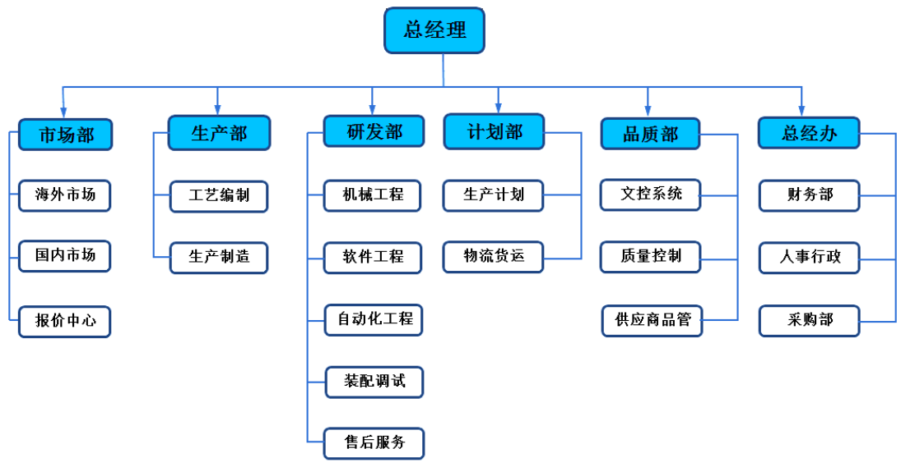

红楼梦家谱

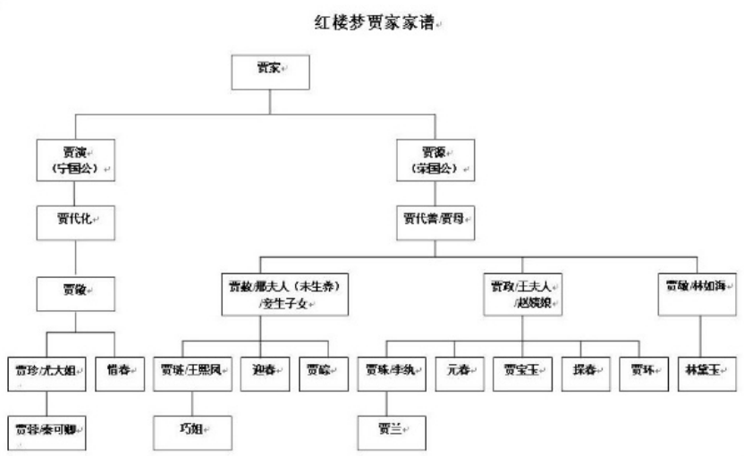

前端非常熟悉的 DOM Tree

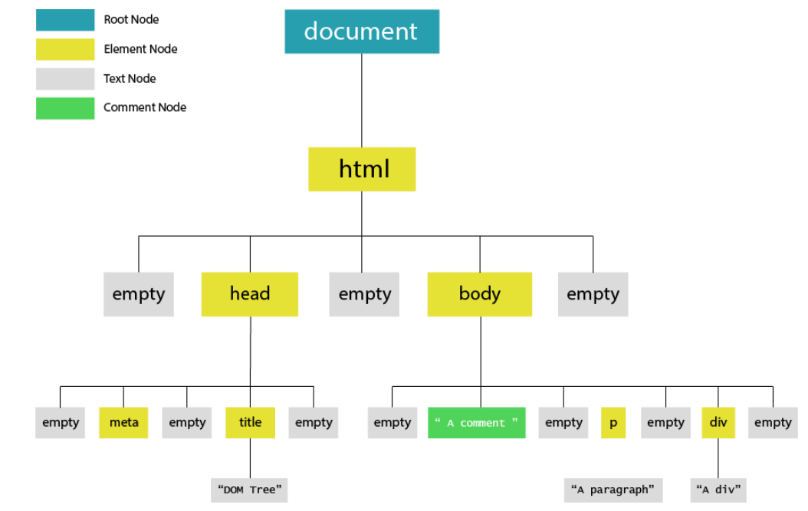

### 1.3、树结构的抽象

我们再将里面的数据移除,仅仅抽象出来结构,那么就是我们要学习的树结构

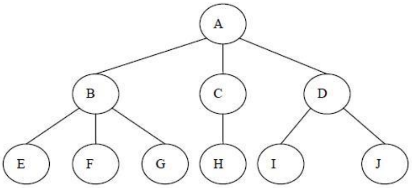

## 2、树结构的优点和术语

### 2.1、树的优点

我们之前已经学习了多种数据结构来保存数据,为什么要使用树结构来保存数据呢?

树结构和数组/链表/哈希表的对比有什么优点呢?

数组:

- 优点:
  - 数组的主要优点是根据下标值访问效率会很高。
  - 但是如果我们希望根据元素来查找对应的位置呢?
  - 比较好的方式是先对数组进行排序,再进行二分查找。
- 缺点:
  - 需要先对数组进行排序,生成有序数组,才能提高查找效率。
  - 另外数组在插入和删除数据时,需要有大量的位移操作(插入到首位或者中间位置的时候),效率很低。

链表:

- 优点:
  - 链表的插入和删除操作效率都很高。
- 缺点:
  - 查找效率很低,需要从头开始依次访问链表中的每个数据项,直到找到。
  - 而且即使插入和删除操作效率很高,但是如果要插入和删除中间位置的数据,还是需要重头先找到对应的数据。

哈希表:

- 优点:
  - 我们学过哈希表后,已经发现了哈希表的插入/查询/删除效率都是非常高的。
  - 但是哈希表也有很多缺点。
- 缺点:
  - 空间利用率不高,底层使用的是数组,并且某些单元是没有被利用的。
  - 哈希表中的元素是无序的,不能按照固定的顺序来遍历哈希表中的元素。
  - 不能快速的找出哈希表中的最大值或者最小值这些特殊的值。

树结构:

- 我们不能说树结构比其他结构都要好,因为每种数据结构都有自己特定的应用场景。
  - 但是树确实也综合了上面的数据结构的优点(当然优点不足于盖过其他数据结构,比如效率一般情况下没有哈希表高)。
  - 并且也弥补了上面数据结构的缺点。
- 而且为了模拟某些场景,我们使用树结构会更加方便。
  - 因为数结构的非线性的,可以表示一对多的关系
  - 比如文件的目录结构。

### 2.2、树的术语

在描述树的各个部分的时候有很多术语。为了让介绍的内容更容易理解,需要知道一些树的术语，不过大部分术语都与真实世界的树相关,或者和家庭关系相关(如父节点和子节点),所以它们比较容易理解。

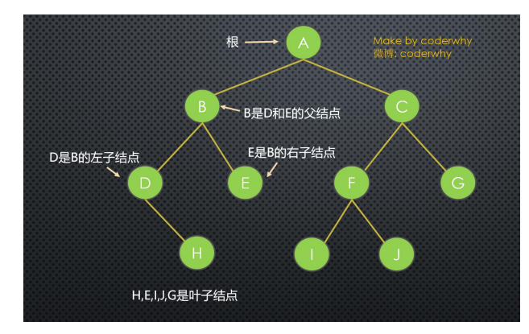

树(Tree):n(n≥0)个节点构成的有限集合。

- 当n=0时,称为空树;

对于任一棵非空树(n> 0),它具备以下性质: 

- 树中有一个称为“根(Root)”的特殊节点,用 r 表示;
- 其余节点可分为m(m>0)个互不相交的有限集T1,T2,..。,Tm,其中每个集合本身又是一棵树,称为原来树的“子树(SubTree)”

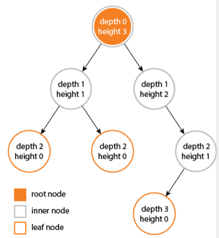

树的术语:

1. 节点的度(Degree):节点的子树个数。

2. 树的度 (Degree) :树的所有节点中最大的度数。

3. 叶节点(Leaf):度为0的节点。(也称为叶子节点)

4. 父节点(Parent):有子树的节点是其子树的根节点的父节点

5. 子节点(Child):若A节点是B节点的父节点,则称B节点是A节点的子节点;子节点也称孩子节点。

6. 兄弟节点(Sibling):具有同一父节点的各节点彼此是兄弟节点。

7. 路径和路径长度:从节点n1到nk的路径为一个节点序列n1 ,n2,... ,nk

   - ni是 n(i+1)的父节点

   - 路径所包含 边 的个数为路径的长度。

8. 节点的层次(Level):规定根节点在1层,其它任一节点的层数是其父节点的层数加1。

9. 树的深度(Depth):对于任意节点n, n的深度为从根到n的唯一路径长,根的深度为0。

10. 树的高度(Height):对于任意节点n,n的高度为从n到一片树叶的最长路径长,所有树叶的高度为0。

## 3、树结构常见表示方法

### 3.1、普通的表示方式

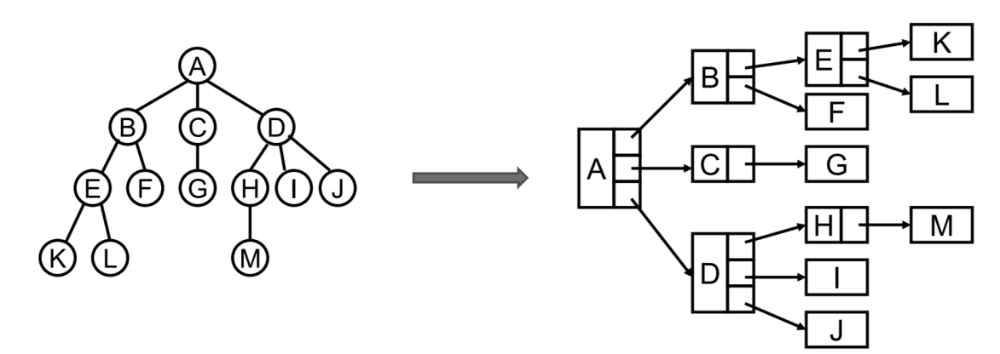

### 3.2、儿子-兄弟表示法

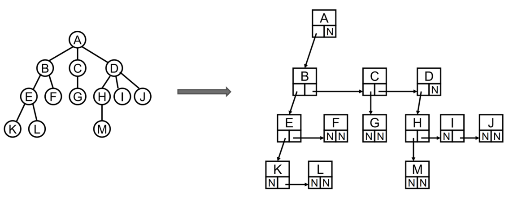

### 3.3、儿子-兄弟表示法旋转

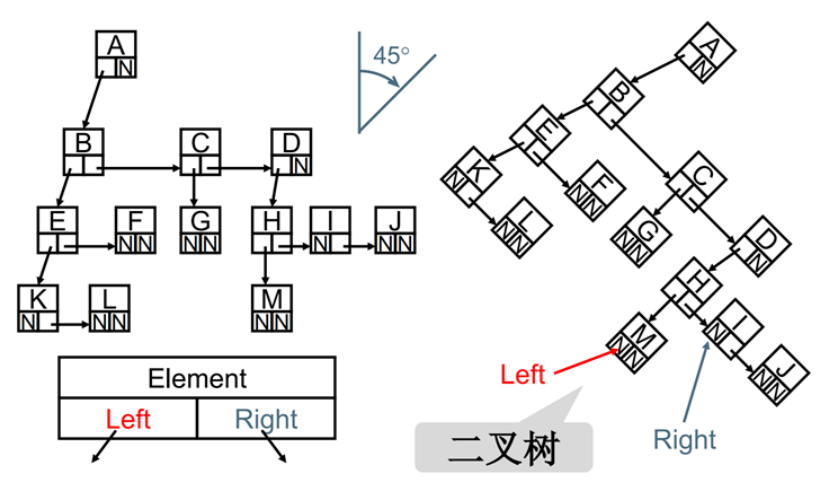

你发现上面规律了吗?

- 其实所有的树本质上都可以使用二叉树模拟出来。
- 所以在学习树的过程中,二叉树非常重要。

## 4、二叉树特性以及概念

### 4.1、二叉树的概念

如果树中每个节点最多只能有两个子节点,这样的树就成为"二叉树"。

- 前面,我们已经提过二叉树的重要性,不仅仅是因为简单,也因为几乎上所有的树都可以表示成二叉树的形式。

二叉树的定义

- 二叉树可以为空,也就是没有节点。
- 若不为空,则它是由根节点 和 称为其 左子树TL和 右子树TR 的两个不相交的二叉树组成。

二叉树有五种形态:

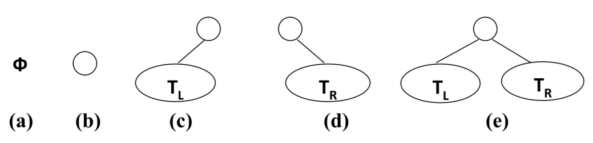

### 4.2、二叉树的特性

二叉树有几个比较重要的特性,在笔试题中比较常见:

- 一颗二叉树第 i 层的最大节点数为:2^(i-1),i >= 1;
- 深度为k的二叉树有最大节点总数为: 2^k - 1,k >= 1;
- 对任何非空二叉树 T,若n0表示叶节点的个数、n2是度为2的非叶节点个数,那么两者满足关系n0 = n2 + 1。

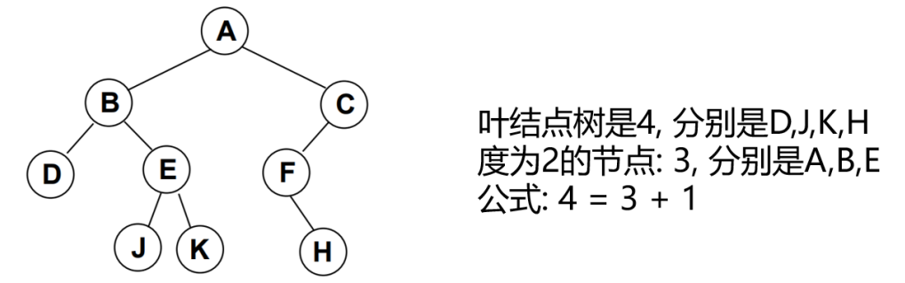

### 4.3、完美二叉树

完美二叉树(Perfect Binary Tree) ,也称为满二叉树(Full Binary Tree)

- 在二叉树中,除了最下一层的叶节点外,每层节点都有2个子节点,就构成了满二叉树。

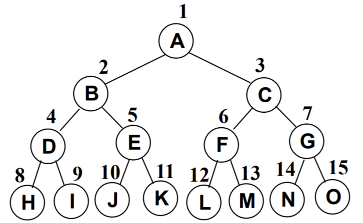

### 4.4、完全二叉树

完全二叉树(Complete Binary Tree)

- 除二叉树最后一层外,其他各层的节点数都达到最大个数。
- 且最后一层从左向右的叶节点连续存在,只缺右侧若干节点。
- 完美二叉树是特殊的完全二叉树。

下面不是完全二叉树,因为D节点还没有右节点,但是E节点就有了左右节点。

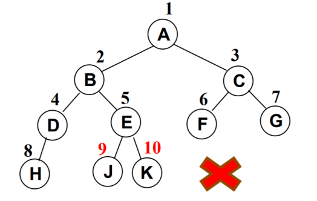

## 5、二叉树常见存储方式

### 5.1、二叉树的存储

二叉树的存储常见的方式是数组和链表。

使用数组

- 完全二叉树:按从上至下、从左到右顺序存储

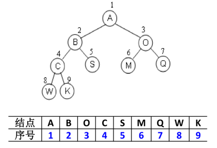

非完全二叉树:

- 非完全二叉树要转成完全二叉树才可以按照上面的方案存储。
- 但是会造成很大的空间浪费

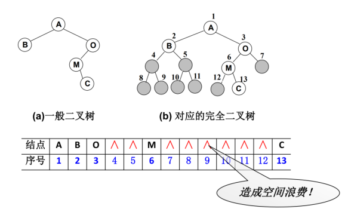

### 5.2、链表存储

二叉树最常见的方式还是使用链表存储。

- 每个节点封装成一个Node,Node中包含存储的数据,左节点的引用,右节点的引用。

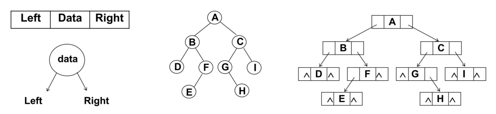

## 6、认识二叉搜索树特性

### 6.1、什么是二叉搜索树?

二叉搜索树(BST,Binary Search Tree),也称二叉排序树或二叉查找树

二叉搜索树是一颗二叉树

- 可以为空;

- 如果不为空,满足以下性质:

  - 非空左子树的所有键值小于其根节点的键值。

  - 非空右子树的所有键值大于其根节点的键值。

  - 左、右子树本身也都是二叉搜索树。

下面哪些是二叉搜索树,哪些不是?

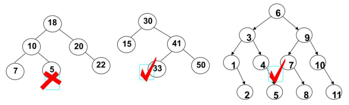

二叉搜索树的特点:

- 二叉搜索树的特点就是相对较小的值总是保存在左节点上,相对较大的值总是保存在右节点上。
- 那么利用这个特点,我们可以做什么事情呢?
- 查找效率非常高,这也是二叉搜索树中,搜索的来源。

### 6.2、二叉搜索树案例

下面是一个二叉搜索树

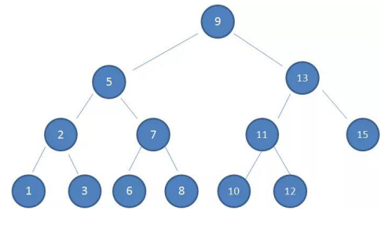

这样的数据结构有什么好处呢?

- 我们试着查找一下值为10的节点

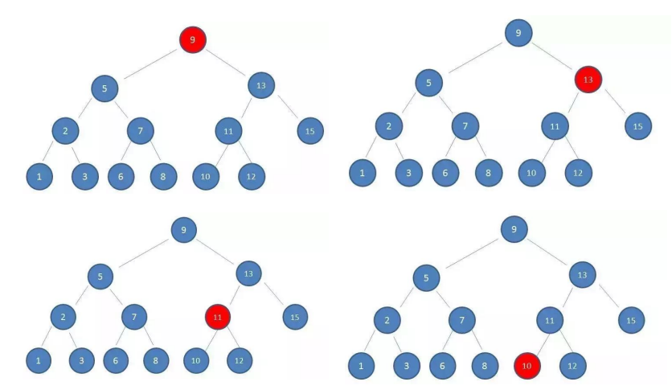

这种方式就是二分查找的思想

- 查找所需的最大次数等于二叉搜索树的深度;
- 插入节点时,也利用类似的方法,一层层比较大小,找到新节点合适的位置。

## 7、二叉搜索树类的封装

### 7.1、二叉搜索树的封装

我们像封装其他数据结构一样,先来封装一个BSTree的类

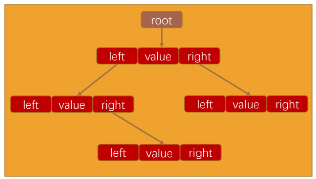

```ts
class Node<T> {
  value: T
  constructor(value: T) {
    this.value = value
  }
}

class TreeNode<T> extends Node<T> {
  left: TreeNode<T> | null = null;
  right: TreeNode<T> | null = null;
}

class BSTree<T> {
  private root: TreeNode<T> | null = null;
}
```

代码解析:

- 封装BSTree的类;
- 还需要封装一个用于保存每一个节点的类Node。
- 该类包含三个属性:节点对应的value,指向的左子树left,指向的右子树right
- 对于BSTree来说,只需要保存根节点即可,因为其他节点都可以通过根节点找到。

### 7.2、二叉搜索树常见操作

插入操作:

- insert(value):向树中插入一个新的数据。

查找操作:

- search(value):在树中查找一个数据,如果节点存在,则返回true;如果不存在,则返回false。
- min:返回树中最小的值/数据。
- max:返回树中最大的值/数据。

遍历操作:

- inOrderTraverse:通过中序遍历方式遍历所有节点。
- preOrderTraverse:通过先序遍历方式遍历所有节点。
- postOrderTraverse:通过后序遍历方式遍历所有节点。
- levelOrderTraverse:通过层序遍历方式遍历所有节点。

删除操作(有一点点复杂):

- remove(value):从树中移除某个数据。

## 8、二叉搜索树插入操作

我们分两个部分来完成这个功能。

首先,外界调用的insert方法:

```ts
/** 插入数据的操作 */
insert(value: T) {
  // 1.根据传入value创建Node(TreeNode)节点
  const newNode = new TreeNode(value);

  // 2.判断当前是否已经有了根节点
  if (!this.root) {
    // 当前树为空
    this.root = newNode;
  } else {
    // 树中已经有其他值
    this.insertNode(this.root, newNode);
  }
}
```

代码解析:

- 首先,根据传入的value,创建对应的Node。
- 其次,向树中插入数据需要分成两种情况:
  - 第一次插入,直接修改根节点即可。
  - 其他次插入,需要进行相关的比较决定插入的位置。
- 在代码中的insertNode方法,我们还没有实现,也是我们接下来要完成的任务。
- 其次,插入非根节点

```ts
private insertNode(node: TreeNode<T>, newNode: TreeNode<T>) {
  if (newNode.value < node.value) {
    // 去左边继续查找空白位置
    if (node.left === null) {
      // node节点的左边已经是空白
      node.left = newNode;
    } else {
      this.insertNode(node.left, newNode);
    }
  } else {
    // 去右边继续查找空白位置
    if (node.right === null) {
      node.right = newNode;
    } else {
      this.insertNode(node.right, newNode);
    }
  }
}
```

代码解析:

- 插入其他节点时,我们需要判断该值到底是插入到左边还是插入到右边。
- 判断的依据来自于新节点的value和原来节点的value值的比较。
  - 如果新节点的newvalue小于原节点的oldvalue,那么就向左边插入。
  - 如果新节点的newvalue大于原节点的oldvalue,那么就向右边插入。
- 代码的1序号位置,就是准备向左子树插入数据。但是它本身又分成两种情况
  - 情况一(代码1.1位置):左子树上原来没有内容,那么直接插入即可。
  - 情况二(代码1.2位置):左子树上已经有了内容,那么就一次向下继续查找新的走向,所以使用递归调用即可。
- 代码的2序号位置,和1序号位置几乎逻辑是相同的,只是是向右去查找。
  - 情况一(代码2.1位置):左右树上原来没有内容,那么直接插入即可。
  - 情况二(代码2.2位置):右子树上已经有了内容,那么就一次向下继续查找新的走向,所以使用递归调用即可。

```ts
const bst = new BSTree<number>();
bst.insert(11);
bst.insert(7);
bst.insert(15);
bst.insert(5);
bst.insert(3);
bst.insert(9);
bst.insert(8);
bst.insert(10);
bst.insert(13);
bst.insert(12);
bst.insert(14);
bst.insert(20);
bst.insert(18);
bst.insert(25);
bst.insert(6);
```

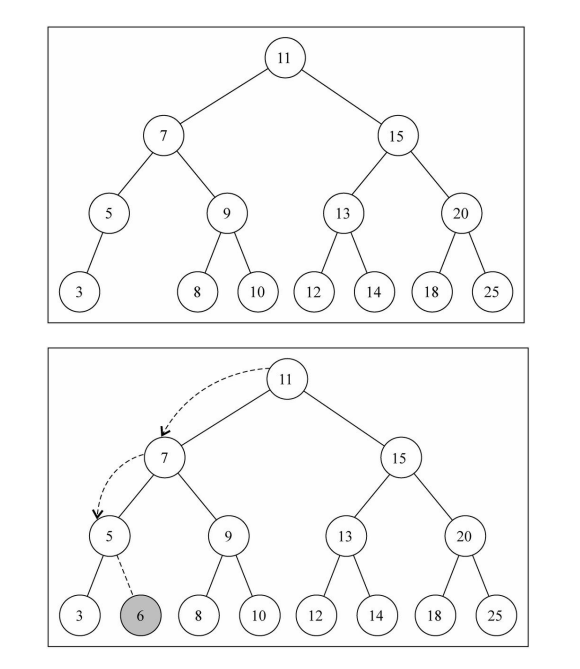

## 9、遍历

### 9.1、遍历二叉搜索树

前面,我们向树中插入了很多的数据,为了能很多的看到测试结果。我们先来学习一下树的遍历。

- 注意:这里我们学习的树的遍历,针对所有的二叉树都是适用的,不仅仅是二叉搜索树。

树的遍历:

- 遍历一棵树是指访问树的每个节点(也可以对每个节点进行某些操作,我们这里就是简单的打印) 
- 但是树和线性结构不太一样,线性结构我们通常按照从前到后的顺序遍历,但是树呢?
- 应该从树的顶端还是底端开始呢? 从左开始还是从右开始呢?

二叉树的遍历常见的有四种方式: 

- 先序遍历
- 中序遍历
- 后序遍历。
- 层序遍历

### 9.2、先序遍历

遍历过程为:

1. 访问根节点;
2. 先序遍历其左子树; 
3. 先序遍历其右子树。

| 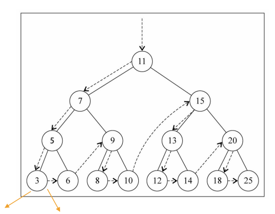 | 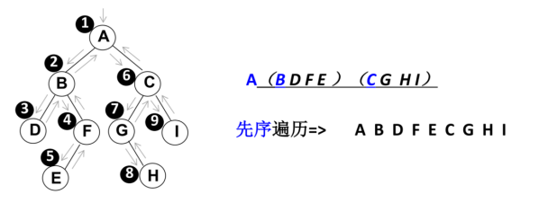 |
| :----------------------------------------------------------: | ------------------------------------------------------------ |
|                                                              |                                                              |

```ts
// 先序遍历
preOrderTraverse() {
  this.preOrderTraverseNode(this.root);
}
private preOrderTraverseNode(node: TreeNode<T> | null) {
  if (node) {
    console.log(node.value);
    this.preOrderTraverseNode(node.left);
    this.preOrderTraverseNode(node.right);
  }
}
```

**先序遍历(非递归 – 扩展)**

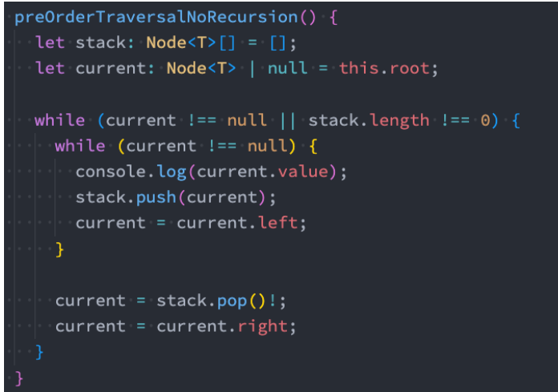

### 9.3、中序遍历

遍历过程为:

1. 中序遍历其左子树; 
2. 访问根节点;
3. 中序遍历其右子树。

| 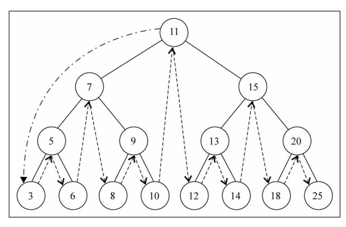 | 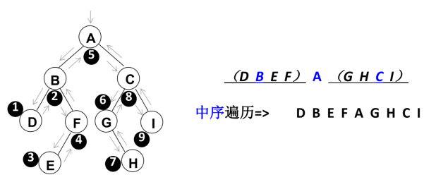 |
| ------------------------------------------------------------ | ------------------------------------------------------------ |
|                                                              |                                                              |

```ts
// 中序遍历
inOrderTraverse() {
  this.inOrderTraverseNode(this.root);
}
private inOrderTraverseNode(node: TreeNode<T> | null) {
  if (node) {
    this.inOrderTraverseNode(node.left);
    console.log(node.value);
    this.inOrderTraverseNode(node.right);
  }
}
```

**中序遍历(非递归 – 扩展)**

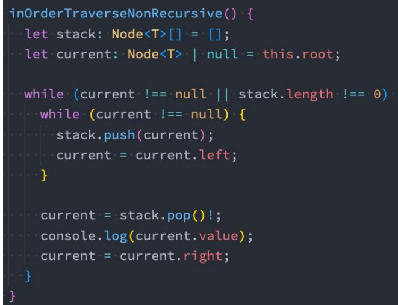

### 9.3、后序遍历

遍历过程为:

1. 后序遍历其左子树; 
2. 后序遍历其右子树; 
3. 访问根节点。

| 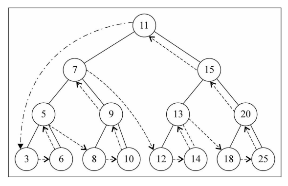 | 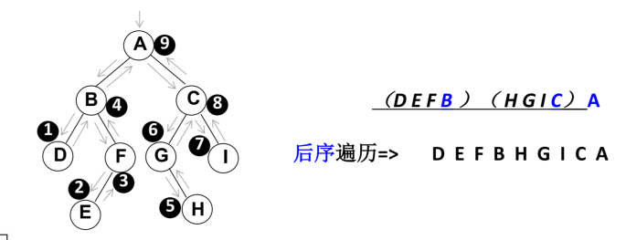 |
| ------------------------------------------------------------ | ------------------------------------------------------------ |
|                                                              |                                                              |

```ts
// 后序遍历
postOrderTraverse() {
  this.postOrderTraverseNode(this.root);
}
private postOrderTraverseNode(node: TreeNode<T> | null) {
  if (node) {
    this.postOrderTraverseNode(node.left);
    this.postOrderTraverseNode(node.right);
    console.log(node.value);
  }
}
```

**后序遍历(非递归 – 扩展)**

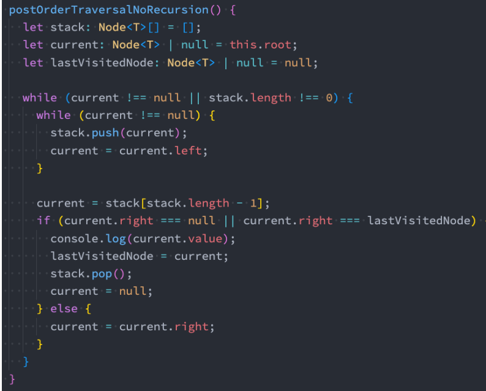

### 9.4、层序遍历

遍历过程为:

- 层序遍历很好理解,就是从上向下逐层遍历。
- 层序遍历通常我们会借助于队列来完成;
  - 也是队列的一个经典应用场景;

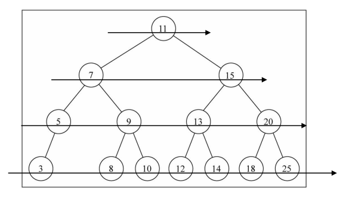

```ts
// 层序遍历
levelOrderTraverse() {
  // 1.如果没有根节点, 那么不需要遍历
  if (!this.root) return;

  // 2.创建队列结构
  const queue: TreeNode<T>[] = [];
  // 第一个节点时根节点
  queue.push(this.root);

  // 3.遍历队列中所有的节点(依次出队)
  while (queue.length) {
    // 3.1.访问节点的过程
    const current = queue.shift()!;
    console.log(current.value);

    // 3.2.将左子节点放入到队列
    if (current.left) {
      queue.push(current.left);
    }

    // 3.3.将右子节点放入到队列
    if (current.right) {
      queue.push(current.right);
    }
  }
}
```

## 10、二叉搜索树搜索操作

### 10.1、最大值 & 最小值

在二叉搜索树中搜索最值是一件非常简单的事情,其实用眼睛看就可以看出来了。

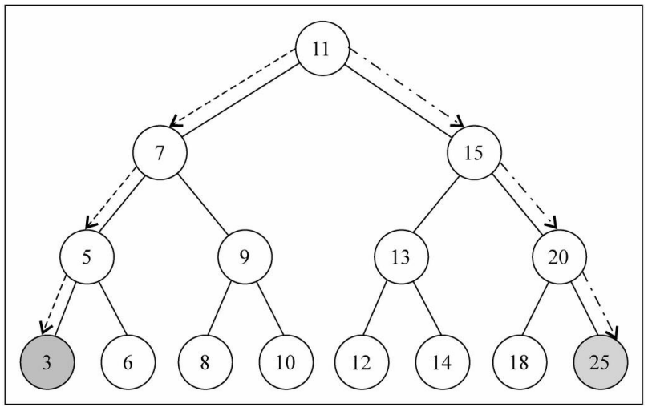

```ts
/** 获取最值操作: 最大值/最小值 */
getMaxValue(): T | null {
  let current = this.root;
  while (current && current.right) {
    current = current.right;
  }

  return current?.value ?? null;
}

getMinValue(): T | null {
  let current = this.root;
  while (current && current.left) {
    current = current.left;
  }

  return current?.value ?? null;
}
```

### 10.2、search搜索特定的值

二叉搜索树不仅仅获取最值效率非常高,搜索特定的值效率也非常高。

- 注意:这里的实现返回boolean类型即可。

```ts
/** 搜索特定的值: 20 => boolean */
search(value: T): boolean {
  let current = this.root;
  while (current) {
    // 找到了节点
    if (current.value === value) return true;

    if (current.value < value) {
      current = current.right;
    } else {
      current = current.left;
    }
  }

  return false;
}
```

**search搜索特定的值(非递归)**

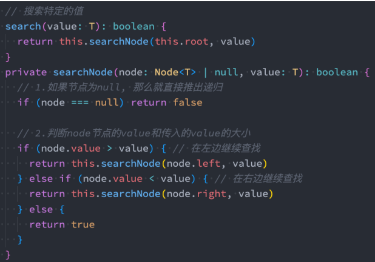

代码解析:

- 这里我们还是使用了递归的方式。
- 递归必须有退出条件,我们这里是两种情况下退出。
- node === null,也就是后面不再有节点的时候。
- 找到对应的value,也就是node.value === value的时候。
- 在其他情况下,根据node.的value和传入的value进行比较来决定向左还是向右查找。
- 如果node.value > value,那么说明传入的值更小,需要向左查找。
- 如果node.value < value,那么说明传入的值更大,需要向右查找

## 11、二叉搜索树删除操作

### 11.1、二叉搜索树的删除

二叉搜索树的删除有些复杂。

删除节点要从查找要删的节点开始,找到节点后,需要考虑三种情况:

- 该节点是叶节点(没有字节点,比较简单)
- 该节点有一个子节点(也相对简单)
- 该节点有两个子节点.(情况比较复杂,我们后面慢慢道来)

我们先从查找要删除的节点入手

- 1> 先找到要删除的节点,如果没有找到,不需要删除
- 2 > 找到要删除节点
  1. 删除叶子节点
  2. 删除只有一个子节点的节点
  3. 删除有两个子节点的节点

### 11.2、情况一:没有子节点

情况一:没有子节点.

- 这种情况相对比较简单,我们需要检测current的left以及right是否都为null.
- 都为null之后还要检测一个东西,就是是否current就是根,都为null,并且为跟根,那么相当于要清空二叉树(当然,只是清空了根,因为只有它).
- 否则就把父节点的left或者right字段设置为null即可.

如果只有一个单独的根,直接删除即可

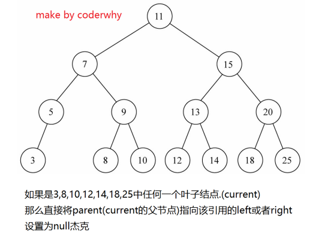

```ts
class TreeNode<T> extends Node<T> {
  left: TreeNode<T> | null = null;
  right: TreeNode<T> | null = null;
  // 当前节点的父节点
  parent: TreeNode<T> | null = null;

  // 判断当前节点是父节点的左子节点
  get isLeft(): boolean {
    return !!(this.parent && this.parent.left === this);
  }
  // 判断当前节点是父节点的右子节点
  get isRight(): boolean {
    return !!(this.parent && this.parent.right === this);
  }
}

class BSTree<T> {
  private root: TreeNode<T> | null = null;

  private searchNode(value: T): TreeNode<T> | null {
    let current = this.root;
    let parent: TreeNode<T> | null = null;
    while (current) {
      // 1.如果找到current, 直接返回即可
      if (current.value === value) {
        return current;
      }

      // 2.继续向下找
      parent = current;
      if (current.value < value) {
        current = current.right;
      } else {
        current = current.left;
      }
      // 如果current有值, 那么current保存自己的父节点
      if (current) current.parent = parent;
    }

    return null;
  }

  /** 搜索特定的值: 20 => boolean */
  search(value: T): boolean {
    return !!this.searchNode(value);
  }

  /** 实现删除操作 */
  remove(value: T): boolean {
    // 1.搜索: 当前是否有这个value
    const current = this.searchNode(value);
    if (!current) return false;

    // 2.获取到三个东西: 当前节点/父节点/是属于父节点的左子节点, 还是右子节点
    // 2.如果删除的是叶子节点
    if (current.left === null && current.right === null) {
      if (current === this.root) {
        // 根节点
        this.root = null;
      } else if (current.isLeft) {
        // 父节点的左子节点
        current.parent!.left = null;
      } else {
        current.parent!.right = null;
      }
    }

    return true;
  }
}
```

### 11.3、情况二:一个子节点

情况二:有一个子节点

- 要删除的current节点,只有2个连接(如果有两个子节点, 就是三个连接了),一个连接父节点,一个连接唯一的子节点.
- 需要从这三者之间:爷爷 - 自己 - 儿子,将自己(current) 剪短,让爷爷直接连接儿子即可.
- 这个过程要求改变父节点的left或者right,指向要删除节点的子节点.
- 当然,在这个过程中还要考虑是否current就是根.

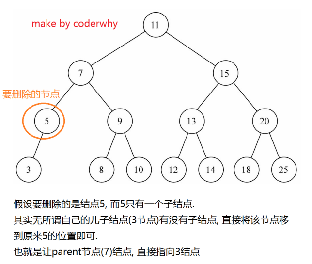

图解过程:

- 如果是根的情况,大家可以自己画一下,比较简单,这里不再给出.
- 如果不是根,并且只有一个子节点的情况.

```ts
/** 实现删除操作 */
remove(value: T): boolean {
  // 1.搜索: 当前是否有这个value
  const current = this.searchNode(value);
  if (!current) return false;

  // 2.获取到三个东西: 当前节点/父节点/是属于父节点的左子节点, 还是右子节点
  // 2.如果删除的是叶子节点
  if (current.left === null && current.right === null) {
    if (current === this.root) {
      // 根节点
      this.root = null;
    } else if (current.isLeft) {
      // 父节点的左子节点
      current.parent!.left = null;
    } else {
      current.parent!.right = null;
    }
  }

  // 3.只有一个子节点: 只有左子节点
  else if (current.right === null) {
    if (current === this.root) {
      this.root = current.left;
    } else if (current.isLeft) {
      current.parent!.left = current.left;
    } else {
      current.parent!.right = current.left;
    }
  }

  // 4.只有一个子节点: 只有右子节点
  else if (current.left === null) {
    if (current === this.root) {
      this.root = current.right;
    } else if (current.isLeft) {
      current.parent!.left = current.right;
    } else {
      current.parent!.right = current.right;
    }
  }

  return true;
}
```

### 11.4、情况三:两个子节点

情况三:有两个子节点.
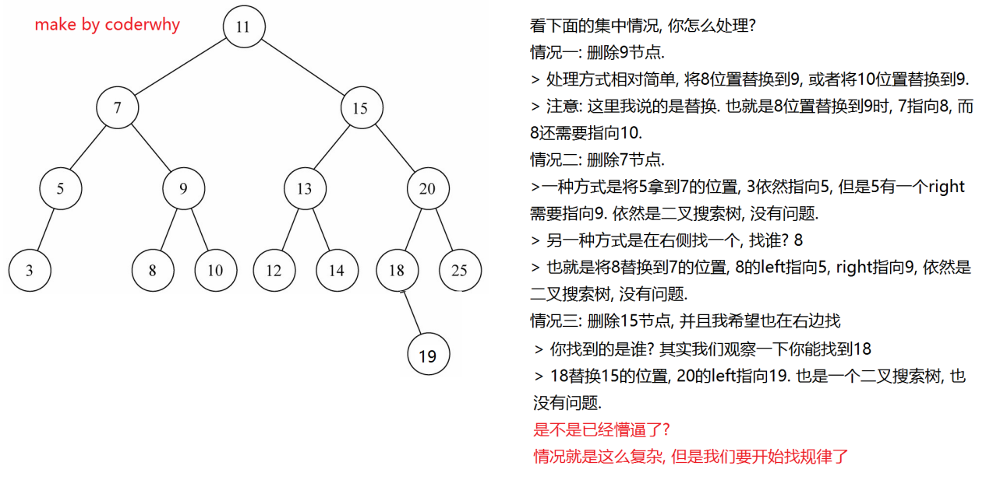

**寻找规律**

如果我们要删除的节点有两个子节点,甚至子节点还有子节点,这种情况下我们需要从下面的子节点中找到一个节点,来替换当前的节点.

但是找到的这个节点有什么特征呢? 应该是current节点下面所有节点中最接近current节点的. 

- 要么比current节点小一点点,要么比current节点大一点点。
- 总结你最接近current,你就可以用来替换current的位置.

这个节点怎么找呢?

- 比current小一点点的节点,一定是current左子树的最大值。
- 比current大一点点的节点,一定是current右子树的最小值。

前驱&后继

- 在二叉搜索树中,这两个特别的节点,有两个特别的名字。
- 比current小一点点的节点,称为current节点的前驱。
- 比current大一点点的节点,称为current节点的后继。

也就是为了能够删除有两个子节点的current,要么找到它的前驱,要么找到它的后继。

所以,接下来,我们先找到这样的节点(前驱或者后继都可以,我这里以找后继为例)

```ts
/** 获取后继节点 */
private getSuccessor(delNode: TreeNode<T>): TreeNode<T> {
  // 获取右子树
  let current = delNode.right;
  let successor: TreeNode<T> | null = null;
  while (current) {
    successor = current;
    current = current.left;
    if (current) {
      current.parent = successor;
    }
  }

  // 拿到了后继节点
  if (successor !== delNode.right) {
    successor!.parent!.left = successor!.right;
    successor!.right = delNode.right;
  }

  // 一定要进行的操作: 将删除节点的left, 赋值给后继节点的left
  successor!.left = delNode.left;

  return successor!;
}

/** 实现删除操作 */
remove(value: T): boolean {
  // 1.搜索: 当前是否有这个value
  const current = this.searchNode(value);
  if (!current) return false;

  // 2.获取到三个东西: 当前节点/父节点/是属于父节点的左子节点, 还是右子节点
  // 2.如果删除的是叶子节点
  if (current.left === null && current.right === null) {
    if (current === this.root) {
      // 根节点
      this.root = null;
    } else if (current.isLeft) {
      // 父节点的左子节点
      current.parent!.left = null;
    } else {
      current.parent!.right = null;
    }
  }

  // 3.只有一个子节点: 只有左子节点
  else if (current.right === null) {
    if (current === this.root) {
      this.root = current.left;
    } else if (current.isLeft) {
      current.parent!.left = current.left;
    } else {
      current.parent!.right = current.left;
    }
  }

  // 4.只有一个子节点: 只有右子节点
  else if (current.left === null) {
    if (current === this.root) {
      this.root = current.right;
    } else if (current.isLeft) {
      current.parent!.left = current.right;
    } else {
      current.parent!.right = current.right;
    }
  }

  // 5.有两个子节点
  else {
    const successor = this.getSuccessor(current);
    if (current === this.root) {
      this.root = successor;
    } else if (current.isLeft) {
      current.parent!.left = successor;
    } else {
      current.parent!.right = successor;
    }
  }

  return true;
}
```

### 11.5、删除操作总结

看到这里,你就会发现删除节点相当棘手。

实际上,因为它非常复杂,一些程序员都尝试着避开删除操作。

- 他们的做法是在Node类中添加一个boolean的字段,比如名称为isDeleted。
- 要删除一个节点时,就将此字段设置为true。
- 其他操作,比如find()在查找之前先判断这个节点是不是标记为删除。
- 这样相对比较简单,每次删除节点不会改变原有的树结构。
- 但是在二叉树的存储中,还保留着那些本该已经被删除掉的节点。

上面的做法看起来很聪明,其实是一种逃避。

- 这样会造成很大空间的浪费,特别是针对数据量较大的情况。
- 而且,作为程序员要学会通过这些复杂的操作,锻炼自己的逻辑。

```ts
class Node<T> {
  value: T
  constructor(value: T) {
    this.value = value
  }
}

class TreeNode<T> extends Node<T> {
  left: TreeNode<T> | null = null;
  right: TreeNode<T> | null = null;
  // 当前节点的父节点
  parent: TreeNode<T> | null = null;

  // 判断当前节点是父节点的左子节点
  get isLeft(): boolean {
    return !!(this.parent && this.parent.left === this);
  }
  // 判断当前节点是父节点的右子节点
  get isRight(): boolean {
    return !!(this.parent && this.parent.right === this);
  }
}

class BSTree<T> {
  private root: TreeNode<T> | null = null;

  print() {
    btPrint(this.root);
  }

  private searchNode(value: T): TreeNode<T> | null {
    let current = this.root;
    let parent: TreeNode<T> | null = null;
    while (current) {
      // 1.如果找到current, 直接返回即可
      if (current.value === value) {
        return current;
      }

      // 2.继续向下找
      parent = current;
      if (current.value < value) {
        current = current.right;
      } else {
        current = current.left;
      }

      // 如果current有值, 那么current保存自己的父节点
      if (current) current.parent = parent;
    }

    return null;
  }

  /** 搜索特定的值: 20 => boolean */
  search(value: T): boolean {
    return !!this.searchNode(value);
  }

  /** 实现删除操作 */
  private getSuccessor(delNode: TreeNode<T>): TreeNode<T> {
    // 获取右子树
    let current = delNode.right;
    let successor: TreeNode<T> | null = null;
    while (current) {
      successor = current;
      current = current.left;
      if (current) {
        current.parent = successor;
      }
    }

    // 拿到了后继节点
    if (successor !== delNode.right) {
      successor!.parent!.left = successor!.right;
      successor!.right = delNode.right;
    }

    // 一定要进行的操作: 将删除节点的left, 赋值给后继节点的left
    successor!.left = delNode.left;

    return successor!;
  }

  remove(value: T): boolean {
    // 1.搜索: 当前是否有这个value
    const current = this.searchNode(value);
    if (!current) return false;

    // 2.获取到三个东西: 当前节点/父节点/是属于父节点的左子节点, 还是右子节点
    let replaceNode: TreeNode<T> | null = null;
    if (current.left === null && current.right === null) {
      replaceNode = null;
    } else if (current.right === null) {
      replaceNode = current.left;
    } else if (current.left === null) {
      replaceNode = current.right;
    } else {
      const successor = this.getSuccessor(current);
      replaceNode = successor;
    }

    if (current === this.root) {
      this.root = replaceNode;
    } else if (current.isLeft) {
      current.parent!.left = replaceNode;
    } else {
      current.parent!.right = replaceNode;
    }

    return true;
  }
}
```

完整代码：

```ts
class Node<T> {
  value: T
  constructor(value: T) {
    this.value = value
  }
}

class TreeNode<T> extends Node<T> {
  left: TreeNode<T> | null = null;
  right: TreeNode<T> | null = null;
  // 当前节点的父节点
  parent: TreeNode<T> | null = null;
  
  // 判断当前节点是父节点的左子节点
  get isLeft(): boolean {
    return !!(this.parent && this.parent.left === this);
  }
  // 判断当前节点是父节点的右子节点
  get isRight(): boolean {
    return !!(this.parent && this.parent.right === this);
  }
}

class BSTree<T> {
  private root: TreeNode<T> | null = null;

  print() {
    btPrint(this.root);
  }

  private searchNode(value: T): TreeNode<T> | null {
    let current = this.root;
    let parent: TreeNode<T> | null = null;
    while (current) {
      // 1.如果找到current, 直接返回即可
      if (current.value === value) {
        return current;
      }

      // 2.继续向下找
      parent = current;
      if (current.value < value) {
        current = current.right;
      } else {
        current = current.left;
      }

      // 如果current有值, 那么current保存自己的父节点
      if (current) current.parent = parent;
    }

    return null;
  }

  /** 插入数据的操作 */
  insert(value: T) {
    // 1.根据传入value创建Node(TreeNode)节点
    const newNode = new TreeNode(value);

    // 2.判断当前是否已经有了根节点
    if (!this.root) {
      // 当前树为空
      this.root = newNode;
    } else {
      // 树中已经有其他值
      this.insertNode(this.root, newNode);
    }
  }

  private insertNode(node: TreeNode<T>, newNode: TreeNode<T>) {
    if (newNode.value < node.value) {
      // 去左边继续查找空白位置
      if (node.left === null) {
        // node节点的左边已经是空白
        node.left = newNode;
      } else {
        this.insertNode(node.left, newNode);
      }
    } else {
      // 去右边继续查找空白位置
      if (node.right === null) {
        node.right = newNode;
      } else {
        this.insertNode(node.right, newNode);
      }
    }
  }

  /** 遍历的操作 */
  // 先序遍历
  preOrderTraverse() {
    this.preOrderTraverseNode(this.root);
  }
  private preOrderTraverseNode(node: TreeNode<T> | null) {
    if (node) {
      console.log(node.value);
      this.preOrderTraverseNode(node.left);
      this.preOrderTraverseNode(node.right);
    }
  }

  // 中序遍历
  inOrderTraverse() {
    this.inOrderTraverseNode(this.root);
  }
  private inOrderTraverseNode(node: TreeNode<T> | null) {
    if (node) {
      this.inOrderTraverseNode(node.left);
      console.log(node.value);
      this.inOrderTraverseNode(node.right);
    }
  }

  // 后序遍历
  postOrderTraverse() {
    this.postOrderTraverseNode(this.root);
  }
  private postOrderTraverseNode(node: TreeNode<T> | null) {
    if (node) {
      this.postOrderTraverseNode(node.left);
      this.postOrderTraverseNode(node.right);
      console.log(node.value);
    }
  }

  // 层序遍历
  levelOrderTraverse() {
    // 1.如果没有根节点, 那么不需要遍历
    if (!this.root) return;

    // 2.创建队列结构
    const queue: TreeNode<T>[] = [];
    // 第一个节点时根节点
    queue.push(this.root);

    // 3.遍历队列中所有的节点(依次出队)
    while (queue.length) {
      // 3.1.访问节点的过程
      const current = queue.shift()!;
      console.log(current.value);

      // 3.2.将左子节点放入到队列
      if (current.left) {
        queue.push(current.left);
      }

      // 3.3.将右子节点放入到队列
      if (current.right) {
        queue.push(current.right);
      }
    }
  }

  /** 获取最值操作: 最大值/最小值 */
  getMaxValue(): T | null {
    let current = this.root;
    while (current && current.right) {
      current = current.right;
    }

    return current?.value ?? null;
  }

  getMinValue(): T | null {
    let current = this.root;
    while (current && current.left) {
      current = current.left;
    }

    return current?.value ?? null;
  }

  /** 搜索特定的值: 20 => boolean */
  search(value: T): boolean {
    return !!this.searchNode(value);
  }

  /** 实现删除操作 */
  private getSuccessor(delNode: TreeNode<T>): TreeNode<T> {
    // 获取右子树
    let current = delNode.right;
    let successor: TreeNode<T> | null = null;
    while (current) {
      successor = current;
      current = current.left;
      if (current) {
        current.parent = successor;
      }
    }

    // 拿到了后继节点
    if (successor !== delNode.right) {
      successor!.parent!.left = successor!.right;
      successor!.right = delNode.right;
    }

    // 一定要进行的操作: 将删除节点的left, 赋值给后继节点的left
    successor!.left = delNode.left;

    return successor!;
  }

  remove(value: T): boolean {
    // 1.搜索: 当前是否有这个value
    const current = this.searchNode(value);
    if (!current) return false;

    // 2.获取到三个东西: 当前节点/父节点/是属于父节点的左子节点, 还是右子节点
    let replaceNode: TreeNode<T> | null = null;
    if (current.left === null && current.right === null) {
      replaceNode = null;
    } else if (current.right === null) {
      replaceNode = current.left;
    } else if (current.left === null) {
      replaceNode = current.right;
    } else {
      const successor = this.getSuccessor(current);
      replaceNode = successor;
    }

    if (current === this.root) {
      this.root = replaceNode;
    } else if (current.isLeft) {
      current.parent!.left = replaceNode;
    } else {
      current.parent!.right = replaceNode;
    }

    return true;
  }
}
```

## 12、二叉搜索树补充

### 12.1、二叉搜索树的缺陷

二叉搜索树作为数据存储的结构由重要的优势:

- 可以快速地找到给定关键字的数据项 并且可以快速地插入和删除数据项。

但是,二叉搜索树有一个很麻烦的问题:

- 如果插入的数据时有序的数据,比如下面的情况
- 有一棵初始化为 9 8 12 的二叉树
- 插入下面的数据:7 6 5 4 3

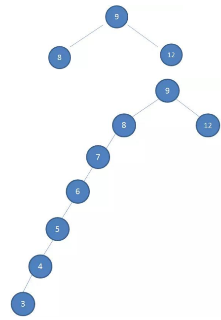

非平衡树:

- 比较好的二叉搜索树数据应该是左右分布均匀的
- 但是插入连续数据后,分布的不均匀,我称这种树为非平衡树。
- 对于一棵平衡二叉树来说,插入/查找等操作的效率是O(logN)
- 对于一棵非平衡二叉树,相当于编写了一个链表,查找效率变成了O(N)

### 12.2、树的平衡性

为了能以较快的时间O(logN)来操作一棵树,我们需要保证树总是平衡的:

- 至少大部分是平衡的,那么时间复杂度也是接近O(logN)的
- 也就是说树中每个节点左边的子孙节点的个数,应该尽可能的等于右边的子孙节点的个数。
- 常见的平衡树有哪些呢?

AVL树:

- AVL树是最早的一种平衡树。它有些办法保持树的平衡(每个节点多存储了一个额外的数据) 
- 因为AVL树是平衡的,所以时间复杂度也是O(logN)。
- 但是,每次插入/删除操作相对于红黑树效率都不高,所以整体效率不如红黑树

红黑树:

- 红黑树也通过一些特性来保持树的平衡。
- 因为是平衡树,所以时间复杂度也是在O(logN)。
- 另外插入/删除等操作,红黑树的性能要优于AVL树,所以现在平衡树的应用基本都是红黑树。


