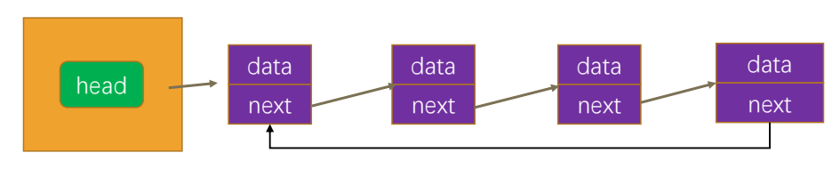
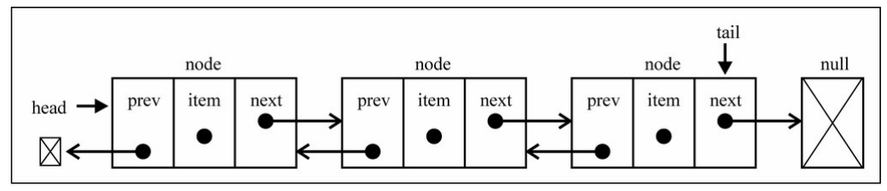
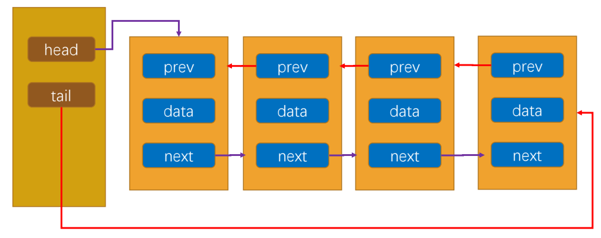
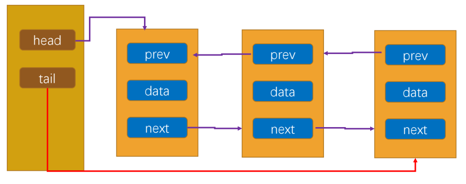
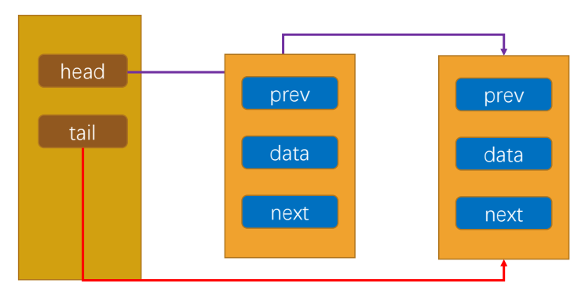
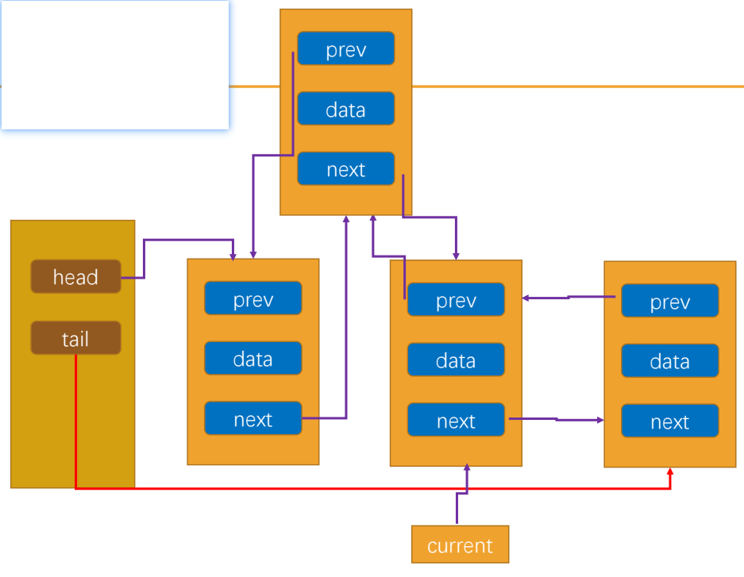
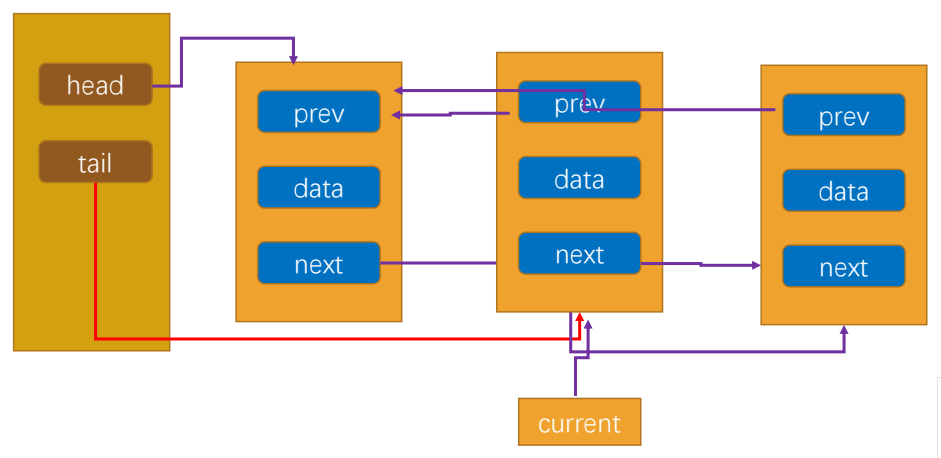

## 1、循环链表结构介绍

前面我们已经从零去封装了一个链表结构,其实我们还可以封装更灵活的链表结构:循环链表和双向链表。

循环链表(Circular LinkedList)是一种特殊的链表数据结构:

- 在普通链表的基础上,最后一个节点的下一个节点不再是 null,而是指向链表的第一个节点。
- 这样形成了一个环,使得链表能够被无限遍历。
- 这样,我们就可以在单向循环链表中从任意一个节点出发,不断地遍历下一个节点,直到回到起点。



单向循环链表我们有两种实现方式:

- 方式一:从零去实现一个新的链表,包括其中所有的属性和方法; 
- 方式二:继承自之前封装的LinkedList,只实现差异化的部分;

## 2、单向链表代码重构

**重构LinkedList**

1. 修饰符改成protected
2. 添加tail指向尾部节点
   - append方法:
     - this.tail.next = newNode
     - this.tail = newNode
   - insert方法:判断是否是插入最后一个节点
   - removeAt方法:
     - this.length === 1
       - this.tail = null
       - this.head = null
     - position === length – 1
       - this.tail = previous
3. 添加判断是否是最后一个节点
4. 重构traverse方法
5. 重构indexOf方法

```ts
import ILinkedList from "./ILinkedList";
import { Node } from "./LinkedNode";

// 2.创建LinkedList的类
export default class LinkedList<T> implements ILinkedList<T> {
  protected head: Node<T> | null = null;
  protected length: number = 0;
  // 新增属性: 总是指向链表的尾部
  protected tail: Node<T> | null = null;

  size() {
    return this.length;
  }

  peek(): T | undefined {
    return this.head?.value;
  }

  // 封装私有方法
  // 根据position获取到当前的节点(不是节点的value, 而是获取节点)
  protected getNode(position: number): Node<T> | null {
    let index = 0;
    let current = this.head;
    while (index++ < position && current) {
      current = current.next;
    }
    return current;
  }

  // 判断是否是最后一个节点
  private isTail(node: Node<T>) {
    return this.tail === node;
  }

  // 追加节点
  append(value: T) {
    // 1.根据value创建一个新节点
    const newNode = new Node(value);
    // 2.判断this.head是否为null
    if (!this.head) {
      this.head = newNode;
    } else {
      this.tail!.next = newNode;
    }
    this.tail = newNode;
    // 3.size++
    this.length++;
  }

  // 遍历链表的方法
  traverse() {
    const values: T[] = [];

    let current = this.head;
    while (current) {
      values.push(current.value);
      if (this.isTail(current)) {
        // 已经遍历最后一个接地那
        current = null;
      } else {
        // 不是最后一个节点
        current = current.next;
      }
    }

    // 循环链表
    if (this.head && this.tail?.next === this.head) {
      values.push(this.head.value);
    }
    console.log(values.join("->"));
  }

  // 插入方法:
  insert(value: T, position: number): boolean {
    // 1.越界的判断
    if (position < 0 || position > this.length) return false;
    // 2.根据value创建新的节点
    const newNode = new Node(value);

    // 3.判断是否需要插入头部
    if (position === 0) {
      newNode.next = this.head;
      this.head = newNode;
    } else {
      const previous = this.getNode(position - 1);
      newNode.next = previous!.next;
      previous!.next = newNode;

      if (position === this.length) {
        this.tail = newNode;
      }
    }
    this.length++;
    return true;
  }

  // 删除方法:
  removeAt(position: number): T | null {
    // 1.越界的判断
    if (position < 0 || position >= this.length) return null;

    // 2.判断是否是删除第一个节点
    let current = this.head;
    if (position === 0) {
      this.head = current?.next ?? null;
      if (this.length === 1) {
        this.tail = null;
      }
    } else {
      const previous = this.getNode(position - 1);
      current = previous!.next;
      previous!.next = previous?.next?.next ?? null;

      if (position === this.length - 1) {
        this.tail = previous;
      }
    }

    this.length--;
    return current?.value ?? null;
  }

  // 获取方法:
  get(position: number): T | null {
    // 越界问题
    if (position < 0 || position >= this.length) return null;
    // 2.查找元素, 并且范围元素
    return this.getNode(position)?.value ?? null;
  }

  // 更新方法:
  update(value: T, position: number): boolean {
    if (position < 0 || position >= this.length) return false;
    // 获取对应位置的节点, 直接更新即可
    const currentNode = this.getNode(position);
    currentNode!.value = value;
    return true;
  }

  // 根据值, 获取对应位置的索引
  indexOf(value: T): number {
    // 从第一个节点开始, 向后遍历
    let current = this.head;
    let index = 0;
    while (current) {
      if (current.value === value) {
        return index;
      }

      if (this.isTail(current)) {
        current = null;
      } else {
        current = current.next;
      }
      index++;
    }
    return -1;
  }

  // 删除方法: 根据value删除节点
  remove(value: T): T | null {
    const index = this.indexOf(value);
    return this.removeAt(index);
  }

  // 判读单链表是否为空的方法
  isEmpty() {
    return this.length === 0;
  }
}
```

## 3、循环链表方法实现

- 实现append方法

- 实现insert方法

- 实现removeAt方法

```ts
import LinkedList from "./01_实现单向链表LinkedList";

class CircularLinkedList<T> extends LinkedList<T> {
  // 重新实现的方法: append方法
  append(value: T): void {
    super.append(value);
    // 拿到最后一个节点next指向第一个节点
    this.tail!.next = this.head;
  }

  insert(value: T, position: number): boolean {
    const isSuccess = super.insert(value, position);
    if (isSuccess && (position === this.length - 1 || position === 0)) {
      this.tail!.next = this.head;
    }
    return isSuccess;
  }

  removeAt(position: number): T | null {
    const value = super.removeAt(position);
    if (value && this.tail && (position === 0 || position === this.length)) {
      this.tail.next = this.head;
    }

    return value;
  }
}
```

## 4、双向链表结构介绍

双向链表:

- 既可以从头遍历到尾, 又可以从尾遍历到头.
- 也就是链表相连的过程是双向的. 那么它的实现原理, 你能猜到吗? 
- 一个节点既有向前连接的引用prev, 也有一个向后连接的引用next.

双向链表有什么缺点呢?

- 每次在插入或删除某个节点时, 需要处理四个引用, 而不是两个. 也就是实现起来要困难一些
- 并且相当于单向链表, 必然占用内存空间更大一些.
- 但是这些缺点和我们使用起来的方便程度相比, 是微不足道的.





## 5、双向链表节点封装

双向链表的节点,需要进一步添加一个prev属性,用于指向前一个节点:

```ts
export class Node<T> {
  value: T;
  next: Node<T> | null = null;
  constructor(value: T) {
    this.value = value;
  }
}

export class DoublyNode<T> extends Node<T> {
  prev: DoublyNode<T> | null = null;
  next: DoublyNode<T> | null = null;
}
```

```ts
import LinkedList from './01_实现单向链表LinkedList'
import { DoublyNode } from './LinkedNode'

class DoublyLinkedList<T> extends LinkedList<T> {
  protected head: DoublyNode<T> | null = null
  protected tail: DoublyNode<T> | null = null
}
```

## 6、双向链表方法实现

双向链表中添加、删除方法的实现和单向链表有较大的区别,所以我们可以对其方法进行重新实现: 

- append方法:在尾部追加元素
- prepend方法:在头部添加元素
- postTraverse方法:从尾部遍历所有节点
- insert方法:根据索引插入元素
- removeAt方法:根据索引删除元素

那么接下来我们就一个个实现这些方法,其他方法都是可以继承的。

### 6.1、append方法



```ts
append(value: T): void {
  const newNode = new DoublyNode(value);

  if (!this.head) {
    this.head = newNode;
    this.tail = newNode;
  } else {
    this.tail!.next = newNode;
    // 不能将一个父类的对象, 赋值给一个子类的类型
    // 可以将一个子类的对象, 赋值给一个父类的类型(多态)
    newNode.prev = this.tail;
    this.tail = newNode;
  }
  this.length++;
}
```

### 6.2、prepend方法



```ts
// 新的方法
prepend(value: T): void {
  const newNode = new DoublyNode(value);

  if (!this.head) {
    this.head = newNode;
    this.tail = newNode;
  } else {
    newNode.next = this.head;
    this.head.prev = newNode;
    this.head = newNode;
  }
  this.length++;
}
```

### 6.4、postTraverse

```ts
postTraverse() {
  const values: T[] = [];
  let current = this.tail;
  while (current) {
    values.push(current.value);
    current = current.prev;
  }
  console.log(values.join("->"));
}
```

### 6.5、insert方法



```ts
// 根据索引插入元素
insert(value: T, position: number): boolean {
  if (position < 0 && position > this.length) return false;

  if (position === 0) {
    this.prepend(value);
  } else if (position === this.length) {
    this.append(value);
  } else {
    const newNode = new DoublyNode(value);
    const current = this.getNode(position) as DoublyNode<T>;

    current.prev!.next = newNode;
    newNode.next = current;
    newNode.prev = current.prev;
    current.prev = newNode;
    this.length++;
  }

  return true;
}
```

### 6.6、removeAt方法



```ts
// 根据索引删除元素
removeAt(position: number): T | null {
  if (position < 0 || position >= this.length) return null;

  let current = this.head;
  if (position === 0) {
    if (this.length === 1) {
      this.head = null;
      this.tail = null;
    } else {
      this.head = this.head!.next;
      this.head!.prev = null;
    }
  } else if (position === this.length - 1) {
    current = this.tail;
    this.tail = this.tail!.prev;
    this.tail!.next = null;
  } else {
    current = this.getNode(position) as DoublyNode<T>;
    current.next!.prev = current.prev;
    current.prev!.next = current.next;
  }

  this.length--;
  return current?.value ?? null;
}
```


