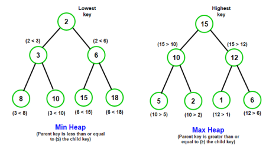
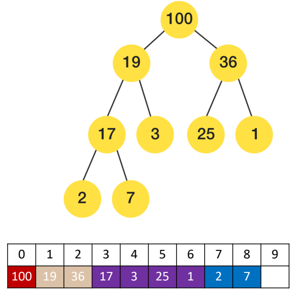
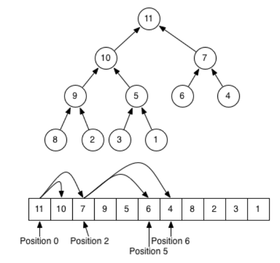
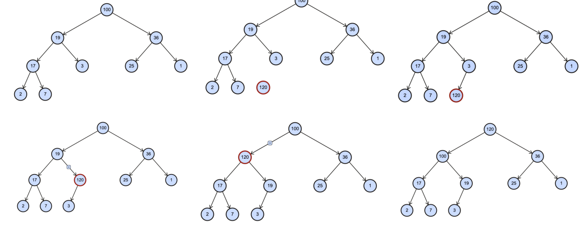

## 1、认识堆结构的特性

### 1.1、什么是堆(Heap)结构?

堆是也是一种非常常见的数据结构,但是相对于前面的数据结构来说,要稍微难理解一点。

堆的本质是一种特殊的树形数据结构,使用完全二叉树来实现: 

- 堆可以进行很多分类,但是平时使用的基本都是二叉堆;
- 二叉堆又可以划分为最大堆和最小堆;

最大堆和最小堆:

- 最小堆:堆中每一个节点都小于等于(<=)它的子节点; 
- 最大堆:堆中每一个节点都大于等于(>=)它的子节点;



### 1.2、为什么需要堆(Heap)结构?

但是这个堆东西有什么意义呢?

- 对于每一个新的数据结构,我们都需要搞清楚为什么需要它,这是我们能够记住并且把握它的关键。
- 它到底帮助我们解决了什么问题?

如果有一个集合,我们希望获取其中的最大值或者最小值,有哪些方案呢?

- 数组/链表:获取最大或最小值是O(n)级别的;
  - 可以进行排序,但是我们只是获取最大值或者最小值而已
  - 排序本身就会消耗性能;
- 哈希表:不需要考虑了;
- 二叉搜索树:获取最大或最小值是O(logn)级别的;
  - 但是二叉搜索树操作较为复杂,并且还要维护树的平衡时才是O(logn)级别;

这个时候需要一种数据结构来解决这个问题,就是堆结构。

### 1.3、认识堆(Heap)结构

堆结构通常是用来解决Top K问题的:

- Top K问题是指在一组数据中,找出最前面的K个最大/最小的元素; 
- 常用的解决方案有使用排序算法、快速选择算法、堆结构等;

但是我们还是不知道具体长什么样子,以及它是如何实现出来的: 

- 二叉堆用树形结构表示出来是一颗完全二叉树;
- 通常在实现的时候我们底层会使用数组来实现;

每个节点在数组中对应的索引i(index)有如下的规律: 

- 如果 i = 0 ,它是根节点;
- 父节点的公式:floor( (i – 1) / 2 )
- 左子节点:2i + 1
- 右子节点:2i + 2



**堆结构的性质**



## 2、堆结构的设计封装

### 2.1、堆结构的设计

常见的属性:

- data:存储堆中的元素,通常使用数组来实现。
- size:堆中当前元素的数量。

常见的方法:

- insert(value):在堆中插入一个新元素。
- extract/delete():从堆中删除最大/最小元素。
- peek():返回堆中的最大/最小元素。
- isEmpty():判断堆是否为空。
- build_heap(list):通过一个列表来构造堆。

### 2.2、堆结构的封装

封装Heap的类:

```ts
class Heap<T> {
  // 属性
  private data: T[] = [];
  private length: number = 0;
}
```

这个堆结构里面只包含了两个属性:data和size 

- data是一个泛型数组,存储堆中的元素; 
- length是当前堆中元素的数量。

```ts
class Heap<T> {
  // 属性
  private data: T[] = [];
  private length: number = 0;

  // 私有工具方法
  private swap(i: number, j: number) {
    const temp = this.data[i];
    this.data[i] = this.data[j];
    this.data[j] = temp;
  }
}
```

## 3、堆结构的插入方法

如果你想实现一个最大堆,那么可以从实现“insert”方法开始。

- 因为每次插入元素后,需要对堆进行重构,以维护最大堆的性质。
- 这种策略叫做上滤(percolate up, percolate [ˈpɜːkəleɪt] 是过滤的意思)。

```ts
// 方法
insert(value: T) {
  // 1.将元素放到数组的尾部
  this.data.push(value);
  this.length++;

  // 2.维护最大堆的特性(最后位置的元素需要进行上滤操作)
  this.heapify_up();
}

heapify_up() {
  let index = this.length - 1;
  while (index > 0) {
    let parentIndex = Math.floor((index - 1) / 2);
    if (this.data[index] <= this.data[parentIndex]) {
      break;
    }
    this.swap(index, parentIndex);
    index = parentIndex;
  }
}
```

如果我们现在有这样一个结构的最大堆:插入120



在线数据结构可视化演练:

- https://www.cs.usfca.edu/~galles/visualization/Algorithms.html(加利福尼亚州的旧金山大学)
- https://visualgo.net/en/heap?slide=1
- http://btv.melezinek.cz/binary-heap.html

## 4、堆结构的删除方法

删除操作也需要考虑在删除元素后的操作:

- 因为每次删除元素后,需要对堆进行重构,以维护最大堆的性质。
- 这种向下替换元素的策略叫作下滤(percolate down)。

```ts
/** 提取操作 */
extract(): T | undefined {
  // 1.判断元素的个数为0或者1的情况
  if (this.length === 0) return undefined;
  if (this.length === 1) {
    this.length--;
    return this.data.pop()!;
  }

  // 2.提取并且需要返回的最大值
  const topValue = this.data[0];
  this.data[0] = this.data.pop()!;
  this.length--;

  // 3.维护最大堆的特性: 下滤操作
  this.heapify_down();

  return topValue;
}

private heapify_down() {
  // 3.1.定义索引位置
  let index = 0;

  while (2 * index + 1 < this.length) {
    // 3.2.找到左右子节点
    let leftChildIndex = 2 * index + 1;
    let rightChildIndex = leftChildIndex + 1;

    // 3.3.找到左右子节点较大的值
    let largerIndex = leftChildIndex;
    if (
      rightChildIndex < this.length &&
      this.data[rightChildIndex] > this.data[leftChildIndex]
    ) {
      largerIndex = rightChildIndex;
    }

    // 3.4.较大的值和index位置进行比较
    if (this.data[index] >= this.data[largerIndex]) {
      break;
    }

    // 3.5.交换位置
    this.swap(index, largerIndex);
    index = largerIndex;
  }
}
```

## 5、堆结构的其他方法

```ts
/** 其他方法 */
peek(): T | undefined {
  return this.data[0];
}

size() {
  return this.length;
}

isEmpty() {
  return this.length === 0;
}

buildHeap(arr: T[]) {}
```

## 6、数组进行原地建堆

 “原地建堆” (In-place heap construction.)是指建立堆的过程中,不使用额外的内存空间,直接在原有数组上进行操作。

```ts
buildHeap(arr: T[]) {
  // 1.使用arr的值: 数组/长度
  this.data = arr;
  this.length = arr.length;

  // 2.从第一个非叶子节点, 开始进行下滤操作
  const start = Math.floor(this.length / 2 - 1);
  for (let i = start; i >= 0; i--) {
    this.heapify_down(i);
  }
}
```

这种原地建堆的方式,我们称之为自下而上的下滤。也可以使用自上而下的上滤,但是效率较低

## 7、最小堆

```ts
class Heap<T> {
  // 属性
  data: T[] = [];
  private length: number = 0;

  constructor(arr: T[] = []) {
    if (arr.length === 0) return;
    this.buildHeap(arr);
  }

  // 私有工具方法
  private swap(i: number, j: number) {
    const temp = this.data[i];
    this.data[i] = this.data[j];
    this.data[j] = temp;
  }

  // 方法
  /** 插入操作 */
  insert(value: T) {
    // 1.将元素放到数组的尾部
    this.data.push(value);
    this.length++;

    // 2.维护最大堆的特性(最后位置的元素需要进行上滤操作)
    this.heapify_up();
  }

  private heapify_up() {
    let index = this.length - 1;
    while (index > 0) {
      let parentIndex = Math.floor((index - 1) / 2);
      if (this.data[parentIndex] <= this.data[index]) {
        break;
      }
      this.swap(index, parentIndex);
      index = parentIndex;
    }
  }

  /** 提取操作 */
  extract(): T | undefined {
    // 1.判断元素的个数为0或者1的情况
    if (this.length === 0) return undefined;
    if (this.length === 1) {
      this.length--;
      return this.data.pop()!;
    }

    // 2.提取并且需要返回的最大值
    const topValue = this.data[0];
    this.data[0] = this.data.pop()!;
    this.length--;

    // 3.维护最大堆的特性: 下滤操作
    this.heapify_down(0);

    return topValue;
  }

  private heapify_down(start: number) {
    // 3.1.定义索引位置
    let index = start;

    while (2 * index + 1 < this.length) {
      // 3.2.找到左右子节点
      let leftChildIndex = 2 * index + 1;
      let rightChildIndex = leftChildIndex + 1;

      // 3.3.找到左右子节点较大的值
      let largerIndex = leftChildIndex;
      if (
        rightChildIndex < this.length &&
        this.data[rightChildIndex] <= this.data[leftChildIndex]
      ) {
        largerIndex = rightChildIndex;
      }

      // 3.4.较大的值和index位置进行比较
      if (this.data[index] <= this.data[largerIndex]) {
        break;
      }

      // 3.5.交换位置
      this.swap(index, largerIndex);
      index = largerIndex;
    }
  }

  /** 其他方法 */
  peek(): T | undefined {
    return this.data[0];
  }

  size() {
    return this.length;
  }

  isEmpty() {
    return this.length === 0;
  }

  buildHeap(arr: T[]) {
    // 1.使用arr的值: 数组/长度
    this.data = arr;
    this.length = arr.length;

    // 2.从第一个非叶子节点, 开始进行下滤操作
    const start = Math.floor((this.length - 1) / 2);
    for (let i = start; i >= 0; i--) {
      this.heapify_down(i);
    }
  }
}
```

## 8、二叉堆

```ts
export default class Heap<T> {
  // 属性
  private data: T[] = [];
  private length: number = 0;
  private isMax: boolean;

  constructor(arr: T[] = [], isMax = true) {
    this.isMax = isMax;
    if (arr.length === 0) return;
    this.buildHeap(arr);
  }

  // 私有工具方法
  private swap(i: number, j: number) {
    const temp = this.data[i];
    this.data[i] = this.data[j];
    this.data[j] = temp;
  }

  private compare(i: number, j: number): boolean {
    if (this.isMax) {
      return this.data[i] >= this.data[j];
    } else {
      return this.data[i] <= this.data[j];
    }
  }

  // 方法
  /** 插入操作 */
  insert(value: T) {
    // 1.将元素放到数组的尾部
    this.data.push(value);
    this.length++;

    // 2.维护最大堆的特性(最后位置的元素需要进行上滤操作)
    this.heapify_up();
  }

  private heapify_up() {
    let index = this.length - 1;
    while (index > 0) {
      let parentIndex = Math.floor((index - 1) / 2);
      if (this.compare(parentIndex, index)) {
        break;
      }
      this.swap(index, parentIndex);
      index = parentIndex;
    }
  }

  /** 提取操作 */
  extract(): T | undefined {
    // 1.判断元素的个数为0或者1的情况
    if (this.length === 0) return undefined;
    if (this.length === 1) {
      this.length--;
      return this.data.pop()!;
    }

    // 2.提取并且需要返回的最大值
    const topValue = this.data[0];
    this.data[0] = this.data.pop()!;
    this.length--;

    // 3.维护最大堆的特性: 下滤操作
    this.heapify_down(0);

    return topValue;
  }

  private heapify_down(start: number) {
    // 3.1.定义索引位置
    let index = start;

    while (2 * index + 1 < this.length) {
      // 3.2.找到左右子节点
      let leftChildIndex = 2 * index + 1;
      let rightChildIndex = leftChildIndex + 1;

      // 3.3.找到左右子节点较大的值
      let largerIndex = leftChildIndex;
      if (
        rightChildIndex < this.length &&
        this.compare(rightChildIndex, leftChildIndex)
      ) {
        largerIndex = rightChildIndex;
      }

      // 3.4.较大的值和index位置进行比较
      if (this.compare(index, largerIndex)) {
        break;
      }

      // 3.5.交换位置
      this.swap(index, largerIndex);
      index = largerIndex;
    }
  }

  /** 其他方法 */
  peek(): T | undefined {
    return this.data[0];
  }

  size() {
    return this.length;
  }

  isEmpty() {
    return this.length === 0;
  }

  buildHeap(arr: T[]) {
    // 1.使用arr的值: 数组/长度
    this.data = arr;
    this.length = arr.length;

    // 2.从第一个非叶子节点, 开始进行下滤操作
    const start = Math.floor((this.length - 1) / 2);
    for (let i = start; i >= 0; i--) {
      this.heapify_down(i);
    }
  }
}
```


