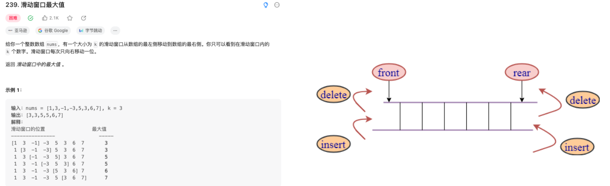

## 1、认识双端队列的特性

前端我们已经学习了队列(Queue)结构,它是一种受限的线性结构,并且限制非常的严格。

双端队列在单向队列的基础上解除了一部分限制:允许在队列的两端添加(入队)和删除(出队)元素。

- 因为解除了一部分限制,所以在解决一些特定问题时会更加的方便;
- 比如滑动窗口问题:https://leetcode.cn/problems/sliding-window-maximum/description/



## 2、双端队列的代码实现

```ts
class ArrayDeque<T> extends ArrayQueue<T> {
  addFront(value: T) {
    this.data.unshift(value);
  }
  removeBack(): T | undefined {
    return this.data.pop();
  }
}
```

## 3、认识优先级队列结构

优先级队列(Priority Queue)是一种比普通队列更加高效的数据结构。

- 它每次出队的元素都是具有最高优先级的,可以理解为元素按照关键字进行排序。
- 优先级队列可以用数组、链表等数据结构来实现,但是堆是最常用的实现方式。

优先级队列的应用

- 一个现实的例子就是机场登机的顺序
  - 头等舱和商务舱乘客的优先级要高于经济舱乘客。
  - 在有些国家,老年人和孕妇(或带小孩的妇女)登机时也享有高于其他乘客的优先级。
- 另一个现实中的例子是医院的(急诊科)候诊室。
  - 医生会优先处理病情比较严重的患者。
  - 当然, 一般情况下是按照排号的顺序。
- 计算机中, 我们也可以通过优先级队列来重新排序队列中任务的顺序
  - 比如每个线程处理的任务重要性不同, 我们可以通过优先级的大小, 来决定该线程在队列中被处理的次序.

## 4、优先级队列的实现一

优先级队列的实现方式一:创建优先级的节点,保存在堆结构中。

```ts
import Heap from "../09_堆结构Heap/06_堆结构Heap(二叉堆)";

// 1.封装PriorityNode
class PriorityNode<T> {
  priority: number;
  value: T;
  
  constructor(value: T, priority: number) {
    this.value = value;
    this.priority = priority;
  }

  valueOf() {
    return this.priority;
  }
}

// 2.创建PriorityQueue
class PriorityQueue<T> {
  private heap: Heap<PriorityNode<T>> = new Heap();

  enqueue(value: T, priority: number) {
    const newNode = new PriorityNode(value, priority);
    this.heap.insert(newNode);
  }

  dequeue(): T | undefined {
    return this.heap.extract()?.value;
  }

  peek(): T | undefined {
    return this.heap.peek()?.value;
  }

  isEmpty() {
    return this.heap.isEmpty();
  }

  size() {
    return this.heap.size();
  }
}

const pQueue = new PriorityQueue<string>();
pQueue.enqueue("why", 98);
pQueue.enqueue("kobe", 90);
pQueue.enqueue("james", 105);
while (!pQueue.isEmpty()) {
  console.log(pQueue.dequeue());
}
```

## 5、优先级队列的实现二

优先级队列的实现方式二:数据自身返回优先级的比较值。

```ts
import Heap from "../09_堆结构Heap/06_堆结构Heap(二叉堆)";

class PriorityQueue<T> {
  private heap: Heap<T> = new Heap();

  enqueue(value: T) {
    this.heap.insert(value);
  }

  dequeue(): T | undefined {
    return this.heap.extract();
  }

  peek(): T | undefined {
    return this.heap.peek();
  }

  isEmpty() {
    return this.heap.isEmpty();
  }

  size() {
    return this.heap.size();
  }
}

class Student {
  name: string;
  score: number;
  constructor(name: string, score: number) {
    this.name = name;
    this.score = score;
  }

  valueOf() {
    return this.score;
  }
}

const pQueue = new PriorityQueue<Student>();
pQueue.enqueue(new Student("why", 99));
pQueue.enqueue(new Student("kobe", 89));
pQueue.enqueue(new Student("james", 95));
pQueue.enqueue(new Student("curry", 88));

while (!pQueue.isEmpty()) {
  console.log(pQueue.dequeue());
}
```


