## 1、平衡的二叉搜索树

### 1.1、平衡树(Balanced Tree)

平衡树(Balanced Tree)是一种特殊的二叉搜索树:

- 其目的是通过一些特殊的技巧来维护树的高度平衡;
- 从而保证树的搜索、插入、删除等操作的时间复杂度都较低;

为什么需要平衡树呢?

- 如果一棵树退化成链状结构,那么搜索、插入、删除等操作的时间复杂度就会达到最坏情况,即O(n),因此不能满足要求。
- 平衡树通过不断调整树的结构,使得树的高度尽量平衡,从而保证搜索、插入、删除等操作的时间复杂度都较低,通常为O(logn)。
- 因此,如果我们需要高效地处理大量的数据,那么平衡树就显得非常重要了。

平衡树的应用非常广泛,如索引、内存管理、图形学等领域均有广泛使用。

比如我们连续的插入1、2、3、4、5、6的数字,那么前面的二叉搜索树最终形成的结构如下

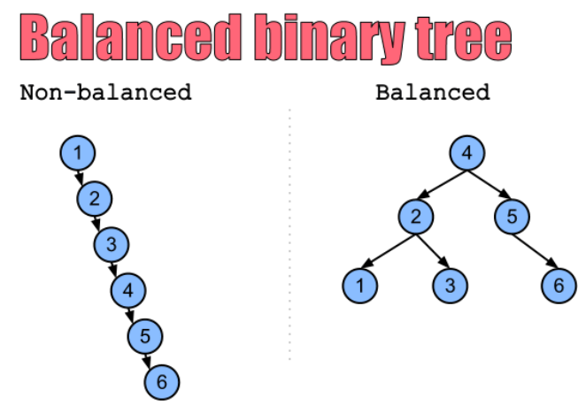

事实上不只是添加会导致树的不平衡,删除元素也可能会导致树的不平衡。

### 1.2、如何让树可以更加平衡呢?

方式一:限制插入、删除的节点(比如在树特性的状态下,不允许插入或者删除某些节点,不现实)

方式二:在随机插入或者删除元素后,通过某种方式观察树是否平衡,如果不平衡通过特定的方式(比如旋转),让树保持平衡。

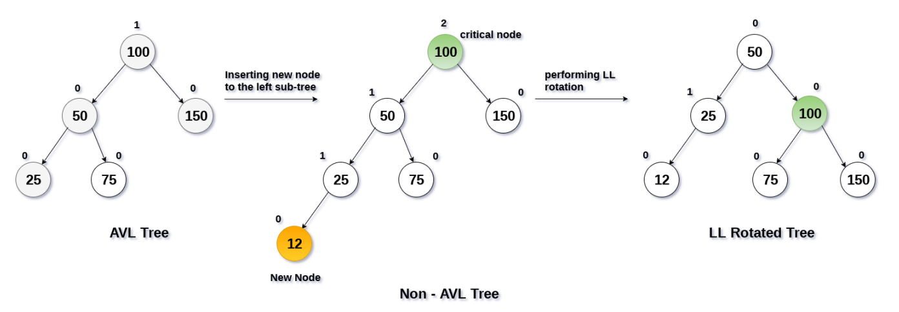

### 1.3、常见的平衡二叉搜索树

常见的平衡二叉搜索树有哪些呢?

- AVL树:这是一种最早的平衡二叉搜索树,在1962年由G.M. Adelson-Velsky和E.M. Landis发明。
- 红黑树:这是一种比较流行的平衡二叉搜索树,由R. Bayer在1972年发明。
- Splay树:这是一种动态平衡二叉搜索树,通过旋转操作对树进行平衡。
- Treap:这是一种随机化的平衡二叉搜索树,是二叉搜索树和堆的结合。
- B-树:这是一种适用于磁盘或其他外存存储设备的多路平衡查找树。

这些平衡二叉搜索树都用于保证搜索树的平衡,从而在插入、删除、查找操作时保证了较低的时间复杂度。

红黑树和AVL树是应用最广泛的平衡二叉搜索树:

- 红黑树:红黑树被广泛应用于实现诸如操作系统内核、数据库、编译器等软件中的数据结构,其原因在于它在插入、删除、查找操作时都具有较低的时间复杂度。
- AVL树:AVL树被用于实现各种需要高效查询的数据结构,如计算机图形学、数学计算和计算机科学研究中的一些特定算法。

## 2、AVL树介绍和特性

### 2.1、AVL树

AVL树(Adelson-Velsky and Landis Tree)是由G.M. Adelson-Velsky和E.M. Landis在1962年发明的

- 它是一种自(Self)平衡二叉搜索树。
- 它是二叉搜索树的一个变体,在保证二叉搜索树性质的同时,通过旋转操作保证树的平衡。

在AVL树中,每个节点都有一个权值,该权值代表了以该节点为根节点的子树的高度差。

- 在AVL树中,任意节点的权值只有1或-1或0,因此AVL树也被称为高度平衡树。
- 对于每个节点,它的左子树和右子树的高度差不超过1。
- 这使得AVL树具有比普通的二叉搜索树更高的查询效率。
- 当插入或删除节点时,AVL树可以通过旋转操作来重新平衡树,从而保证其平衡性。

AVL树的插入和删除操作与普通的二叉搜索树类似,但是在插入或者删除之后,需要继续保持树的平衡。

- AVL树需要通过旋转操作来维护平衡。
- 有四种情况旋转操作:左左情况、右右情况、左右情况和右左情况双旋。
- 具体使用哪一种旋转,要根据不同的情况来进行区分和判断。

由于AVL树具有自平衡性,因此其最坏情况下的时间复杂度仅O(log n)。

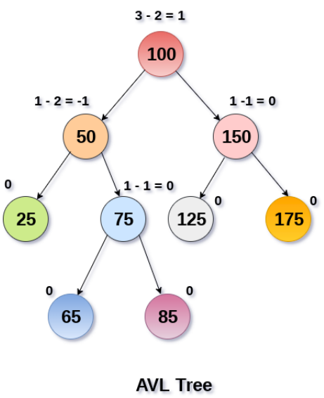

### 2.2、AVL树的旋转情况

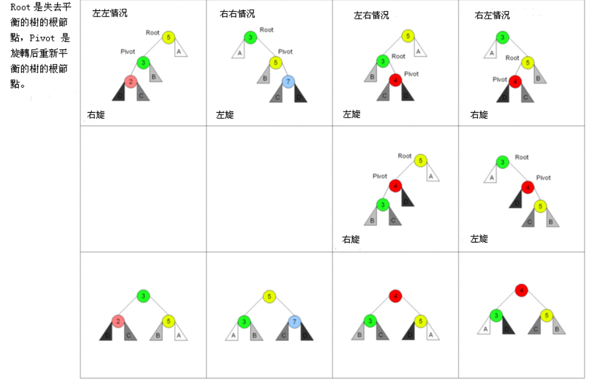

## 3、AVL树节点的封装

**AVLTreeNode – 节点的封装**

```ts
import { TreeNode } from "./00_二叉搜索树BSTree";

class AVLTreeNode<T> extends TreeNode<T> {
  // 保证获取到的left/right节点的类型是AVLTreeNode
  left: AVLTreeNode<T> | null = null;
  right: AVLTreeNode<T> | null = null;
  parent: AVLTreeNode<T> | null = null;

  /**
   * 获取每个节点的高度
   */
  private getHeight(): number {
    const leftHeight = this.left ? this.left.getHeight() : 0;
    const rightHeight = this.right ? this.right.getHeight() : 0;
    return Math.max(leftHeight, rightHeight) + 1;
  }

  /**
   * 权重: 平衡因子(左边height - 右边height)
   */
  private getBalanceFactor(): number {
    const leftHeight = this.left ? this.left.getHeight() : 0;
    const rightHeight = this.right ? this.right.getHeight() : 0;
    return leftHeight - rightHeight;
  }

  /**
   * 直接判断当前节点是否平衡
   */
  get isBalanced(): boolean {
    const factor = this.getBalanceFactor();
    return factor >= -1 && factor <= 1; // -1 0 1
  }

  /**
   * 获取更高子节点
   */
  public get higherChild(): AVLTreeNode<T> | null {
    const leftHeight = this.left ? this.left.getHeight() : 0;
    const rightHeight = this.right ? this.right.getHeight() : 0;

    if (leftHeight > rightHeight) return this.left;
    if (leftHeight < rightHeight) return this.right;
    return this.isLeft ? this.left : this.right;
  }
}
```

## 4、AVL左旋转右旋转

### 4.1、右旋转

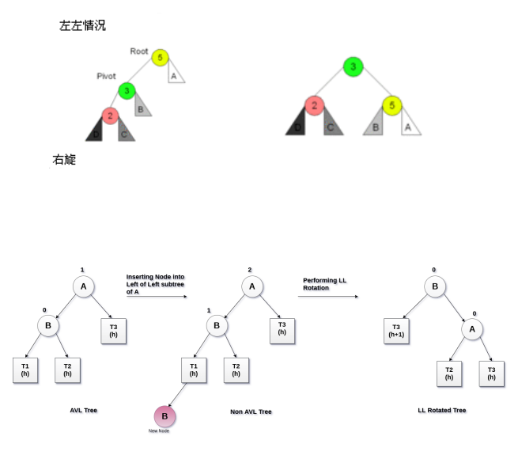

```ts
/**
 * 旋转操作: 右旋转
 */
rightRotation() {
  const isLeft = this.isLeft;
  const isRight = this.isRight;

  // 1.处理pivot节点
  const pivot = this.left!;
  pivot.parent = this.parent;

  // 2.处理pivot的right
  this.left = pivot.right;
  if (pivot.right) {
    pivot.right.parent = this;
  }

  // 3.处理this
  pivot.right = this;
  this.parent = pivot;

  // 4.挂载pivot
  if (!pivot.parent) {
    // pivot直接作为tree的根
    return pivot;
  } else if (isLeft) {
    // pivot作为父节点的左子节点
    pivot.parent.left = pivot;
  } else if (isRight) {
    // pivot作为父节点的右子节点
    pivot.parent.right = pivot;
  }

  return pivot;
}
```

实现步骤分析

- 处理pivot的位置
  1. 选择当前节点的左子节点作为旋转轴心(pivot)
  2. pivot的父节点指向this(root) 当前节点的父节点
- 处理pivot右节点的位置
  3. this(root)当前节点的左节点, 指向pivot的右节点
  4. 如果右节点有值, 那么右节点的父节点指向this节点
- 处理this节点的位置
  5. pivot的右节点指向this
  6. this节点的父节点指向pivot
  7. 判断是否有父节点, 父节点的left/right指向pivot

### 4.2、左旋转

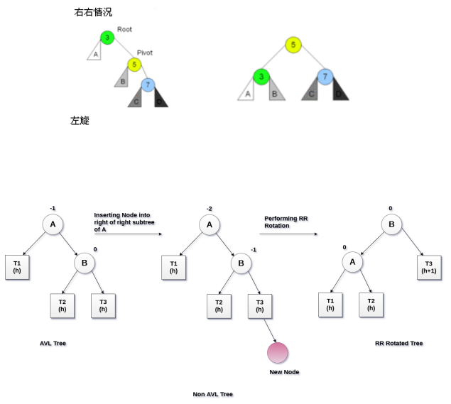

```ts
/**
 * 旋转操作: 左旋转
 */
leftRotation() {
  const isLeft = this.isLeft;
  const isRight = this.isRight;

  // 1.处理pivot
  const pivot = this.right!;
  pivot.parent = this.parent;

  // 2.处理pivot的left
  this.right = pivot.left;
  if (pivot.left) {
    pivot.left.parent = this;
  }

  // 3.处理root(this)
  pivot.left = this;
  this.parent = pivot;

  // 4.挂载整颗子树pivot
  if (!pivot.parent) {
    return pivot;
  } else if (isLeft) {
    pivot.parent.left = pivot;
  } else if (isRight) {
    pivot.parent.right = pivot;
  }

  return pivot;
}
```

实现步骤分析

1. 选择当前节点的右子节点作为旋转轴心(pivot)
2. pivot的父节点指向this(root)当前节点的父节点
3. this(root)当前节点的右节点, 指向pivot的左节点
4. 如果左节点有值, 那么左节点的父节点指向this节点
5. pivot的右节点指向this
6. this节点的父节点指向pivot
7. 判断是否有父节点, 父节点的left/right指向pivot

## 5、不同情况旋转代码

### 5.1、封装AVLTree

```ts
import { BSTree } from "./00_二叉搜索树BSTree";

class AVLTree<T> extends BSTree<T> {}
```

### 5.2、旋转的四种情况

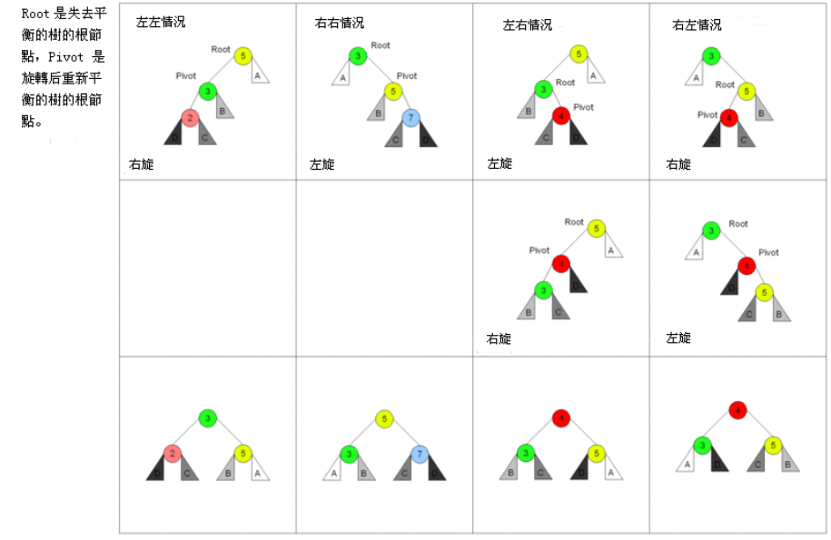

如何对AVL树进行旋转呢?

首先,我们需要先找到失衡的节点:

- 失衡的节点称之为grandParent
- 失衡节点的儿子(更高的儿子)称之为parent
- 失衡节点的孙子(更高的孙子)称之为current

如果从grandParent到current的是:

- LL:左左情况,那么右旋转;
- RR:右右情况,那么左旋转;
- LR:左右情况,那么先对parent进行左旋转,再对grandParent进行右旋转;
- RL:右左情况,那么先对parent进行右旋转,再对grandParent进行左旋转;

```ts
import { BSTree } from "./00_二叉搜索树BSTree";
import AVLTreeNode from "./04_封装AVLTreeNode(左旋转操作)";

class AVLTree<T> extends BSTree<T> {
  // 如何去找到不平衡的节点??? 先不管
  // 假设已经找到了, 那么我们如何让这个节点变的平衡
  /**
   * 根据不平衡的节点的情况(LL/RR/LR/RL)让子树平衡
   * @param root 找到的不平衡的节点
   */
  rebalance(root: AVLTreeNode<T>) {
    const pivot = root.higherChild;
    const current = pivot?.higherChild;

    let resultNode: AVLTreeNode<T> | null = null;
    if (pivot?.isLeft) {
      // L: left
      if (current?.isLeft) {
        // LL: left left
        resultNode = root.rightRotation();
      } else {
        // LR: left right
        pivot.leftRotation();
        resultNode = root.rightRotation();
      }
    } else {
      // R: right
      if (current?.isLeft) {
        // RL: right left
        pivot?.rightRotation();
        resultNode = root.leftRotation();
      } else {
        // RR: right right
        resultNode = root.leftRotation();
      }
    }

    // 判断返回的pivot是否有父节点
    if (!resultNode.parent) {
      this.root = resultNode;
    }
  }
}
```

## 6、AVL插入时的调整

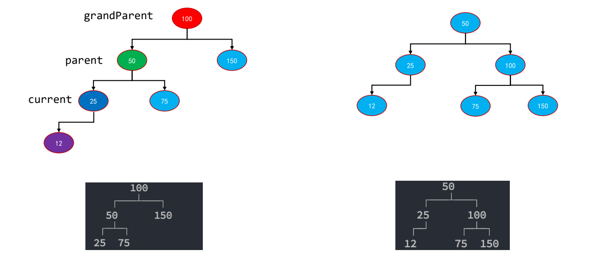

我们可以继续使用之前的插入操作,在插入完成后去检查树的平衡:

```ts
export class BSTree<T> {
  protected root: TreeNode<T> | null = null;

  protected createNode(value: T): TreeNode<T> {
    return new TreeNode(value);
  }

  protected checkBalance(node: TreeNode<T>, isAdd = true) {}

  /** 插入数据的操作 */
  insert(value: T) {
    // 1.根据传入value创建Node(TreeNode)节点
    const newNode = this.createNode(value);

    // 2.判断当前是否已经有了根节点
    if (!this.root) {
      // 当前树为空
      this.root = newNode;
    } else {
      // 树中已经有其他值
      this.insertNode(this.root, newNode);
    }

    // 3.检测树是否平衡
    this.checkBalance(newNode);
  }

  private insertNode(node: TreeNode<T>, newNode: TreeNode<T>) {
    if (newNode.value < node.value) {
      // 去左边继续查找空白位置
      if (node.left === null) {
        // node节点的左边已经是空白
        node.left = newNode;
        newNode.parent = node;
      } else {
        this.insertNode(node.left, newNode);
      }
    } else {
      // 去右边继续查找空白位置
      if (node.right === null) {
        node.right = newNode;
        newNode.parent = node;
      } else {
        this.insertNode(node.right, newNode);
      }
    }
  }
}
```

```ts
import { BSTree, TreeNode } from "./00_二叉搜索树BSTree";
import AVLTreeNode from "./04_封装AVLTreeNode(左旋转操作)";

class AVLTree<T> extends BSTree<T> {
  // 重写调用的createNode方法
  protected createNode(value: T): TreeNode<T> {
    return new AVLTreeNode(value);
  }

  // 如何去找到不平衡的节点
  checkBalance(node: AVLTreeNode<T>) {
    let current = node.parent;
    while (current) {
      if (!current.isBalanced) {
        this.rebalance(current);
      }
      current = current.parent;
    }
  }

  // 假设已经找到了, 那么我们如何让这个节点变的平衡
  /**
   * 根据不平衡的节点的情况(LL/RR/LR/RL)让子树平衡
   * @param root 找到的不平衡的节点
   */
  rebalance(root: AVLTreeNode<T>) {
    const pivot = root.higherChild;
    const current = pivot?.higherChild;

    let resultNode: AVLTreeNode<T> | null = null;
    if (pivot?.isLeft) {
      // L: left
      if (current?.isLeft) {
        // LL: left left
        resultNode = root.rightRotation();
      } else {
        // LR: left right
        pivot.leftRotation();
        resultNode = root.rightRotation();
      }
    } else {
      // R: right
      if (current?.isLeft) {
        // RL: right left
        pivot?.rightRotation();
        resultNode = root.leftRotation();
      } else {
        // RR: right right
        resultNode = root.leftRotation();
      }
    }

    // 判断返回的pivot是否有父节点
    if (!resultNode.parent) {
      this.root = resultNode;
    }
  }
}
```

## 7、AVL删除时的调整

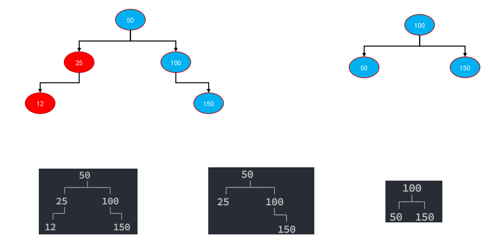

问题 – checkBalance传入谁?

- 很明显应该是删除的节点;
- 但是如果有两个子节点的情况,我们需要找的是前期和后继,最终是将前驱和后继位置的节点删除掉的; 
- 寻找的应该是从AVL树中被移除位置的节点;

情况一:删除节点本身是叶子节点

- 传入current节点即可,并且需要根据current节点的parent去寻找失衡节点;

情况二:删除节点只有一个子节点

- 传入current节点即可,并且需要根据current节点的parent去寻找失衡节点;

情况三:删除节点有两个子节点:

- 找到后继节点successor原来的位置,并且需要根据successor节点去寻找失衡节点;

这里的关键点是两个:

- 关键点一:必须要找到检测位置的节点; 
- 关键点二:检测位置的节点必须有父节点;

```ts
remove(value: T): boolean {
  // 1.搜索: 当前是否有这个value
  const current = this.searchNode(value);
  if (!current) return false;

  let delNode: TreeNode<T> = current;

  // 2.获取到三个东西: 当前节点/父节点/是属于父节点的左子节点, 还是右子节点
  let replaceNode: TreeNode<T> | null = null;
  if (current.left === null && current.right === null) {
    replaceNode = null;
  } else if (current.right === null) {
    replaceNode = current.left;
  } else if (current.left === null) {
    replaceNode = current.right;
  } else {
    const successor = this.getSuccessor(current);
    current.value = successor.value;
    delNode = successor;
    this.checkBalance(delNode, false);
    return true;
  }

  if (current === this.root) {
    this.root = replaceNode;
  } else if (current.isLeft) {
    current.parent!.left = replaceNode;
  } else {
    current.parent!.right = replaceNode;
  }

  // 判断replaceNode
  if (replaceNode && current.parent) {
    replaceNode.parent = current.parent;
  }

  // 删除完成后, 检测树是否平衡(传入的节点是那个真正从二叉树中被移除的节点)
  this.checkBalance(delNode, false);

  return true;
}
```

## 8、AVL再平衡的优化

目前我们rebalance的操作是哪些节点会执行呢?

- 插入节点的所有父节点(一直向上查找父节点);
- 删除节点的所有父节点(一直向上查找父节点);

但是 是否需要每次插入、删除都需要将所有的父节点都rebalance操作呢? 

- 这个取决于在插入一个节点后后,是否改变了祖父节点的高度;
- 这个取决于在删除一个节点后后,是否改变了祖父节点的高度;

我们得出结论:

- 插入节点,再平衡rebalance后不需要继续后续节点的再平衡rebalance ; 
- 删除节点,再平衡rebalance后需要继续后续节点的再平衡rebalance;

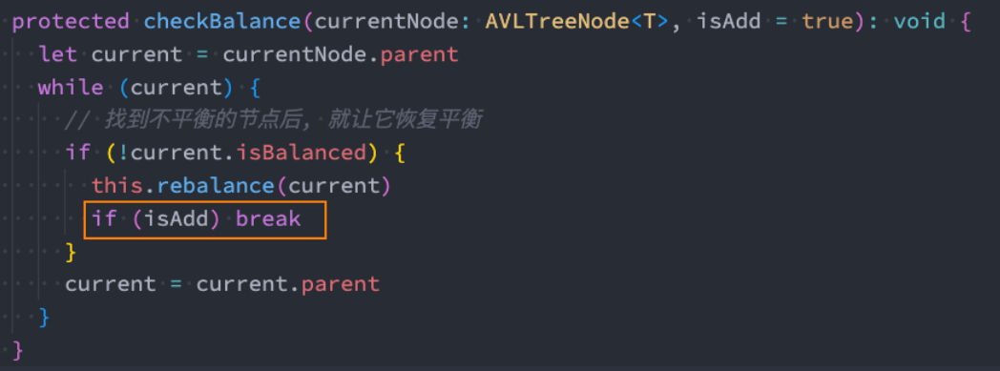

## 9、红黑树介绍和特性

### 9.1、邂逅 红黑树

首先,红黑树是数据结构中很难的一个知识点,难到什么程度呢? 

- 基本你跟别人聊数据结构的时候, 他不会和你聊红黑树, 因为它是数据结构中一个难点中的难点. 
- 数据结构的学习本来就比较难了, 红黑树是又将难度上升一个档次的知识点.

面试的时候经常出现这个场景:

- 面试官: 你知道红黑树吗?
- 面试者: 知道啊。
- 面试官: 知道原理吗?
- 面试者: 不知道啊。
- 面试官: 那你让‘不’过来面试我们公司吧,你先回去等通知吧。

哪些面试会出现红黑树呢?

- 在面试时基本不会让手写红黑树(即使是面试Google、Apple这样的公司,也很少会出现)。
- 通常是这样问题的(比如腾讯的一次面试题):为什么已经有平衡二叉树(比如AVL树)了,还需要红黑树呢?

### 9.2、红黑树的介绍

红黑树(英语:Red–black tree)是一种自平衡二叉查找树,是在计算机科学中用到的一种数据结构。

- 它在1972年由鲁道夫·贝尔发明,被称为“对称二叉B树”,它现代的名字源于Leo J. Guibas和罗伯特·塞奇威克于1978年写的一篇论文。

红黑树, 除了符合二叉搜索树的基本规则外, 还添加了一下特性:

1. 节点是红色或黑色。
2. 根节点是黑色。
3. 每个叶子节点都是黑色的空节点(NIL节点,空节点)。
   - 第三条性质要求每个叶节点(空节点)是黑色的
   - 这是因为在红黑树中,黑色节点的数量表示从根节点到叶子节点的黑色节点数量。
4. 每个红色节点的两个子节点都是黑色。(从每个叶子到根的所有路径上不能有两个连续的红色节点)
   - 第四条性质保证了红色节点的颜色不会影响树的平衡,同时保证了红色节点的出现不会导致连续的红色节点。
5. 从任一节点到其每个叶子的所有路径都包含相同数目的黑色节点。
   - 第五条性质是最重要的性质,保证了红黑树的平衡性。

这些规则会让人一头雾水

- 完成搞不懂规则叠加起来,怎么让一棵树平衡的。
- 但是它们还是被一些聪明的人发明出来了。

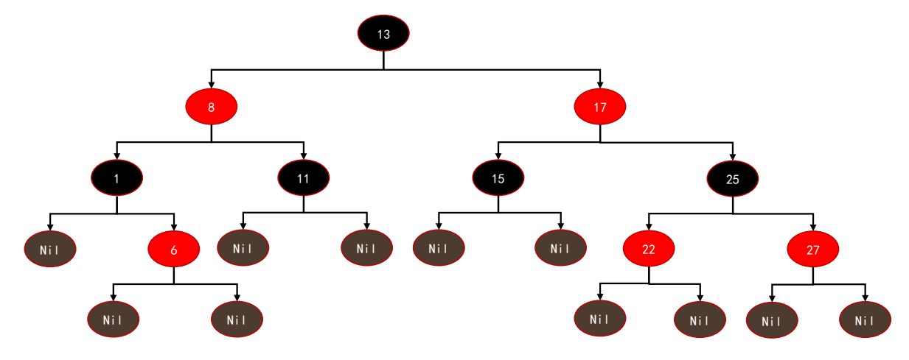

## 10、红黑树的相对平衡

前面的性质约束,确保了红黑树的关键特性:

- 从根到叶子的最长可能路径, 不会超过最短可能路径的两倍长。
- 结果就是这个树基本是平衡的.
- 虽然没有做到绝对的平衡,但是可以保证在最坏的情况下, 依然是高效的。

为什么可以做到 最长路径不超过最短路径的两倍 呢?

- 性质五决定了最短路径和最长路径必须有相同的黑色节点;
- 路径最短的情况:全部是黑色节点n;
- 路径最长的情况:黑色节点数量也是n,中间全部是红色节点n – 1; 
  - 性质二:根节点是黑节点;
  - 性质三:叶子节点都是黑节点;
  - 性质四:两个红色节点不能相连
- 最短路径为 n – 1(边的数量);
- 最长路径为 (n + n – 1) - 1 = 2n – 2;
- 所以 最长路径 一定不超过 最短路径的2倍;

## 11、红黑树的代码思路

手写一个 TypeScript 红黑树的详细步骤:

- 定义红黑树的节点:定义一个带有键、值、颜色、左子节点、右子节点和父节点的类; 
- 实现左旋操作:将一个节点向左旋转,保持红黑树的性质;
- 实现右旋操作:将一个节点向右旋转,保持红黑树的性质;
- 实现插入操作:在红黑树中插入一个新的节点,并保持红黑树的性质;
- 实现删除操作:从红黑树中删除一个节点,并保持红黑树的性质;
- 实现修复红黑树性质:在插入或删除操作后,通过旋转和变色来修复红黑树的性质; 
- 其他方法较为简单,可以自行实现;


## 12、红黑树的性能分析

事实上,红黑树的性能在搜索上是不如AVL树的,为什么呢?

我们来看一下右边的红黑树:

- 首先,它符合是一颗红黑树吗?符合。
- 这个时候我们插入 节点30,会被插入到哪里呢?
  - 27的右边,并且节点30是红色节点时,依然符合红黑树的性质。
- 也就是对于红黑树来说,它不需要进行任何操作;

那么AVL树会怎么样呢?

- 如果是AVL树必然要对17、25、27节点进行右旋转; 
- 事实上右旋转是一系列的操作;

但是红黑树的高度比AVL树要高:

- 所以如果同样是搜索30,那么红黑树需要搜索4次,AVL树搜索3次;
- 所以红黑树相当于牺牲了一点点的搜索性能,来提高了插入和删除的性能;

**AVL树和红黑树的选择**

AVL树和红黑树的性能对比:

- AVL树是一种平衡度更高的二叉搜索树,所以在搜索效率上会更高;
- 但是AVL树为了维护这种平衡性,在插入和删除操作时,通常会进行更多的旋转操作,所以效率相对红黑树较低; 
- 红黑树在平衡度上相较于AVL树没有那么严格,所以搜索效率上会低一些;
- 但是红黑树在插入和删除操作时,通常需要更少的旋转操作,所以效率相对AVL树较高;
- 它们的搜索、添加、删除时间复杂度都是O(logn),但是细节上会有一些差异;

开发中如何进行选择呢?

- 选择AVL树还是红黑树,取决于具体的应用需求。
- 如果需要保证每个节点的高度尽可能地平衡,可以选择AVL树。
- 如果需要保证删除操作的效率,可以选择红黑树。

在早期的时候,很多场景会选择AVL树,目前选择红黑树的越来越多(AVL树依然是一种重要的平衡树)。

- 比如操作系统内核中的内存管理;
- 比如Java的TreeMap、TreeSet底层的源码;


