## 1、排序算法的介绍

### 1.1、什么是排序?

排序(Sorting)是一个非常 非常 非常 常见的功能,在平时生活中也是随处可见的。

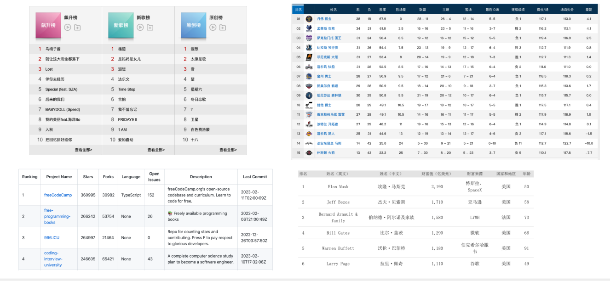

### 1.2、如何排序?

#### 1.2.1、人来排序

如何排序?

- 需求: 对一组身高不等的10个人进行排序

人来排序:

- 如果是人来排序事情会非常简单,因为人只要扫过去一眼就能看出来谁最高谁最低。
- 然后让最低(或者最高)的站在前面,其他人依次后移。
- 按照这这样的方法。 依次类推就可以了。

人排序的特点:

- 可以统筹全局,直接获取到最高或者最低的结果。
- 不需要考虑空间的问题,因为通常情况下都有足够的空间来相互推嚷。

人排序的缺点:

- 容易出错。
- 数据量非常庞大时,很难进行排序(比如有1000000的数据量)。

#### 1.2.2、计算机来排序

计算机来排序:

- 计算机有些笨拙,它只能执行指令,所以没办法一眼扫过去。
- 计算机也很聪明,只要你写出了正确的指令,可以让它帮你做无数次类似的事情而不用担心出现错误。
- 并且计算机排序也无需担心数据量的大小。
- (想象一下,让人排序10000个,甚至更大的数据项你还能一眼扫过去吗?)
- 人在排序时不一定要固定特有的空间,他们可以相互推推嚷嚷就腾出了位置,还能互相前后站立。
- 但是计算机必须有严密的逻辑和特定的指令。

计算机排序的特点:

- 计算机不能像人一样,一眼扫过去这样通览所有的数据。
- 它只能根据计算机的比较操作原理,在同一个时间对两个队员进行比较。
- 在人类看来很简单的事情,计算机的算法却不能看到全景。
- 因此,它只能一步步解决具体问题和遵循一些简单的规则。

### 1.3、认识排序算法

排序算法就是研究如何对数组进行高效排序的算法,也是在面试时非常常见的面试题型之一。

维基百科堆排序算法的解释:

- 在计算机科学与数学中,一个排序算法(英语:Sorting algorithm)是一种能将一串资料依照特定排序方式排列的算法。
- 虽然排序算法从名称来看非常容易理解,但是从计算机科学发展以来,在此问题上已经有大量的研究。

由于排序非常重要而且可能非常耗时,所以它已经成为一个计算机科学中广泛研究的课题

- 而且人们已经研究出一套成熟的方案来实现排序。
- 因此,幸运的是你并不需要是发明某种排序算法,而是站在巨人的肩膀上即可。

在计算机科学所使用的排序算法通常依以下标准分类:

- 计算的时间复杂度:使用大O表示法,也可以实际测试消耗的时间;
- 内存使用量(甚至是其他电脑资源):比如外部排序,使用磁盘来存储排序的数据; 
- 稳定性:稳定排序算法会让原本有相等键值的纪录维持相对次序;
- 排序的方法:插入、交换、选择、合并等等;

## 2、常见的排序算法

**常见的排序算法非常多: **

- 冒泡排序
- 选择排序
- 插入排序
- 归并排序
- 快速排序
- 堆排序
- 希尔排序
- 计数排序
- 桶排序
- 基数排序
- 内省排序
- 平滑排序

**排序算法的时间复杂度**

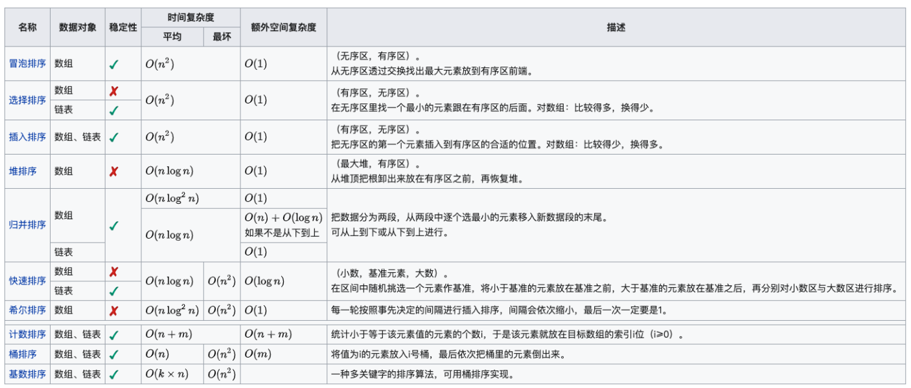

## 3、冒泡排序的实现

### 3.1、冒泡排序的定义

*从最简单的排序算法入手:冒泡排序。*

冒泡排序(Bubble Sort)是一种简单的排序方法。

- 基本思路是通过两两比较相邻的元素并交换它们的位置,从而使整个序列按照顺序排列。
- 该算法一趟排序后,最大值总是会移到数组最后面,那么接下来就不用再考虑这个最大值。
- 一直重复这样的操作,最终就可以得到排序完成的数组。

这个算法的名字由来是因为越大的元素会经由交换慢慢“浮”到数组的尾端,故名 “冒泡排序”

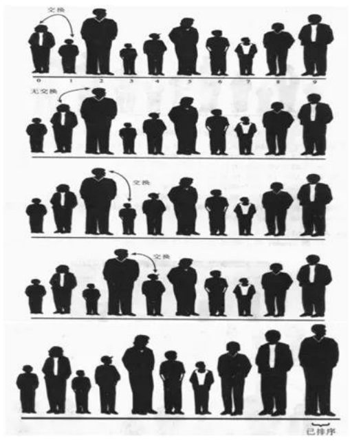

### 3.2、冒泡排序的流程

冒泡排序的流程如下:

- 从第一个元素开始,逐一比较相邻元素的大小。
- 如果前一个元素比后一个元素大,则交换位置。
- 在第一轮比较结束后,最大的元素被移动到了最后一个位置。
- 在下一轮比较中,不再考虑最后一个位置的元素,重复上述操作。
- 每轮比较结束后,需要排序的元素数量减一,直到没有需要排序的元素。
- 排序结束。
- 这个流程会一直循环,直到所有元素都有序排列为止。

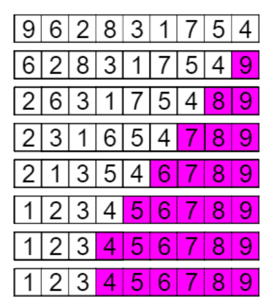

### 3.3、冒泡排序的图解

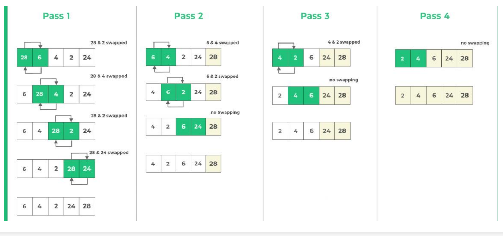

### 3.4、冒泡排序的实现

```ts
export default function bubbleSort(arr: number[]): number[] {
  const n = arr.length;
  // 外层for循环: 0~n-1
  for (let i = 0; i < n; i++) {
    let swapped = false;
    // 内层循环是找到最大值
    for (let j = 0; j < n - 1 - i; j++) {
      if (arr[j] > arr[j + 1]) {
        swap(arr, j, j + 1);
        swapped = true;
      }
    }
    if (!swapped) break;
  }
  return arr;
}
```

```ts
export function swap(arr: number[], i: number, j: number) {
  const temp = arr[i]
  arr[i] = arr[j]
  arr[j] = temp
}
```

### 3.5、排序测试工具编写

```ts
export function isSorted(arr: number[]): boolean {
  for (let i = 0; i < arr.length - 1; i++) {
    if (arr[i] > arr[i + 1]) return false;
  }
  return true;
}

// 编写一个工具, 直接帮助测试排序算法
type SortAlgoFn = (arr: number[]) => number[];
export function testSort(sortFn: SortAlgoFn) {
  // 1.随机一个长度为10的数组(数组中存放多个数字)
  const nums = Array.from({ length: 10 }, () => {
    return Math.floor(Math.random() * 200);
  });

  // 2.使用排序对数组进行排序
  console.log("排序前的原数组:", nums);
  const newNums = sortFn(nums);
  console.log("排序后的新数组:", newNums);
  console.log("是否排序后有正确的顺序?", isSorted(newNums));
}
```

### 3.6、冒泡排序的时间复杂度

在冒泡排序中,每次比较两个相邻的元素,并交换他们的位置,如果左边的元素比右边的元素大,则交换它们的位置。这样的比较和交换的过程可以用一个循环实现。

- 最好情况:O(n)
  - 即待排序的序列已经是有序的。
  - 此时仅需遍历一遍序列,不需要进行交换操作。
- 最坏情况:O(n^2)
  - 即待排序的序列是逆序的。
  - 需要进行n-1轮排序,每一轮中需要进行n-i-1次比较和交换操作。
- 平均情况:O(n^2)
  - 即待排序的序列是随机排列的。
  - 每一对元素的比较和交换都有1/2的概率发生,因此需要进行n-1轮排序,每一轮中需要进行n-i-1次比较和交换操作。

由此可见,冒泡排序的时间复杂度主要取决于数据的初始顺序,最坏情况下时间复杂度是O(n^2),不适用于大规模数据的排序。

### 3.7、总结

冒泡排序适用于数据规模较小的情况,因为它的时间复杂度为O(n^2),对于大数据量的排序会变得很慢。同时,它的实现简单,代码实现也容易理解,适用于学习排序算法的初学者。但是,在实际的应用中,冒泡排序并不常用,因为它的效率较低。因此,在实际应用中,冒泡排序通常被更高效的排序算法代替,如快速排序、归并排序等。

## 4、选择排序的实现

### 4.1、选择排序的定义

选择排序(Selection Sort)是一种简单的排序算法。

它的基本思想是:

- 首先在未排序的数列中找到最小(大)元素,然后将其存放到数列的起始位置;
- 接着,再从剩余未排序的元素中继续寻找最小(大)元素,然后放到已排序序列的末尾。
- 以此类推,直到所有元素均排序完毕。

选择排序的主要优点与数据移动有关。

- 如果某个元素位于正确的最终位置,则它不会被移动。
- 选择排序每次交换一对元素,它们当中至少有一个将被移到其最终位置上,因此对n个元素的表进行排序总共进行至多n-1次交换。
- 在所有的完全依靠交换去移动元素的排序方法中,选择排序属于非常好的一种。

选择排序的实现方式很简单,并且容易理解,因此它是学习排序算法的很好的选择。

### 4.2、选择排序的流程

选择排序的实现思路可以分为以下几个步骤:
1. 遍历数组,找到未排序部分的最小值
1 首先,将未排序部分的第一个元素标记为最小值
2 然后,从未排序部分的第二个元素开始遍历,依次和已知的最小值进行比较
3 如果找到了比最小值更小的元素,就更新最小值的位置
2. 将未排序部分的最小值放置到已排序部分的后面
1 首先,用解构赋值的方式交换最小值和已排序部分的末尾元素的位置
2 然后,已排序部分的长度加一,未排序部分的长度减一
3. 重复执行步骤 1 和 2,直到所有元素都有序

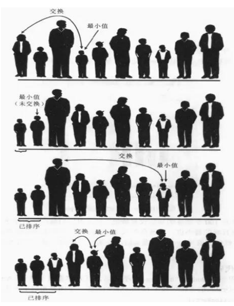

### 4.3、选择排序的图解

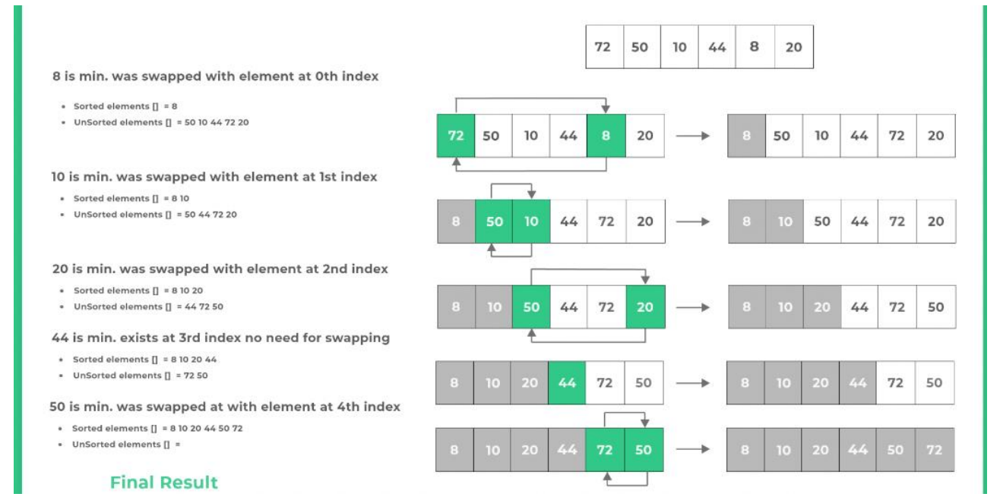

### 4.4、选择排序的实现

```ts
import { swap } from "hy-algokit";

export default function selectionSort(arr: number[]): number[] {
  const n = arr.length;
  // 外层循环作用: 经过多少论的找最小值
  for (let i = 0; i < n - 1; i++) {
    let minIndex = i;
    // 内层循环作用: 每次找到最小值
    for (let j = 1 + i; j < n; j++) {
      if (arr[j] < arr[minIndex]) {
        minIndex = j;
      }
    }
    // 只有不相等时, 才需要进行交换操作
    if (i !== minIndex) {
      swap(arr, i, minIndex);
    }
  }
  return arr;
}
```

### 4.5、选择排序的时间复杂度

选择排序的时间复杂度是比较容易分析的。

最好情况时间复杂度:O(n^2)

- 最好情况是指待排序的数组本身就是有序的。
- 在这种情况下,内层循环每次都需要比较 n-1 次,因此比较次数为 n(n-1)/2,交换次数为 0。
- 所以,选择排序的时间复杂度为 O(n^2)。

最坏情况时间复杂度:O(n^2)

- 最坏情况是指待排序的数组是倒序排列的。
- 在这种情况下,每次内层循环都需要比较 n-i-1 次,因此比较次数为 n(n-1)/2,交换次数也为 n(n-1)/2。
- 所以,选择排序的时间复杂度为 O(n^2)。

平均情况时间复杂度:O(n^2)

- 平均情况是指待排序的数组是随机排列的。
- 在这种情况下,每个元素在内层循环中的位置是等概率的,因此比较次数和交换次数的期望值都是 n(n-1)/4。
- 所以,选择排序的时间复杂度为 O(n^2)。

### 4.6、总结

虽然选择排序的实现非常简单,但是它的时间复杂度较高,对于大规模的数据排序效率较低。如果需要对大规模的数据进行排序,通常会选择其他更为高效的排序算法,例如快速排序、归并排序等。

总的来说,选择排序适用于小规模数据的排序和排序算法的入门学习,对于需要高效排序的场合,可以选择其他更为高效的排序算法。

## 5、插入排序的实现

### 5.1、插入排序的定义

插入排序就像我们打扑克牌时,摸到一张新牌需要插入到手牌中的合适位置一样。

- 我们会将新牌和手牌中已有的牌进行比较,找到一个合适的位置插入新牌。
- 如果新牌比某张牌小,那么我们就把这张牌向右移动一位,为新牌腾出位置。
- 一直比较直到找到一个合适的位置将新牌插入,这样就完成了一次插入操作。

与打牌类似,插入排序(Insertion sort)的实现方法是:

- 首先假设第一个数据是已经排好序的,接着取出下一个数据,在已经排好序的数据中从后往前扫描,找到比它小的数的位置,将该位置之后的数整体后移一个单位,然后再将该数插入到该位置。
- 不断重复上述操作,直到所有的数据都插入到已经排好序的数据中,排序完成。

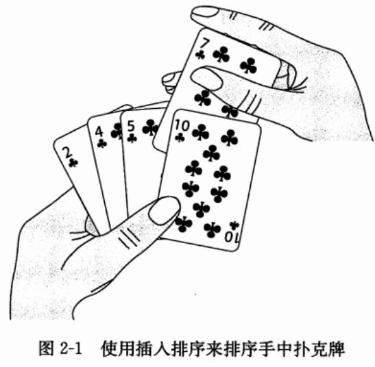

### 5.2、插入排序的流程

插入排序的流程如下:

1. 首先,假设数组的第一个元素已经排好序了,因为它只有一个元素,所以可以认为是有序的。
2. 然后,从第二个元素开始,不断与前面的有序数组元素进行比较。
3. 如果当前元素小于前面的有序数组元素,则把当前元素插入到前面的合适位置。
4. 否则,继续与前面的有序数组元素进行比较。
5. 以此类推,直到整个数组都有序。
6. 循环步骤2~5,直到最后一个元素。
7. 完成排序。

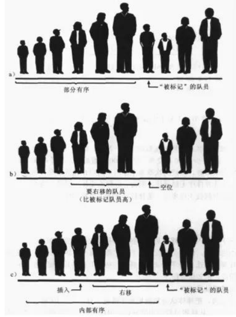

### 5.3、插入排序的图解

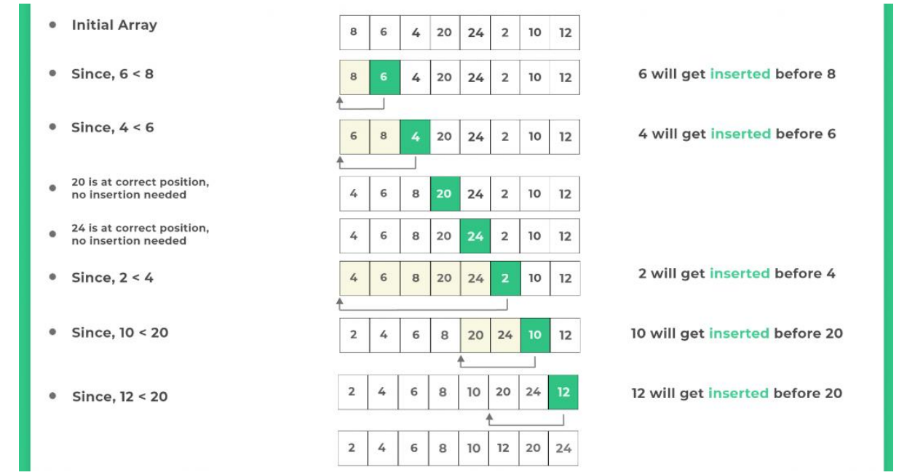

### 5.4、插入排序的实现

```ts
export default function insertionSort(arr: number[]): number[] {
  const n = arr.length;
  for (let i = 1; i < n; i++) {
    // 内层循环
    const newNum = arr[i];
    let j = i - 1;
    while (arr[j] > newNum && j >= 0) {
      arr[j + 1] = arr[j];
      j--;
    }
    arr[j + 1] = newNum;
  }
  return arr;
}
```

### 5.5、插入排序的复杂度分析

最好情况: O(n)

- 如果待排序数组已经排好序
- 那么每个元素只需要比较一次就可以确定它的位置,因此比较的次数为 n-1,移动的次数为 0。
- 所以最好情况下,插入排序的时间复杂度为线性级别,即 O(n)。

最坏情况: O(n^2)

- 如果待排序数组是倒序排列的
- 那么每个元素都需要比较和移动 i 次,其中 i 是元素在数组中的位置。
- 因此比较的次数为 n(n-1)/2,移动的次数也为 n(n-1)/2。
- 所以最坏情况下,插入排序的时间复杂度为平方级别,即 O(n^2)。

平均情况:

- 对于一个随机排列的数组,插入排序的时间复杂度也为平方级别,即 O(n^2)。

总而言之,如果数组部分有序,插入排序可以比冒泡排序和选择排序更快。

- 但是如果数组完全逆序,则插入排序的时间复杂度比较高,不如快速排序或归并排序。

### 5.6、总结

插入排序是一种简单直观的排序算法,它的基本思想就是将待排序数组分为已排序部分和未排序部分,然后将未排序部分的每个元素插入到已排序部分的合适位置。插入排序的时间复杂度为 O(n^2),虽然这个复杂度比较高,但是插入排序的实现非常简单,而且在某些情况下性能表现也很好比如,如果待排序数组的大部分元素已经排好序,那么插入排序的性能就会比较优秀。

总之,插入排序虽然没有快速排序和归并排序等高级排序算法的复杂性和高效性,但是它的实现非常简单,而且在一些特定的场景下表现也很好。

## 6、归并排序的实现

### 6.1、归并排序的定义

归并排序(merge sort)是一种常见的排序算法:

- 它的基本思想是将待排序数组分成若干个子数组。
- 然后将相邻的子数组归并成一个有序数组。
- 最后再将这些有序数组归并(merge)成一个整体有序的数组。

这个算法最早出现在1945年,由约翰·冯·诺伊曼(John von Neumann)(又一个天才,现代计算机之父,冯·诺依曼结构、普林斯顿结构)首次提出。

- 当时他在为美国政府工作,研究原子弹的问题。
- 由于当时计算机,他在研究中提出了一种高效计算的方法,这个方法就是归并排序。

归并排序的基本思路是先将待排序数组递归地拆分成两个子数组,然后对每个子数组进行排序, 最后将两个有序子数组合并成一个有序数组。

- 在实现中,我们可以使用“分治法”来完成这个过程,即将大问题分解成小问题来解决。

归并排序的算法复杂度为 O(nlogn),是一种比较高效的排序算法,因此在实际应用中被广泛使用。

虽然归并排序看起来比较复杂,但是只要理解了基本思路,实现起来并不困难,而且它还是一个非常有趣的算法。

### 6.2、归并排序的思路

归并排序是一种基于分治思想的排序算法,其基本思路可以分为三个步骤:

步骤一:分解(Divide):归并排序使用递归算法来实现分解过程,具体实现中可以分为以下几个步骤: 

- 如果待排序数组长度为1,认为这个数组已经有序,直接返回;
- 将待排序数组分成两个长度相等的子数组,分别对这两个子数组进行递归排序;
- 将两个排好序的子数组合并成一个有序数组,返回这个有序数组。

步骤二:合并(Merge):合并过程中,需要比较每个子数组的元素并将它们有序地合并成一个新的数组:

- 可以使用两个指针 i 和 j 分别指向两个子数组的开头,比较它们的元素大小,并将小的元素插入到新的有序数组中。
- 如果其中一个子数组已经遍历完,就将另一个子数组的剩余部分直接插入到新的有序数组中。
- 最后返回这个有序数组。

步骤三:归并排序的递归终止条件:

- 归并排序使用递归算法来实现分解过程,当子数组的长度为1时,认为这个子数组已经有序,递归结束。

总体来看,归并排序的基本思路是分治法,分成子问题分别解决,然后将子问题的解合并成整体的解。

### 6.3、归并排序的图解

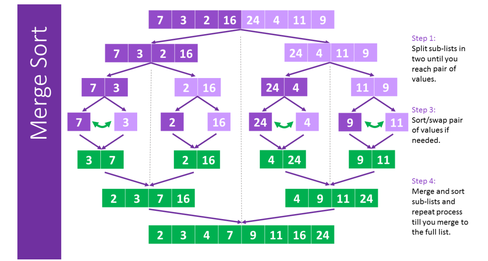

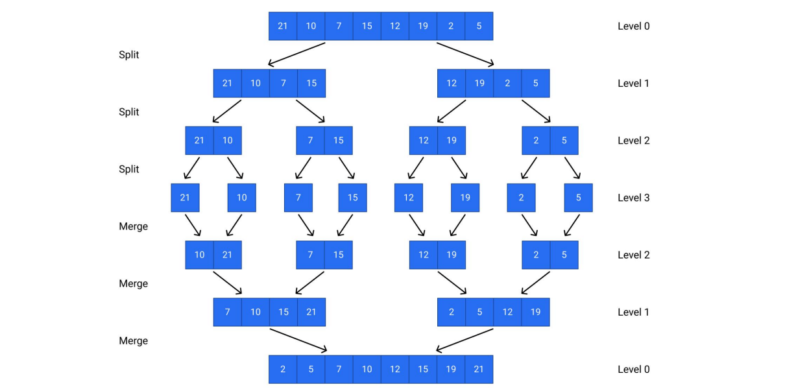

### 6.4、归并排序的实现

```ts
export default function mergeSort(arr: number[]): number[] {
  if (arr.length <= 1) return arr;

  // 1.分解(divide): 对数组进行分解(分解成两个小数组)
  // 8 / 2 = 4
  // 1.1. 切割数组
  const mid = Math.floor(arr.length / 2);
  const leftArr = arr.slice(0, mid);
  const rightArr = arr.slice(mid);

  // 1.2.递归的切割leftArr和rightArr
  const newLeftArr = mergeSort(leftArr);
  const newRightArr = mergeSort(rightArr);

  // 2.合并(merge): 将两个子数组进行合并(双指针)
  // 2.1.定义双指针
  const newArr: number[] = [];
  let i = 0;
  let j = 0;
  while (i < newLeftArr.length && j < newRightArr.length) {
    if (newLeftArr[i] <= newRightArr[j]) {
      newArr.push(newLeftArr[i]);
      i++;
    } else {
      newArr.push(newRightArr[j]);
      j++;
    }
  }

  // 2.2.判断是否某一个数组中还有剩余的元素
  // 循环完左边还有剩余
  if (i < newLeftArr.length) {
    newArr.push(...newLeftArr.slice(i));
  }
  // 循环完右边还有剩余
  if (j < newRightArr.length) {
    newArr.push(...newRightArr.slice(j));
  }

  // 3.将合并后的数组返回
  return newArr;
}
```

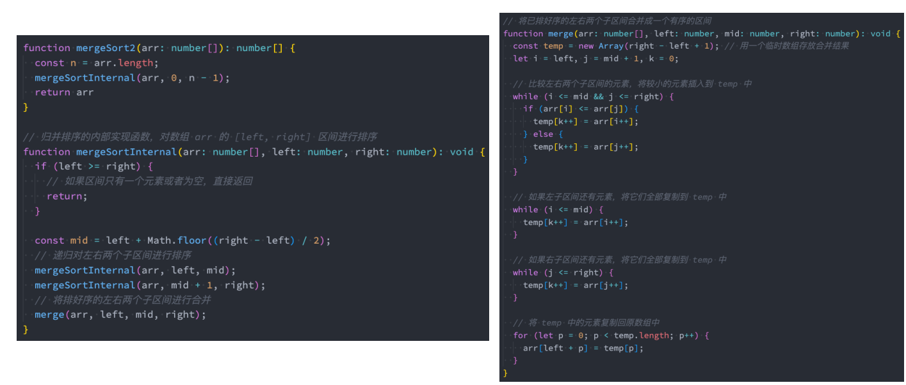

### 6.5、归并排序的复杂度分析

复杂度的分析过程:

- 假设数组长度为 n,需要进行 logn 次归并操作;
- 每次归并操作需要 O(n) 的时间复杂度;
- 因此,归并排序的时间复杂度为 O(nlogn)。

最好情况: O(log n)

- 最好情况下,待排序数组已经是有序的了,那么每个子数组都只需要合并一次,即只需要进行一次归并操作。
- 因此,此时的时间复杂度是 O(log n)。

最坏情况: O(nlogn)

- 最坏情况下,待排序数组是逆序的,那么每个子数组都需要进行多次合并。
- 因此,此时的时间复杂度为 O(nlogn)。

平均情况: O(nlogn)

- 在平均情况下,我们假设待排序数组中任意两个元素都是等概率出现的。
- 此时,可以证明归并排序的时间复杂度为 O(nlogn)。

### 6.6、总结

归并排序是一种非常高效的排序算法,它的核心思想是分治,即将待排序数组分成若干个子数组,分别对这些子数组进行排序, 最后将排好序的子数组合并成一个有序数组。归并排序的时间复杂度为 O(nlogn),并且在最好、最坏和平均情况下都可以达到这个时间复杂度。虽然归并排序看起来比较复杂,但是只要理解了基本思路,实现起来并不困难,而且它是一种非常高效的排序算法。

## 7、快速排序的实现

### 7.1、快速排序的介绍

快速排序( Quicksort )是一种经典的排序算法,有时也被称为“划分交换排序”(partition-exchange sort) ,它的发明人是一位名叫 Tony Hoare (东尼·霍尔)的计算机科学家。

- Tony Hoare 在1960年代初期发明了快速排序,是在一份ALGOL60 (一种编程语言,作者也是)手稿中。
- 为了让稿件更具可读性,他采用了这种新的排序算法。
- 当时,快速排序还没有正式命名,后来被 Tony Hoare 命名为 quicksort, 也就是快速排序的意思。
- 由于快速排序的思想非常巧妙,因此在计算机科学中得到了广泛的应用。

虽然它的名字叫做“快速排序”,但并不意味着它总是最快的排序算法, 它的实际运行速度取决于很多因素,如输入数据的分布情况、待排序数组的长度等等。

### 7.2、快速排序的定义

快速排序(Quick Sort)是一种基于分治思想的排序算法:

- 基本思路是将一个大数组分成两个小数组,然后递归地对两个小数组进行排序。
- 具体实现方式是通过选择一个基准元素(pivot),将数组分成左右两部分,左部分的元素都小于或等于基准元素,右部分的元素都大于基准元素。
- 然后,对左右两部分分别进行递归调用快速排序,最终将整个数组排序。

快速排序是一种原地排序算法,不需要额外的数组空间。

- 同时,快速排序的时间复杂度是 O(nlogn),在最坏情况下是 O(n^2)。
- 但是这种情况出现的概率非常小,因此快速排序通常被认为是一种非常高效的排序算法。

虽然快速排序看起来比较复杂,但是只要理解了基本思路,实现起来并不困难。

### 7.3、快速排序的思路分析

快速排序的思路可以分解成以下几个步骤:

1. 首先,我们需要选择一个基准元素,通常选择第一个或最后一个元素作为基准元素。
2. 然后,我们定义两个指针 i 和 j,分别指向数组的左右两端。
3. 接下来,我们从右侧开始,向左移动 j 指针,直到找到一个小于或等于基准元素的值。
4. 然后,我们从左侧开始,向右移动 i 指针,直到找到一个大于或等于基准元素的值。
5. 如果 i 指针小于或等于 j 指针,交换 i 和 j 指针所指向的元素。
6. 重复步骤 3-5,直到 i 指针大于 j 指针,这时,我们将基准元素与 j 指针所指向的元素交换位置,将基准元素放到中间位置。
7. 接着,我们将数组分为两部分,左侧部分包含小于或等于基准元素的元素,右侧部分包含大于基准元素的元素。
8. 然后,对左右两部分分别进行递归调用快速排序,直到左右两部分只剩下一个元素。
9. 最终,整个数组就变得有序了。

### 7.4、快速排序的图解

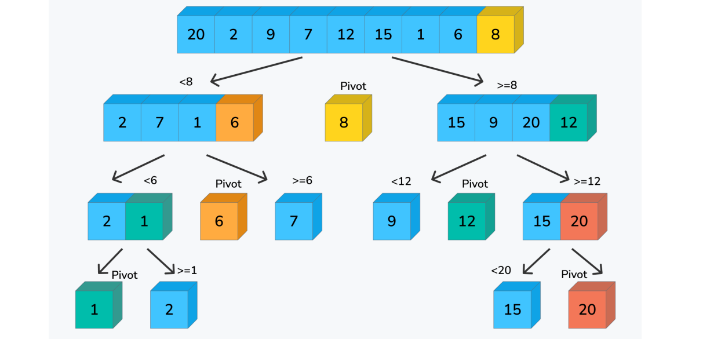

### 7.5、快速排序实现

```ts
export default function quickSort(arr: number[]): number[] {
  partition(0, arr.length - 1);

  function partition(left: number, right: number) {
    if (left >= right) return;

    // 1.找到基准元素(pivot轴心)
    const pivot = arr[right];

    // 2.双指针进行交换操作(左边都是比pivot小的数字, 右边都是比pivot大的数字)
    let i = left;
    let j = right - 1;

    while (i <= j) {
      // 找到一个比pivot大的元素
      while (arr[i] < pivot) {
        i++;
      }
      // 找到一个比pivot小的元素
      while (arr[j] > pivot) {
        j--;
      }

      // 说明我们已经找到了(比pivot大的元素i)和(比pivot小的j的元素)
      if (i <= j) {
        swap(arr, i, j);
        i++;
        j--;
      }
    }

    // 将pivot放在正确的位置
    swap(arr, i, right);

    // 左右继续划分区域(partition)
    partition(left, j); // 左边区域划分
    partition(i + 1, right);
  }

  return arr;
}
```

### 7.6、快速排序的复杂度分析

快速排序的时间复杂度主要取决于基准元素的选择、数组的划分、递归深度等因素。

下面是快速排序的复杂度算法分析过程:

最好情况: O(nlogn)

- 当每次划分后,两部分的大小都相等,即基准元素恰好位于数组的中间位置,此时递归的深度为 O(log n)。
- 每一层需要进行 n 次比较,因此最好情况下的时间复杂度为 O(nlogn)。

最坏情况: O(n^2)

- 当每次划分后,其中一部分为空,即基准元素是数组中的最大或最小值,此时递归的深度为 O(n)。
- 每一层需要进行 n 次比较,因此最坏情况下的时间复杂度为 O(n^2)。
- 需要注意的是,采用三数取中法或随机选择基准元素可以有效避免最坏情况的发生。

平均情况: O(nlogn)

- 在平均情况下,每次划分后,两部分的大小大致相等,此时递归的深度为 O(log n)
- 每一层需要进行大约 n 次比较,因此平均情况下的时间复杂度为 O(nlogn)。

需要注意的是,快速排序是一个原地排序算法,不需要额外的数组空间。

### 7.7、总结

快速排序的性能优于许多其他排序算法,因为它具有良好的局部性和使用原地排序的优点。

- 它在大多数情况下的时间复杂度为 O(n log n),但在最坏情况下会退化到 O(n^2)。
- 为了避免最坏情况的发生,可以使用一些优化策略,比如随机选择基准元素和三数取中法。

总之,快速排序是一种高效的排序算法,它在实践中被广泛使用。

## 8、堆排序的实现

### 8.1、堆排序的定义

堆排序(Heap Sort)是堆排序是一种基于比较的排序算法,它的核心思想是使用二叉堆来维护一个有序序列。

- 二叉堆是一种完全二叉树,其中每个节点都满足父节点比子节点大(或小)的条件。
- 在堆排序中,我们使用最大堆来进行排序,也就是保证每个节点都比它的子节点大。

在堆排序中,我们首先构建一个最大堆。

- 然后,我们将堆的根节点(也就是最大值)与堆的最后一个元素交换,这样最大值就被放在了正确的位置上。
- 接着,我们将堆的大小减小一,并将剩余的元素重新构建成一个最大堆。
- 我们不断重复这个过程,直到堆的大小为 1。
- 这样,我们就得到了一个有序的序列。

堆排序和选择排序有一定的关系,因为它们都利用了“选择”这个基本操作。

- 选择排序的基本思想是在待排序的序列中选出最小(或最大)的元素,然后将其放置到序列的起始位置。
- 堆排序也是一种选择排序算法,它使用最大堆来维护一个有序序列,然后不断选择出最大的值。

堆排序的时间复杂度为 O(nlogn)。

注意:学习堆排序之前最好先理解堆结构,这样更有利于对堆排序的理解。

### 8.2、堆排序的思路分析

堆排序可以分成两大步骤:构建最大堆和排序

- 构建最大堆:
  1. 遍历待排序序列,从最后一个非叶子节点开始,依次对每个节点进行调整。
  2. 假设当前节点的下标为 i,左子节点的下标为 2i+1,右子节点的下标为 2i+2,父节点的下标为 (i-1)/2。
  3. 对于每个节点 i,比较它和左右子节点的值,找出其中最大的值,并将其与节点 i 进行交换。
  4. 重复进行这个过程,直到节点 i 满足最大堆的性质。
  5. 依次对每个非叶子节点进行上述操作,直到根节点,这样我们就得到了一个最大堆。
- 排序:
  1. 将堆的根节点(也就是最大值)与堆的最后一个元素交换,这样最大值就被放在了正确的位置上。
  2. 将堆的大小减小一,并将剩余的元素重新构建成一个最大堆。
  3. 重复进行步骤 1 和步骤 2,直到堆的大小为 1,这样我们就得到了一个有序的序列。

### 8.3、堆排序的图解

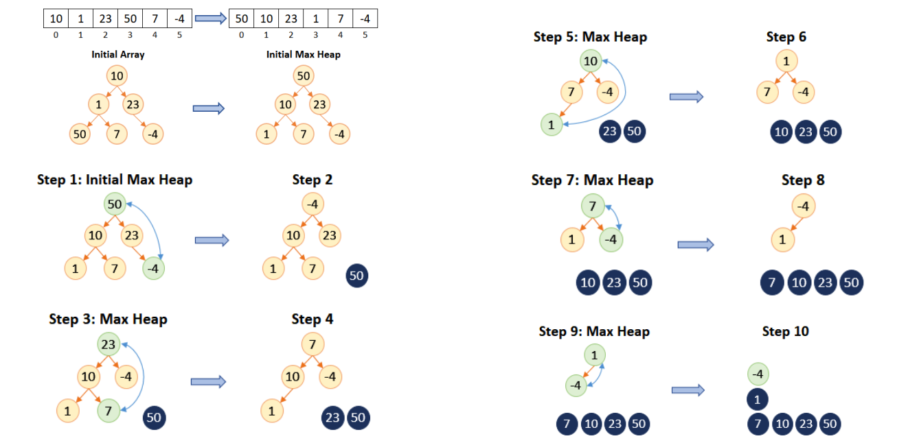

### 8.4、堆排序的实现

```ts
export default function heapSort(arr: number[]): number[] {
  // 1.获取数组的长度
  const n = arr.length;

  // 2.对arr进行原地建堆
  // 2.1. 从第一个非叶子节点开始进行下滤操作
  const start = Math.floor(n / 2 - 1);
  for (let i = start; i >= 0; i--) {
    // 2.2. 进行下滤操作
    heapifyDown(arr, n, i);
  }
  // 3.对最大堆进行排序的操作
  for (let i = n - 1; i > 0; i--) {
    swap(arr, 0, i);
    heapifyDown(arr, i, 0);
  }

  return arr;
}

/**
 * 下滤操作函数
 * @param arr 在数组中进行下滤操作
 * @param n 下滤操作的范围
 * @param index 哪一个位置需要进行下滤操作
 */
function heapifyDown(arr: number[], n: number, index: number) {
  while (2 * index + 1 < n) {
    // 1.获取左右子节点的索引
    const leftChildIndex = 2 * index + 1;
    const rightChildIndex = 2 * index + 2;

    // 2.找出左右子节点较大的值
    let largerIndex = leftChildIndex;
    if (rightChildIndex < n && arr[rightChildIndex] > arr[leftChildIndex]) {
      largerIndex = rightChildIndex;
    }

    // 3.判断index位置的值比更大的子节点, 直接break
    if (arr[index] >= arr[largerIndex]) {
      break;
    }

    // 4.和更大位置的进行交换操作
    swap(arr, index, largerIndex);
    index = largerIndex;
  }
}
```

### 8.5、堆排序的复杂度分析

堆排序的时间复杂度分析较为复杂,因为它既涉及到堆的建立过程,也涉及到排序过程。

下面我们分别对这两个步骤的时间复杂度进行分析。

步骤一:堆的建立过程

- 堆的建立过程包括 n/2 次堆的向下调整操作,因此它的时间复杂度为 O(n log n)。

步骤二:排序过程

- 排序过程需要执行 n 次堆的删除最大值操作,每次操作都需要将堆的最后一个元素与堆顶元素交换,然后向下 调整堆。
- 每次向下 调整操作的时间复杂度为 O(log n),因此整个排序过程的时间复杂度为 O(n log n)。

综合起来,堆排序的时间复杂度为 O(n log n)。

需要注意的是,堆排序的空间复杂度为 O(1),因为它只使用了常数个辅助变量来存储堆的信息。

### 8.6、总结

堆排序是一种高效的排序算法,它利用堆这种数据结构来实现排序。堆排序具有时间复杂度为 O(n log n) 的优秀性能,并且由于它只使用了常数个辅助变量来存储堆的信息,因此空间复杂度为 O(1)。但是,由于堆排序的过程是不稳定的,即相同元素的相对位置可能会发生变化,因此在某些情况下可能会导致排序结果不符合要求。

总的来说,堆排序是一种高效的、通用的排序算法,它适用于各种类型的数据,并且可以应用于大规模数据的排序。

## 9、希尔排序的实现

### 9.1、希尔排序的介绍

希尔排序( Shell Sort )是一种创新的排序算法,它的名字来源于它的发明者Donald Shell (唐纳德·希尔),1959年,希尔排序算法诞生了。

在简单排序算法诞生后的很长一段时间内,人们不断尝试发明各种各样的排序算法,但是当时的排序算法的时间复杂度都是O(N²),看起来很难超越。

- 当时计算机学术界充满了 “排序算法不可能突破O(N²)” 的声音,这与人类100米短跑不可能突破10秒大关的想法一样。
- 这是因为很多著名的排序算法,如冒泡排序、选择排序、插入排序等,它们的时间复杂度都是 O(N²) 级别的。
- 因此,人们普遍认为,除非发生突破性的创新,否则排序算法的时间复杂度是不可能达到O(N log N) 级别的。

在这种情况下,希尔排序的提出成为了一种重要的突破。

- 希尔排序利用了分组和插入排序的思想,通过不断缩小间隔的方式,让数据不断地接近有序状态,从而达到了较高的排序效率。
- 希尔排序的时间复杂度不仅低于 O(N²),而且可以通过调整步长序列来进一步优化。这一突破性的创新引起了广泛的关注和研究,也为后来的排序算法研究提供了重要的借鉴。

### 9.2、插入排序的回顾

回顾插入排序的过程:

- 由于希尔排序基于插入排序,所以有必须回顾一下前面的插入排序。
- 我们设想一下,在插入排序执行到一半的时候,标记符左边这部分数据项都是排好序的,而标识符右边的数据项是没有排序的。
- 这个时候,取出指向的那个数据项,把它存储在一个临时变量中,接着,从刚刚移除的位置左边第一个单元开始,每次把有序的数据项向右移动一个单元,直到存储在临时变量中的数据项可以成功插入。

插入排序的问题:

- 假设一个很小的数据项在很靠近右端的位置上,这里本来应该是较大的数据项的位置。
- 把这个小数据项移动到左边的正确位置,所有的中间数据项都必须向右移动一位。
- 如果每个步骤对数据项都进行N次移动,平均下来是移动N/2,N个元素就是 N*N/2 = N²/2。
- 所以我们通常认为插入排序的效率是O(N²)
- 如果有某种方式,不需要一个个移动所有中间的数据项,就能把较小的数据项移动到左边,那么这个算法的执行效率就会有很大的改进。

### 9.3、希尔排序的思路

希尔排序的做法:

- 比如下面的数字,81,94,11,96,12,35,17,95,28,58,41,75,15。
- 我们先让间隔为5,进行排序。 (35,81),(94,17),(11,95),(96,28),(12,58),(35,41),(17,75),(95,15)
  - 排序后的新序列,一定可以让数字离自己的正确位置更近一步。
- 我们再让间隔位3,进行排序。 (35,28,75,58,95),(17,12,15,81),(11,41,96,94)
  - 排序后的新序列,一定可以让数字离自己的正确位置又近了一步。
- 最后,我们让间隔为1,也就是正确的插入排序。 这个时候数字都离自己的位置更近,那么需要复制的次数一定会减少很多。

### 9.4、希尔排序的增量

希尔排序的基本思想是利用分组插入排序的思想,通过不断缩小间隔来让数据逐步趋于有序。它的步骤思路如下: 

1. 定义一个增量序列 d1, d2, ..., dk,一般选择增量序列最后一个元素为1,即 dk=1;
2. 以 dk 为间隔将待排序的序列分成 dk 个子序列,对每个子序列进行插入排序;
3. 缩小增量,对缩小后的每个子序列进行插入排序,直到增量为1。

其中,第一步的增量序列的选择比较重要,增量序列的不同选择会影响到排序效率的好坏。目前比较常用的增量序列有希尔增量、Hibbard增量、Knuth增量等。

以希尔增量为例,希尔增量的计算方法为:dk = floor(n/2^k),其中,k 为增量序列的元素下标,n 为待排序序列的长度。当 k=0 时,dk=1。

### 9.5、希尔排序的实现

```ts
// 希尔排序
export default function shellSort(arr: number[]): number[] {
  const n = arr.length;

  // 选择不同的增量(步长/间隔)
  let gap = Math.floor(n / 2);

  // 6 - 3 - 1
  // 1.第一层循环: 不断改变步长的过程
  while (gap > 0) {
    // 获取到不同的gap, 使用gap进行插入排序
    // 2.第二层循环: 找到不同的数列集合进行插入排序的操作
    for (let i = gap; i < n; i++) {
      let j = i;
      const num = arr[i];

      // 第三层循环: while循环, 对数列进行插入排序的过程
      // 使用num向前去找到一个比num小的值
      while (j > gap - 1 && num < arr[j - gap]) {
        arr[j] = arr[j - gap];
        j = j - gap;
      }

      arr[j] = num;
    }

    gap = Math.floor(gap / 2);
  }

  return arr;
}
```

### 9.6、希尔排序的复杂度

希尔排序的效率

- 希尔排序的效率很增量是有关系的。
- 但是,它的效率证明非常困难,甚至某些增量的效率到目前依然没有被证明出来。
- 但是经过统计,希尔排序使用原始增量,最坏的情况下时间复杂度为O(N²),通常情况下都要好于O(N²)

Hibbard 增量序列

- 增量的算法为2^k - 1。 也就是为1 3 5 7。。。等等。
- 这种增量的最坏复杂度为O(N^3/2),猜想的平均复杂度为O(N^5/4),目前尚未被证明。

Sedgewick增量序列

- {1,5,19,41,109,... },该序列中的项或者是9*4^i - 9*2^i + 1或者是4^i - 32^i + 1 
- 这种增量的最坏复杂度为O(N^4/3),平均复杂度为O(N^7/6),但是均未被证明。

总之,我们使用希尔排序大多数情况下效率都高于简单排序。

### 9.7、希尔排序的实现( Hibbard 增量)

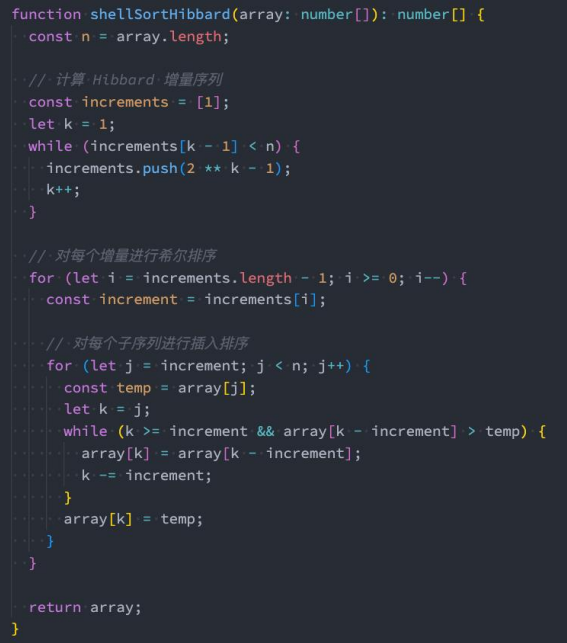

### 9.8、总结

希尔排序是一种改进版的插入排序,从历史的角度来看,它是一种非常非常重要的排序算法,因为它解除了人们对原有排序的固有认知。希尔排序的时间复杂度取决于步长序列的选择,目前最优的步长序列还没有被证明,因此希尔排序的时间复杂度依然是一个开放的问题。但是现在已经有很多更加优秀的排序算法:归并排序、快速排序等,所以从实际的应用角度来说,希尔排序已经使用的非常非常少了。

因为,我们只需要了解其核心思想即可。

## 10、排序算法面试题

https://leetcode.cn/problems/sort-an-array/

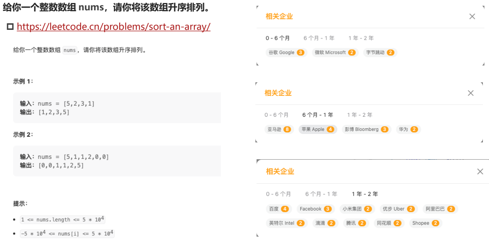


