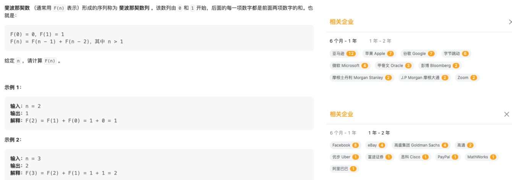
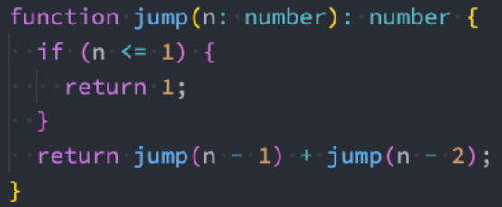
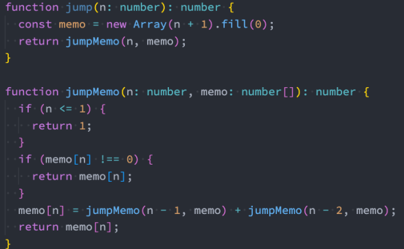
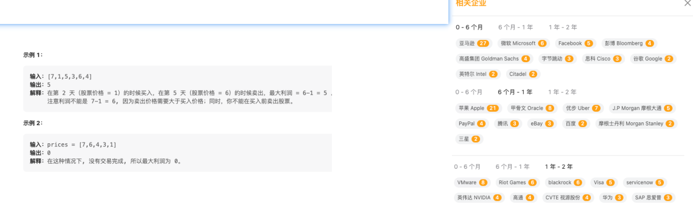
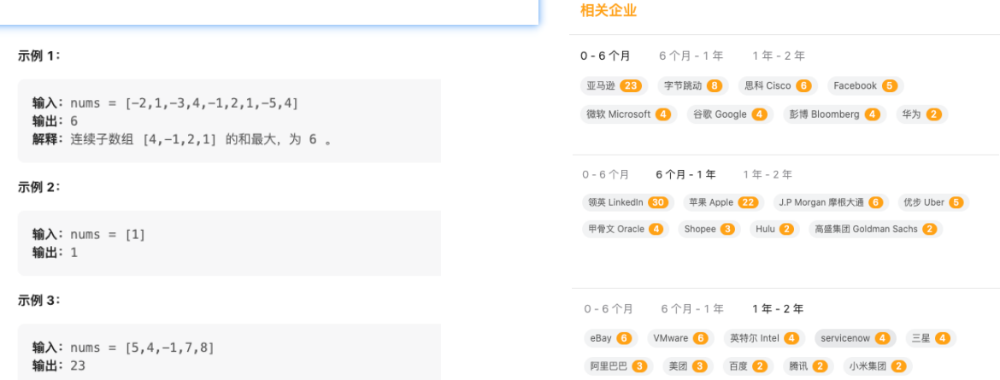
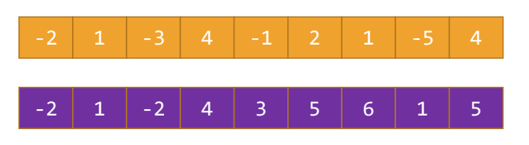
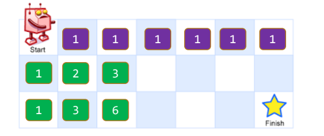

## 1、认识动态规划DP

### 1.1、认识动态规划

什么是动态规划?维基百科的解释

- 动态规划(英语:Dynamic programming,简称DP)是一种在数学、管理科学、计算机科学、经济学和生物信息学中使用的, 通过把原问题分解为相对简单的子问题的方式求解复杂问题的方法。

动态规划的名字来源于20世纪50年代的一个美国数学家 Richard Bellman。

- 他在处理一类具有重叠子问题和最优子结构性质的问题时,想到了一种“动态”地求解问题的方法。
- 它通过将问题划分为若干个子问题,并在计算子问题的基础上,逐步构建出原问题的解。
- 他使用“动态规划”这个术语来描述这种方法,并将它应用于各种领域,如控制论、经济学、运筹学等。

动态规划(Dynamic Programming,可以简称DP)是一个非常重要的算法思想:

- 在算法竞赛、数据结构、机器学习等领域中,动态规划都是必不可少的知识之一。

动态规划也是互联网大厂和算法竞赛中非常喜欢考察的一类题目:

- 因为通过动态规划可以很好的看出一个人的思考问题的能力、逻辑的强度、程序和算法的设计等等。
- 那么通过学习动态规划,可以提高算法设计和分析的能力,为解决复杂问题提供强有力的工具和思路。

### 1.2、动态规划的解题思路

动态规划的核心思想是“将问题划分为若干个子问题,并在计算子问题的基础上,逐步构建出原问题的解”。

具体地说,动态规划通常涉及以下四个步骤:

- 步骤一:定义状态。
  - 将原问题划分为若干个子问题,定义状态表示子问题的解,通常使用一个数组或者矩阵来表示。
- 步骤二:确定状态转移方程。
  - 在计算子问题的基础上,逐步构建出原问题的解。
  - 这个过程通常使用“状态转移方程”来描述,表示从一个状态转移到另一个状态时的转移规则。
- 步骤三:初始化状态。
- 步骤四:计算原问题的解(最终答案)。
  - 通过计算状态之间的转移,最终计算出原问题的解。
  - 通常使用递归或者迭代(循环)的方式计算。

 这四个步骤是动态规划的核心思想,其中状态定义和状态转移方程是动态规划的关键。

## 2、斐波那契数列求解

509斐波那契数https://leetcode.cn/problems/fibonacci-number/



### 2.1、如何开始动态规划

从一个最简单的算法:斐波那契数列开始。

斐波那契数列是一个经典的数列,在自然界中很多地方都可以找到,它的定义如下:

- 第 0 个和第 1 个斐波那契数分别为0和1,即 F0 = 0, F1 = 1。
- 从第 2 个数开始,每个斐波那契数都是它前面两个斐波那契数之和,即F2 = F0 + F1,F3 = F1 + F2,F4 = F2 + F3,以此类推。

那么我们来看一下,如果我们要求斐波那契数列第N个数的值。

那么我们有多少种求解的办法呢?

- 方式一:递归算法
- 方式二:记忆化搜索
- 方式三:动态规划的方案
- 方式四:动态规划 – 状态压缩

### 2.2、递归求解

递归算法是一种基本的算法思想:

- 其基本思想是将一个大问题拆分成若干个相似的小问题。
- 然后通过解决这些小问题来解决整个大问题。

递归算法通常采用函数自身调用的方式实现,每次调用函数时都会处理一个规模更小的问题,直到问题规模足够小,可以直接求解为止。

```ts
function fib(n: number): number {
  if (n <= 1) return n;
  return fib(n - 1) + fib(n - 2);
}
```

当 n 小于等于 1 时,直接返回 n;否则,递归调用 fibonacci 函数来计算 n-1 和 n-2 两个子问题的结果,然后将它们相加得到结果。

递归函数必须有一个终止条件,以确保递归过程能够结束。

### 2.3、记忆化搜索

对于递归算法,很容易出现重复计算的问题,因为在计算同一个子问题时,可能会被重复地计算多次。

为了避免这个问题,我们可以使用记忆化搜索(Memoization)的技巧,将已经计算过的结果保存下来,以便在后续的计算中直接使用。

下面是一个使用记忆化搜索优化的斐波那契数列实现,它可以避免重复计算,提高计算效率:

```ts
function fib(n: number, memo: number[] = []): number {
  if (n <= 1) return n;

  // 求n的值, 直接拿到值返回即可
  if (memo[n]) {
    return memo[n];
  }

  // 没有从meno中获取到值
  const res = fib(n - 1, memo) + fib(n - 2, memo);
  memo[n] = res; // 将n位置的结果存储到memo中

  return res;
}
```

这个实现和前面的递归实现非常相似,只是增加了一个 memo 参数,用于保存已经计算过的结果。

- 在实际应用中,记忆化搜索可以极大地提高递归算法的效率,特别是对于有大量重复计算的问题,优化效果尤为明显。
- 这种解法也可以称之为自顶向下的解法;

### 2.4、动态规划

从上面的斐波那契数列的例子中,我们可以发现,通过记忆化搜索的方式,可以避免重复计算,提高计算效率。

而动态规划(Dynamic Programming)算法就是一种利用历史状态信息来避免重复计算的算法。

- 动态规划算法可以看作是记忆化搜索的一种扩展,它通常采用自底向上的方式计算子问题的结果,并将结果保存下来以便后续的计算使用。
- 在动态规划算法中,通常需要明确定义状态、设计状态转移方程、初始化状态,以及确定计算顺序等。

下面我们可以以斐波那契数列为例,介绍如何用动态规划算法来解决这个问题:

```ts
function fib(n: number): number {
  // n位置的值: (n-1) + (n-2)
  const memo: number[] = [];
  for (let i = 0; i <= n; i++) {
    // 初始化状态0和1位置对应的数字是0和1
    if (i <= 1) {
      memo[i] = i;
      continue;
    }
    // i = 0 memo[0] = 0
    // i = 1 memo[1] = 1
    // i = 2 memo[2] = 1
    // i = 3 memo[3] = 2
    memo[i] = memo[i - 1] + memo[i - 2];
  }
  return memo[n];
}
```

```ts
function fib(n: number): number {
  // 1.定义状态
  // dp保留斐波那契数列中每一个位置对应的值(状态)
  // dp[x]表示的就是x位置对应的值(状态)
  // 2.状态转移方程: dp[i] = dp[i-1] + dp[i-2]
  // 状态转移方程一般情况都是写在循环(for/while)中
  // 3.设置初始化状态: dp[0]/dp[1]初始化状态
  // 4.计算最终的结果

  // 1.定义状态
  const dp: number[] = [];
  // 2.初始化状态
  dp[0] = 0;
  dp[1] = 1;
  for (let i = 2; i <= n; i++) {
    // 3.状态转移方程
    dp[i] = dp[i - 1] + dp[i - 2];
  }
  // 4.计算最终的结果
  return dp[n];
}
```

需要注意的是,在动态规划算法中,为了保证状态之间的依赖关系正确,通常需要按照一定的计算顺序来计算子问题的结果。

对于斐波那契数列问题来说,我们采用自底向上的方式计算子问题的结果,确保 dp[i-1] 和 dp[i-2] 的值已经计算出来了,才能计算 dp[i] 的值。

### 2.5、动态规划(状态压缩)

在动态规划算法中,有一种常见的优化方法叫做状态压缩,可以将状态的存储空间从数组优化为一个常数。

对于斐波那契数列问题来说,我们只需要保存 dp[i-1] 和 dp[i-2] 两个状态的值,就能够计算出 dp[i] 的值,因此可以使用两个变量来存储这两个状态的值,从而实现状态压缩的优化。

以下是使用状态压缩优化后的代码:

```ts
function fib(n: number): number {
  if (n <= 1) return n;

  // 1.定义状态和2.初始化状态
  let prev = 0;
  let cur = 1;

  for (let i = 2; i <= n; i++) {
    // 3.状态转移方程
    const newValue = prev + cur;
    prev = cur;
    cur = newValue;
  }
  // 4.计算最终的结果
  return cur;
}
```

这个实现和前面的动态规划实现相比,减少了存储空间的使用,优化了空间复杂度。

### 2.6、动态规划的统一解题步骤

- 步骤一:定义状态:
  - 明确状态的含义,通常需要使用一个或多个变量来表示状态。
  - 状态表示问题的解空间中的某个状态。
- 步骤二:找到状态转移方程:
  - 根据题目的要求和状态的定义,写出状态转移方程。
  - 状态转移方程表示的是从当前状态到下一个状态的转移规律,是动态规划算法的核心。
- 步骤三:确定初始状态:
  - 确定状态转移过程中的初始状态,也就是问题的边界。
  - 初始状态是转移方程的基础,也是状态转移的起点。
- 步骤四:计算最终状态:
  - 根据状态转移方程和初始状态,计算出最终状态的值。
  - 最终状态是问题的解,也是状态转移的终点。

## 3、跳台阶的问题求解

### 3.1、跳台阶的问题

假设你正在爬楼梯。需要 n 阶你才能到达楼顶。

- 每次你可以爬 1 或 2 个台阶。你有多少种不同的方法可以爬到楼顶呢? 
- https://leetcode.cn/problems/climbing-stairs/description/


### 3.2、暴力递归

对于跳台阶问题,假设有 n 级台阶,我们要求出到达第 n 级台阶的不同跳法数量。

- 可以发现,从第 n 级台阶只能由第 n-1 级台阶或第 n-2 级台阶跳上来;
- 因此,到达第 n 级台阶的跳法数量等于到达第 n-1 级台阶的跳法数量加上到达第 n-2 级台阶的跳法数量; 
- 即:jump(n) = jump(n-1) + jump(n-2)
- 对于 n=0 和 n=1 的情况,跳法数量分别为 1 和 1



### 3.3、记忆化搜索

在介绍完暴力递归之后,我们可以引入记忆化搜索(Memoization)的方式进行优化。

- 对于跳台阶问题,我们可以使用一个长度为 n+1 的数组 memo,用来记录每个阶梯的跳法数量。
- 初始时,我们将 memo 数组中所有元素都初始化为 0。
- 然后在递归过程中,如果 memo[n] 已经被计算过,直接返回 memo[n]。
- 否则计算 memo[n] 的值,并将其存储到 memo[n] 中。



### 3.4、动态规划

我们可以使用一个一维数组来记录跳台阶的结果。

我们可以定义一个长度为 n+1 的一维数组 dp,用来记录每个阶梯的跳法数量。

- 初始时,我们将 dp 数组中所有元素都初始化为 0;
- 然后设置 dp[0] = 1,dp[1] = 1,表示到达第 0 级台阶和第 1 级台阶时,只有 1 种跳法。
- 接下来,我们可以使用循环,依次计算 dp[2]、dp[3]、...、dp[n] 的值,最终得到 dp[n] 即为答案。

```ts
function jump(n: number): number {
  // 1.定义状态
  // dp = [每一阶台阶不同的方法]
  // dp[3] = xx
  // 2.确定状态转移方程
  // dp[i] = dp[i-1] + dp[i-2]
  // 3.初始化状态
  // dp[0] = 1
  // dp[1] = 1
  // 思考: dp[2] = 2
  // 思考: dp[3] = 3
  // 思考: dp[4] = 2 + 3 = 5
  // 4.最终的答案: dp[n]
  // 1.定义状态
  const dp: number[] = [];
  // 2.初始化状态
  dp[0] = 1;
  dp[1] = 1;
  // 3.状态转移方程
  for (let i = 2; i <= n; i++) {
    dp[i] = dp[i - 1] + dp[i - 2];
  }

  return dp[n];
}
```

### 3.5、滚动数组(滑动窗口)

另外一种常见的优化方法是滚动数组(滑动窗口)的方式。

滚动数组的基本思想是:

- 由于每个状态只与它之前的状态有关。
- 因此我们不需要记录所有的状态,只需要记录当前状态和它之前的若干个状态即可。
- 通过不断更新这个滚动窗口,可以避免使用额外的空间,将空间复杂度进一步降低。

```ts
function jump(n: number): number {
  // 1.定义状态
  let pre = 1;
  let cur = 1;

  // 3.状态转移方程
  for (let i = 2; i <= n; i++) {
    const iValue = pre + cur;
    pre = cur;
    cur = iValue;
  }

  return cur;
}
```

使用滚动数组的方式,可以将算法的空间复杂度降到 O(1),是一种非常高效的动态规划优化方式。

## 4、股票买卖的最大值

121买卖股票的最佳时机
https://leetcode.cn/problems/best-time-to-buy-and-sell-stock/

给定一个数组 prices ,它的第 i 个元素 prices[i] 表示一支给定股票第 i 天的价格。你只能选择 某一天 买入这只股票,并选择在 未来的某一个不同的日子 卖出该股票。设计一个算法来计算你所能获取的最大利润。返回你可以从这笔交易中获取的最大利润。如果你不能获取任何利润,返回 0 。



### 4.1、动态规划的实现思路

定义状态:设 dp[i] 表示前 i 天中能够获取的最大利润。

状态转移方程:

- 对于第 i 天,有两种情况:
  - 在第 i 天卖出股票,在第i天的价格 减去 之前最便宜那天的买入价格,因此可以得到利润为prices[i] - minPrice;
  - 在第 i 天不卖出股票,那么目前的最大利润依然是前一天的最大利润 dp[i-1]。

- 可以得到状态转移方程为:dp[i] = max(dp[i-1], prices[i] - minPrice)

初始状态:由于最小的天数是 1,因此初始状态为dp[0] = 0。

计算最终状态:最后一天保留下来的最大利润的值。

```ts
function maxProfit(prices: number[]): number {
  // 1.定义状态: dp[i]
  // * 到i天能获取到的最大收益是多少
  // 2.状态转移方程
  // dp[i] = max(dp[i - 1], price[i] - minPrice)
  // 3.初始化状态: dp[0] = 0
  // 4.获取最后一次的值 dp[n-1]
  const n = prices.length;
  if (n <= 1) return 0;

  // 1.定义状态
  const dp: number[] = [];
  // 2.设置初始化值
  dp[0] = 0;
  // 3.状态转移方程求dp[i]
  let minPrice = prices[0];
  for (let i = 1; i < n; i++) {
    // 当前i位置 - 前一个最小值
    dp[i] = Math.max(prices[i] - minPrice, dp[i - 1]);
    minPrice = Math.min(prices[i], minPrice);
  }

  return dp[n - 1];
}
```

### 4.2、状态压缩

对于这个问题,实际上可以进行状态压缩。

由于在状态转移方程中,当前状态只与前一个状态有关,因此可以不用维护整个 dp 数组,只需要用一个变量来表示前一个状态的最大利润即可。

```ts
function maxProfit(prices: number[]): number {
  const n = prices.length;
  if (n <= 1) return 0;

  // 1.定义状态
  // const dp: number[] = []
  // 2.设置初始化值
  let preValue = 0;
  // 3.状态转移方程求dp[i]
  let minPrice = prices[0];
  for (let i = 1; i < n; i++) {
    // 当前i位置 - 前一个最小值
    // 这里可以压缩的原因: i位置的值, 只和前一个位置有关系
    preValue = Math.max(prices[i] - minPrice, preValue);
    minPrice = Math.min(prices[i], minPrice);
  }

  return preValue;
}
```

## 5、求最大子数组的和

53最大子数组和  https://leetcode.cn/problems/maximum-subarray/
给你一个整数数组 nums ,请你找出一个具有最大和的连续子数组(子数组最少包含一个元素),返回其最大和。
子数组 是数组中的一个连续部分。



### 5.1、动态规划的实现思路



动态规划的规律:

- 以每个位置结尾的最大子序列的计算方式:
  - 如果前面的子序列是负数,那么最大子序列和一定是自己; 
  - 如果前面的子序列是正数,那么最大子序列和是自己+前值; 
- 由此可以得出计算公式:
  - dp[i] = max(dp[i-1] + nums[i], nums[i])
- 初始化值:dp[0] = nums[0]
- 计算最终值:找出所有值中最大的值即可

```ts
function maxArray(nums: number[]): number {
  // 1.定义状态 dp[i]
  // * 以i位置的元素结尾的连续数组能获取到的最大值
  // dp[0] = 3
  // dp[1] = 8
  // dp[2] = 9
  // dp[3] = -1
  // dp[4] = max(nums[i], dp[3] + nums[i])
  // dp[4] = max(8, -1 + 8  = 7) = nums[i] = 8
  // dp[5] = -4
  // dp[6] = 10

  // 2.状态转移方程
  // dp[i] = max(num[i], dp[i-1] + nums[i])

  // 3.初始化状态 dp[0] = 3

  // 4.最终值 遍历整个dp获取到最大的值

  // 1.获取数组的长度
  const n = nums.length;

  // 2.定义状态
  const dp: number[] = [];

  // 3.初始化状态
  dp[0] = nums[0];

  // 4.状态转移的过程
  for (let i = 1; i < n; i++) {
    dp[i] = Math.max(nums[i], nums[i] + dp[i - 1]);
  }

  return Math.max(...dp);
}
```

### 5.2、状态压缩的优化

在动态规划算法中,我们需要定义一个一维数组 dp,其中dp[i] 表示以第 i 个元素结尾的子数组的最大和。
 根据动态转移方程 dp[i] = max(dp[i-1] + nums[i], nums[i]), 我们可以计算出 dp 数组中的每个元素,从而求解原问题。
 这个算法的空间复杂度为 O(n)。

然而,我们可以发现,dp 数组中的每个元素只与前一个元素有关。

因此,我们可以使用滚动数组的技巧,将一维数组 dp 压缩成一个变量 maxSum,从而将空间复杂度优化为 O(1)。

```ts
function maxArray(nums: number[]): number {
  // 1.获取数组的长度
  const n = nums.length;
  let preValue = nums[0];

  // 4.状态转移的过程
  let max = preValue;
  for (let i = 1; i < n; i++) {
    preValue = Math.max(nums[i], nums[i] + preValue);
    max = Math.max(preValue, max);
  }

  return max;
}
```

## 6、不同的路径的数量

62不同路径  https://leetcode.cn/problems/unique-paths/description/
一个机器人位于一个 m x n 网格的左上角 (起始点在下图中标记为 “Start” )。
机器人每次只能向下或者向右移动一步。机器人试图达到网格的右下角(在下图中标记为 “Finish” )。
问总共有多少条不同的路径?


### 6.1、动态规划的实现思路

这个题目和跳楼梯其实是一类题目。

- 设 dp[i][j] 表示从起点到网格的 (i, j) 点的不同路径数。
- 对于每个格子,由于机器人只能从上面或左边到达该格子, 因此有以下两种情况:
  - 从上面的格子到达该格子,即 dp[i][j] = dp[i-1][j];
  - 从左边的格子到达该格子,即 dp[i][j] = dp[i][j-1]。
    - 因此,到达网格的 (i, j) 点的不同路径数就等于到达上面格子的路径数加上到达左边格子的路径数。
  - 动态转移方程为:dp[i][j] = dp[i-1][j] + dp[i][j-1];
- 初始状态:对于边界情况,起点的路径数为 1,即 dp[0][0] = 1。
- 计算最终状态:dp[m-1][n-1]



```ts
```


###  6.2、不同路径的组合数学

我们可以使用组合数学的方法,通过计算总共需要向下和向右走的步数,从而计算不同的路径数目。

假设总共需要向下走 n 步,向右走 m 步,则路径的总长度为 n + m,其中需要选择 n 个位置向下走,因此路径的总数目为 C(n + m, n)。

```ts
```


