## 1、字符串大厂面试题

### 1.1、14. 最长公共前缀

最长公共前缀(Longest Common Prefix) https://leetcode.cn/problems/longest-common-prefix/

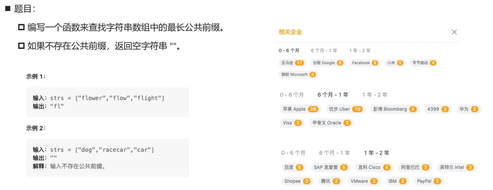

```ts
function longestCommonPrefix(strs: string[]): string {
  // 如果数组为空[], 那么直接返回 ""
  if (strs.length === 0) return ""

  // ["flower","flow","flight"]
  let prefix = strs[0]
  for (let i = 1; i < strs.length; i++) {
    const s = strs[i]
    while (s.indexOf(prefix) !== 0) {
      prefix = prefix.slice(0, prefix.length - 1)
    }

    if (prefix.length === 0) {
      return ""
    }
  }

  return prefix
};
```

### 1.2、3. 无重复字符的最长子串

无重复字符的最长子串https://leetcode.cn/problems/longest-substring-without-repeating-characters/description/


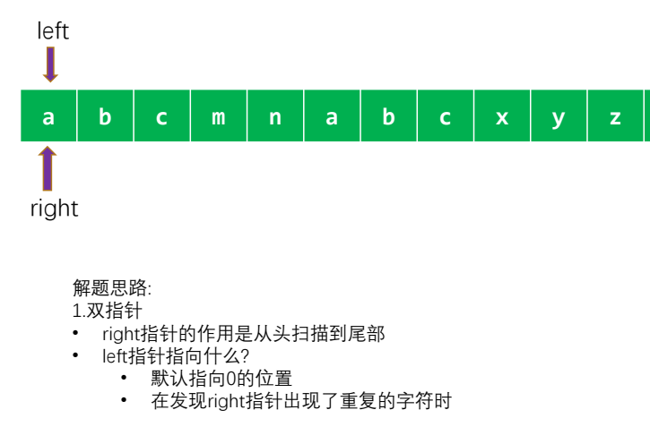

```ts
function lengthOfLongestSubstring(s: string): number {
  const n = s.length;

  // 1.定义需要用到的变量
  const map = new Map<string, number>();
  let maxLength = 0;
  let left = 0;
  for (let right = 0; right < n; right++) {
    const rightChar = s[right];

    // 保留最新的索引之前, 先判断是否之前这个字符已经出现过
    if (map.has(rightChar) && map.get(rightChar)! >= left) {
      left = map.get(rightChar)! + 1;
    }

    map.set(rightChar, right);

    const currLength = right - left + 1;
    maxLength = Math.max(currLength, maxLength);
  }

  return maxLength;
}
```

###  1.3、 最长回文子串

最长回文子串https://leetcode.cn/problems/longest-palindromic-substring/description/

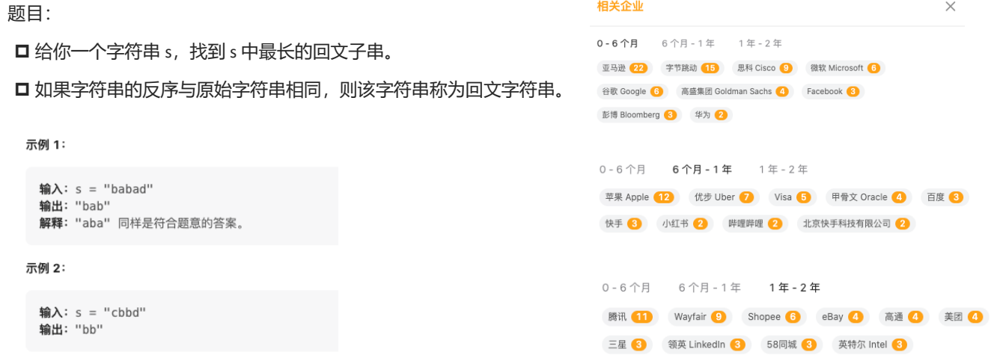

```ts
function longestPalindrome(s: string): string {
  const n = s.length;
  // 边界判断的情况
  if (n <= 1) return s;

  // 核心思路: 对称
  let start = 0;
  let end = 0;
  for (let i = 0; i < n; i++) {
    const length1 = centerExpand(s, i, i);
    const length2 = centerExpand(s, i, i + 1);
    const len = Math.max(length1, length2);

    if (len > end - start) {
      const left = i - Math.floor((len - 1) / 2);
      const right = i + Math.floor(len / 2);

      // 新的长度比原来保存的start/end要长, 重新赋值
      start = left;
      end = right;
    }
  }

  return s.substring(start, end + 1);
}

function centerExpand(s: string, left: number, right: number): number {
  while (left >= 0 && right < s.length && s[left] === s[right]) {
    left--;
    right++;
  }
  return right - left - 1;
}
```

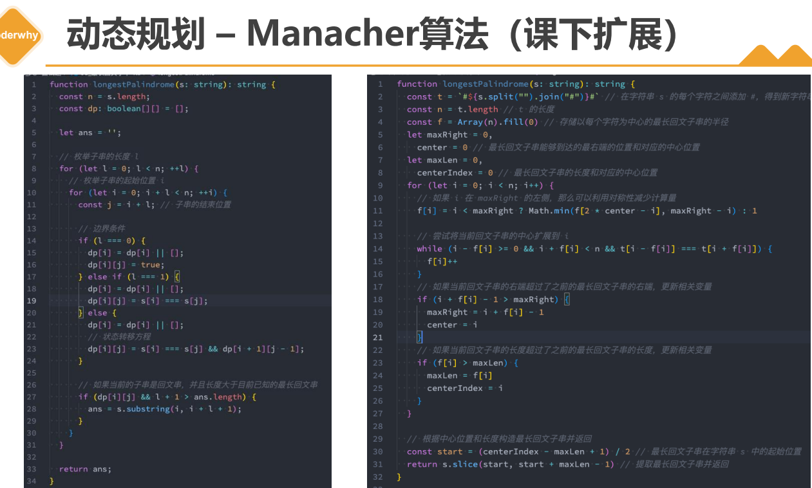

## 2、栈结构大厂面试题

### 2.1、114. 二叉树展开为链表

二叉树展开为链表https://leetcode.cn/problems/flatten-binary-tree-to-linked-list/

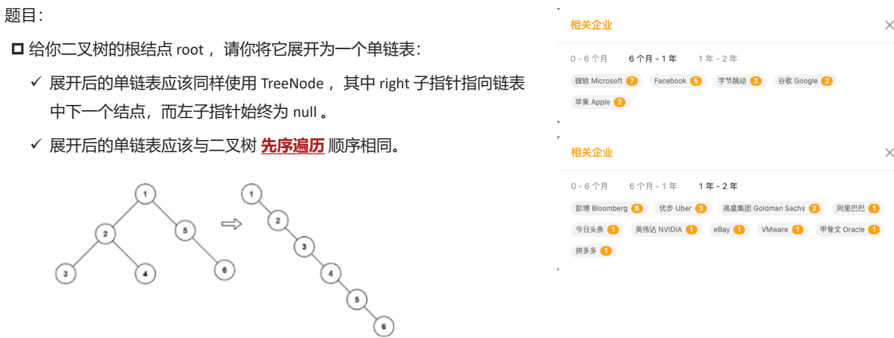

可以使用栈结构:

- 将当前节点的右子树和左子树依次压入栈中。
- 然后再取出栈顶元素,将其左子树设为空,右子树设为栈顶元素。
- 再继续将新的右子树和左子树压入栈中,重复这个过程直到栈为空。

```ts
export default class TreeNode {
  val: number;
  left: TreeNode | null;
  right: TreeNode | null;
  constructor(val?: number, left?: TreeNode | null, right?: TreeNode | null) {
    this.val = val === undefined ? 0 : val;
    this.left = left === undefined ? null : left;
    this.right = right === undefined ? null : right;
  }
}

function flatten(root: TreeNode | null): void {
  // 边界判断
  if (!root) return;

  // 栈结构
  const stack = [root];
  let previous: TreeNode | null = null;

  while (stack.length) {
    const current = stack.pop()!;

    if (previous) {
      previous.right = current;
      previous.left = null;
    }

    // 将左右两个的节点压入到栈中
    const left = current.left;
    const right = current.right;
    if (right) {
      stack.push(right);
    }
    if (left) {
      stack.push(left);
    }

    previous = current;
  }
}
```

### 2.2、150. 逆波兰表达式求值

逆波兰表达式求值 https://leetcode.cn/problems/evaluate-reverse-polish-notation/description/

题目:

- 给你一个字符串数组 tokens ,表示一个根据 逆波兰表示法表示的算术表达式。
- 请你计算该表达式。返回一个表示表达式值的整数。
- 注意:
  - 有效的算符为 '+'、'-'、'*' 和 '/' 。
  - 每个操作数(运算对象)都可以是一个整数或者另一个表达式。
  - 两个整数之间的除法总是 向零截断 。
  - 表达式中不含除零运算。
  - 输入是一个根据逆波兰表示法表示的算术表达式。
  - 答案及所有中间计算结果可以用 32 位 整数表示。


使用了一个栈来存储数字和运算符。

- 遍历 tokens 数组,遇到数字时将其压入栈中,遇到运算符时从栈中弹出两个数字并进行相应的计算,将计算结果再压入栈中。
- 最后栈中剩下的数字就是表达式的值。

```ts
function evalRPN(tokens: string[]): number {
  const stack: number[] = [];

  // 遍历所有的tokens
  for (const token of tokens) {
    if (token === "+") {
      const num2 = stack.pop()!;
      const num1 = stack.pop()!;
      const res = num1 + num2;
      stack.push(res);
    } else if (token === "-") {
      const num2 = stack.pop()!;
      const num1 = stack.pop()!;
      const res = num1 - num2;
      stack.push(res);
    } else if (token === "*") {
      const num2 = stack.pop()!;
      const num1 = stack.pop()!;
      const res = num1 * num2;
      stack.push(res);
    } else if (token === "/") {
      const num2 = stack.pop()!;
      const num1 = stack.pop()!;
      const res = Math.trunc(num1 / num2);
      stack.push(res);
    } else {
      stack.push(Number(token));
    }
  }

  return stack.pop()!;
}
```

### 2.3、09. 用两个栈实现队列

用两个栈实现队列: https://leetcode.cn/problems/yong-liang-ge-zhan-shi-xian-dui-lie-lcof/description/


使用两个栈 s1 和 s2:s1 用来插入元素,s2 用来删除元素

- 其中插入元素只需要将元素插入 s1 即可
- 删除元素则需要分情况:
  - 如果 s2 不为空,直接弹出 s2 的栈顶元素;
  - 如果 s2 为空,将 s1 中的元素逐个弹出并压入 s2,然后弹出 s2 的栈顶元素;

```ts
class CQueue {
  private stack1: number[] = [];
  private stack2: number[] = [];

  constructor() {}

  appendTail(value: number): void {
    this.stack1.push(value);
  }

  deleteHead(): number {
    // 1.判断stack2中是否有数据
    if (this.stack2.length > 0) {
      return this.stack2.pop()!;
    }

    // 2.判断stack1中是否有数据
    else if (this.stack1.length > 0) {
      // 从stack1中取出所有的数据放到stack2中
      while (this.stack1.length > 0) {
        const item = this.stack1.pop()!;
        this.stack2.push(item);
      }
      return this.stack2.pop()!;
    }

    // 3.数据全部移除完毕, 返回-1
    else {
      return -1;
    }
  }
}
```

## 3、队列结构大厂面试题

### 3.1、239. 滑动窗口最大值

滑动窗口最大值https://leetcode.cn/problems/sliding-window-maximum/description/


首先,我们需要定义一个双端队列 deque 用来存储下标,一个空数组 res 用来存储结果。

接着,我们遍历整个数组,对于当前的数字 nums[i],如果双端队列 deque 不为空,并且当前数字 nums[i] 大于等于队列末尾的数字,则我们弹出队列末尾的数字,直到队列为空或者当前数字 nums[i] 小于队列末尾的数字。这样可以保证队列中的数字是单调递减的。然后,我们将当前数字的下标 i 入队。

接下来,我们需要保证队列中的数字是在滑动窗口范围内的。如果队列头部的数字的下标小于等于 i - k,说明这个数字已经不在滑动窗口内,我们需要弹出队列头部的数字。

最后,如果当前下标 i 大于等于 k - 1,我们将队列头部数字所对应的 nums 中的数字加入到结果数组 res 中。

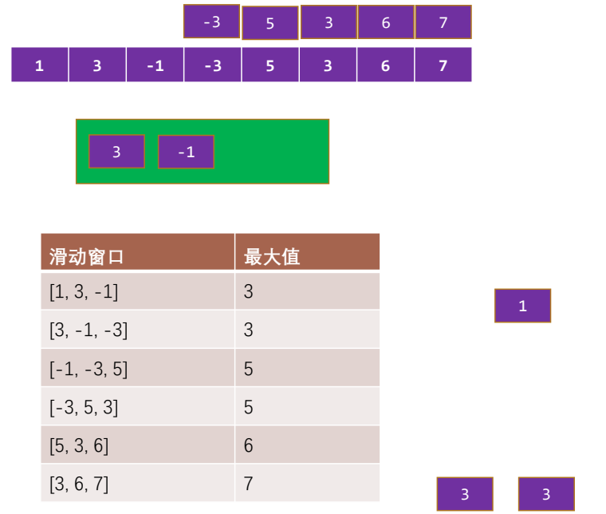

```ts
function maxSlidingWindow(nums: number[], k: number): number[] {
  const n = nums.length;

  // 窗口双端队列结构
  const deque: number[] = [];
  const res: number[] = [];

  // 遍历每一个元素
  for (let i = 0; i < n; i++) {
    // 将元素放入到队列的尾部
    while (deque.length && nums[i] > nums[deque[deque.length - 1]]) {
      deque.pop();
    }
    deque.push(i);

    // 判断目前队列的头部元素的索引是否在范围之内
    while (deque[0] <= i - k) {
      deque.shift();
    }

    // 获取到头部的值, 作为最大值
    if (i >= k - 1) {
      const max = nums[deque[0]];
      res.push(max);
    }
  }

  return res;
}
```

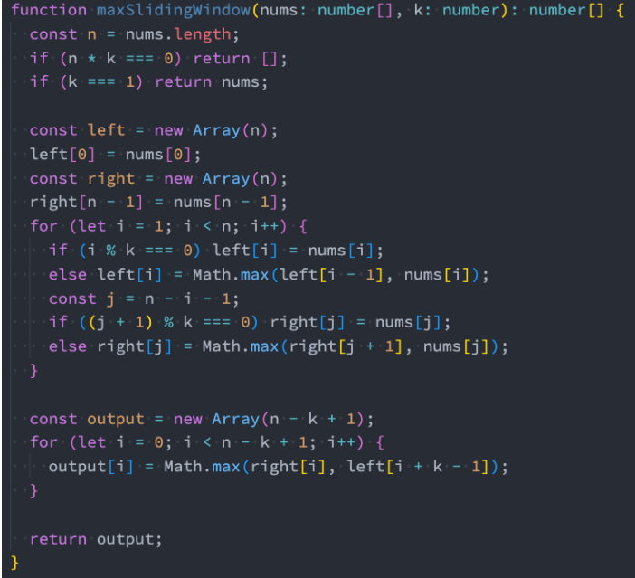

## 4、链表结构大厂面试题

### 4.1、19. 删除链表的倒数第 N 个结点

删除链表的倒数第 N 个结点https://leetcode.cn/problems/remove-nth-node-from-end-of-list/description/

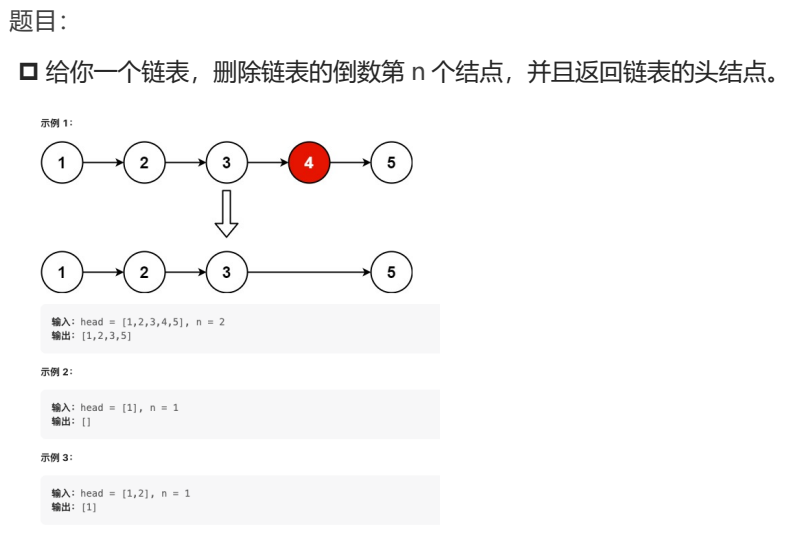


可以使用双指针来解决这个问题。

- 首先让快指针先移动 n 步,然后让慢指针和快指针一起移动, 直到快指针到达链表末尾。
- 此时慢指针所指的节点就是要删除的节点的前一个节点,可以将其指向下下个节点,从而删除倒数第 n 个节点。
- 其中 dummy 节点是为了方便处理边界情况而添加的。

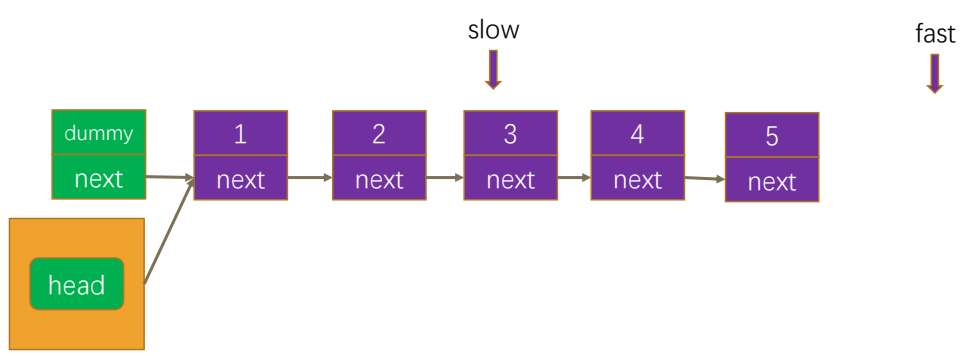

```ts
export default class ListNode {
  val: number;
  next: ListNode | null;
  constructor(val?: number, next?: ListNode | null) {
    this.val = val === undefined ? 0 : val;
    this.next = next === undefined ? null : next;
  }
}

function removeNthFromEnd(head: ListNode | null, n: number): ListNode | null {
  // 1.创建虚拟节点
  const dummy = new ListNode(0);
  dummy.next = head;

  // 2.创建双指针(快慢指针)
  let slow = dummy;
  let fast = dummy;

  // 3.先让快指针移动n+1个位置
  for (let i = 0; i <= n; i++) {
    fast = fast.next!;
  }

  // 4.两个指针一起移动
  while (fast) {
    fast = fast.next!;
    slow = slow.next!;
  }

  // 5.slow指向的一定是要删除节点的前一个节点
  slow.next = slow.next!.next;

  return dummy.next;
}
```

### 4.2、24. 两两交换链表中的节点

两两交换链表中的节点 https://leetcode.cn/problems/swap-nodes-in-pairs/description/

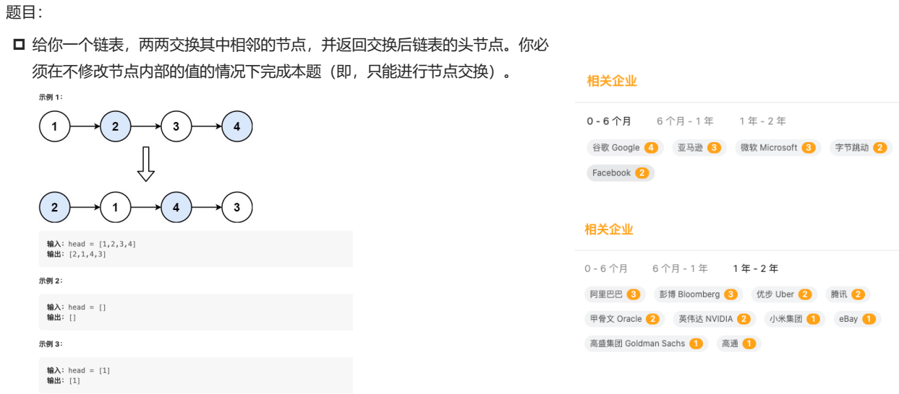

实现思路:

- 首先添加一个 dummy 节点;
- 创建一个p节点,默认指向虚拟节点(这里因为有虚拟节点,所以可以直接调用next);
- 使用一个指针 p 依次指向每组相邻的节点,然后交换这两个节点的位置,直到遍历完整个链表。

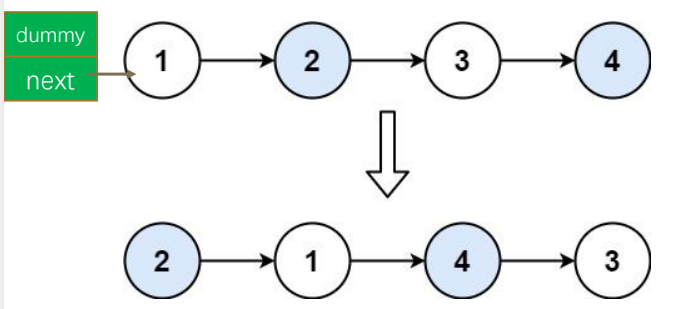

```ts
export default class ListNode {
  val: number;
  next: ListNode | null;
  constructor(val?: number, next?: ListNode | null) {
    this.val = val === undefined ? 0 : val;
    this.next = next === undefined ? null : next;
  }
}

function swapPairs(head: ListNode | null): ListNode | null {
  // 1.创建虚拟节点
  const dummy = new ListNode(0);
  dummy.next = head;

  // 2.创建current节点, 指向虚拟节点
  let current = dummy;
  while (current.next && current.next.next) {
    // 将接下来的两个节点取出
    const node1 = current.next;
    const node2 = current.next.next;

    // 交换node1和node2的位置
    current.next = node2;
    node1.next = node2.next;
    node2.next = node1;

    // 开始进行下一次的交换
    current = node1;
  }

  return dummy.next;
}
```

## 5、二叉树大厂面试题

### 5.1、144. 二叉树的前序遍历

二叉树的前序遍历https://leetcode.cn/problems/binary-tree-preorder-traversal/


```ts

```

### 5.2、94. 二叉树的中序遍历

二叉树的中序遍历https://leetcode.cn/problems/binary-tree-inorder-traversal/


```ts
```

### 5.3、145. 二叉树的后序遍历

二叉树的后序遍历https://leetcode.cn/problems/binary-tree-postorder-traversal/


```ts
```

### 5.4、102. 二叉树的层序遍历

二叉树的层序遍历https://leetcode.cn/problems/binary-tree-level-order-traversal/description/


```ts
```

### 5.5、226. 翻转二叉树

翻转二叉树(Max Howell去Google面试没有写出来的题目) https://leetcode.cn/problems/invert-binary-tree/description/

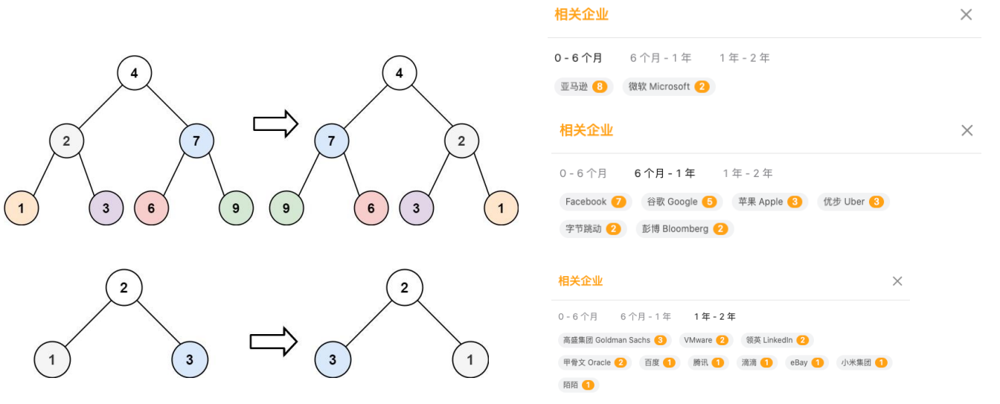

```ts
// 递归解法
export default class TreeNode {
  val: number;
  left: TreeNode | null;
  right: TreeNode | null;
  constructor(val?: number, left?: TreeNode | null, right?: TreeNode | null) {
    this.val = val === undefined ? 0 : val;
    this.left = left === undefined ? null : left;
    this.right = right === undefined ? null : right;
  }
}

function invertTree(root: TreeNode | null): TreeNode | null {
  if (root === null) return null;
  // root不为空
  const left = root.left;
  root.left = invertTree(root.right);
  root.right = invertTree(left);
  return root;
}
```

```ts
// 栈解法
export default class TreeNode {
  val: number;
  left: TreeNode | null;
  right: TreeNode | null;
  constructor(val?: number, left?: TreeNode | null, right?: TreeNode | null) {
    this.val = val === undefined ? 0 : val;
    this.left = left === undefined ? null : left;
    this.right = right === undefined ? null : right;
  }
}

function invertTree(root: TreeNode | null): TreeNode | null {
  if (!root) return null;

  // 1.创建stack栈结构
  const stack = [root];

  // 2.从栈中不断的取出节点, 对节点的左右子节点进行交换
  while (stack.length) {
    const current = stack.pop()!;

    // 对current节点左右交换位置
    const temp = current.left;
    current.left = current.right;
    current.right = temp;

    // 将子节点加入到栈中
    if (current.left) {
      stack.push(current.left);
    }
    if (current.right) {
      stack.push(current.right);
    }
  }

  return root;
}
```

### 5.6、124. 二叉树中的最大路径和

二叉树中的最大路径和https://leetcode.cn/problems/binary-tree-maximum-path-sum/description/
题目:

- 路径 被定义为一条从树中任意节点出发,沿父节点-子节点连接,达到任意节点的序列。同一个节点在一条路径序列中 至多出现一次 。该路径 至少包含一个 节点,且不一定经过根节点。
- 路径和 是路径中各节点值的总和。
- 给你一个二叉树的根节点 root ,返回其 最大路径和 。

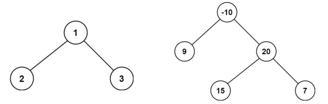


这道题目可以使用深度优先搜索(DFS)来解决。

- 我们可以从根节点开始递归,遍历二叉树中的所有节点。
- 对于每个节点,我们需要计算经过该节点的最大路径和。
  - 在计算经过该节点的最大路径和时,我们需要考虑到左子树和右子树是否能够贡献最大路径和。
  - 如果左子树的最大路径和大于 0,那么我们就将其加入到经过该节点的最大路径和中;
  - 如果右子树的最大路径和大于 0,那么我们就将其加入到经过该节点的最大路径和中。
- 最后,我们将经过该节点的最大路径和与已经计算出的最大路径和进行比较,取两者中的较大值。

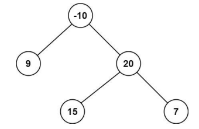

```ts
export default class TreeNode {
  val: number;
  left: TreeNode | null;
  right: TreeNode | null;
  constructor(val?: number, left?: TreeNode | null, right?: TreeNode | null) {
    this.val = val === undefined ? 0 : val;
    this.left = left === undefined ? null : left;
    this.right = right === undefined ? null : right;
  }
}

function maxPathSum(root: TreeNode | null): number {
  let maxSum = -Infinity;

  // 定义内部函数进行递归的操作
  function dfs(node: TreeNode | null): number {
    if (!node) return 0;

    // 左右子树计算可以提供的非0最大值
    const leftSum = Math.max(dfs(node.left), 0);
    const rightSum = Math.max(dfs(node.right), 0);

    // 当前节点中能获取到的最大值
    const pathSum = node.val + leftSum + rightSum;
    maxSum = Math.max(pathSum, maxSum);

    // 返回当前节点能给父节点提供的最大值
    return node.val + Math.max(leftSum, rightSum);
  }

  dfs(root);
  return maxSum;
}
```

## 6、动态规划大厂面试题

### 6.1、62. 不同路径

不同路径https://leetcode.cn/problems/unique-paths/description/
一个机器人位于一个 m x n 网格的左上角 (起始点在下图中标记为 “Start” )。
机器人每次只能向下或者向右移动一步。机器人试图达到网格的右下角(在下图中标记为 “Finish” )。
问总共有多少条不同的路径?


这个题目和跳楼梯其实是一类题目。

- 设 dp[i][j] 表示从起点到网格的 (i, j) 点的不同路径数。
- 对于每个格子,由于机器人只能从上面或左边到达该格子, 因此有以下两种情况:
  - 从上面的格子到达该格子,即 `dp[i][j] = dp[i-1][j]`;
  - 从左边的格子到达该格子,即 `dp[i][j] = dp[i][j-1]`。
    - 因此,到达网格的 (i, j) 点的不同路径数就等于到达上面格子的路径数加上到达左边格子的路径数。
  - 动态转移方程为:`dp[i][j] = dp[i-1][j] + dp[i][j-1];`
- 初始状态:对于边界情况,起点的路径数为 1,即 dp[0][0] = 1。
- 计算最终状态:`dp[m-1][n-1]`

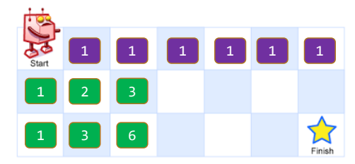

```ts
function uniquePaths(m: number, n: number): number {
  // 1.定义状态dp的二维数组
  const dp: number[][] = Array.from({ length: m }, () => {
    return Array(n).fill(0);
  });

  // 2.设置初始化值
  /**
   * [
   *   [1, 1, 1, 1, 1, 1, 1],
   *   [1, 0, 0, 0, 0, 0, 0],
   *   [1, 0, 0, 0, 0, 0, 0]
   * ]
   */
  for (let i = 0; i < m; i++) {
    dp[i][0] = 1;
  }
  for (let j = 0; j < n; j++) {
    dp[0][j] = 1;
  }

  // 3.状态转移求解后面位置的值
  for (let i = 1; i < m; i++) {
    for (let j = 1; j < n; j++) {
      dp[i][j] = dp[i - 1][j] + dp[i][j - 1];
    }
  }

  // 4.最终的结果计算
  return dp[m - 1][n - 1];
}
```

我们可以使用组合数学的方法,通过计算总共需要向下和向右走的步数,从而计算不同的路径数目。
假设总共需要向下走 n 步,向右走 m 步,则路径的总长度为 n + m,其中需要选择 n 个位置向下走,因此路径的总数目为 C(n + m, n)。

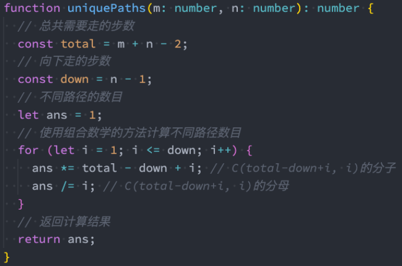

### 6.2、47. 礼物的最大价值

礼物的最大价值https://leetcode.cn/problems/li-wu-de-zui-da-jie-zhi-lcof/description/


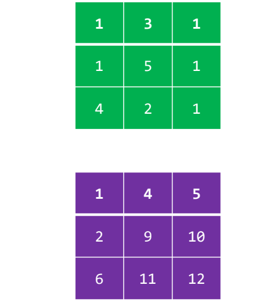

```ts
function maxValue(grid: number[][]): number {
  // 1.获取m排n列
  const m = grid.length;
  const n = grid[0].length;

  // 2.初始化dp保存每个位置的最大值
  const dp: number[][] = Array.from({ length: m }, () => {
    return Array(n).fill(0);
  });
  dp[0][0] = grid[0][0];

  // 3.初始化值
  for (let i = 1; i < m; i++) {
    dp[i][0] = dp[i - 1][0] + grid[i][0];
  }
  for (let j = 1; j < n; j++) {
    dp[0][j] = dp[0][j - 1] + grid[0][j];
  }

  // 4.状态转移方程
  for (let i = 1; i < m; i++) {
    for (let j = 1; j < n; j++) {
      dp[i][j] = grid[i][j] + Math.max(dp[i - 1][j], dp[i][j - 1]);
    }
  }

  return dp[m - 1][n - 1];
}
```

### 6.3、300. 最长递增子序列

最长递增子序列(Longest Increasing Subsequence,简称LIS) https://leetcode.cn/problems/longest-increasing-subsequence/description/

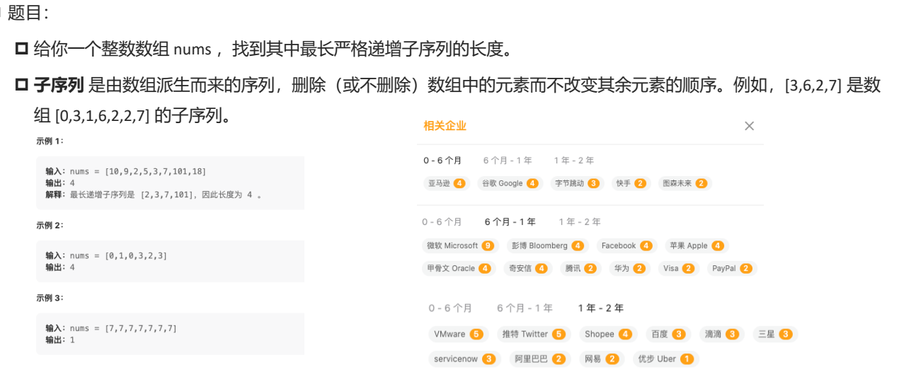

这道题目可以使用动态规划来解决。

- 定义状态:设dp[i]表示以第i个元素结尾的最长上升子序列的长度。
- 状态转移方程:
  - 对于每个i,我们需要找到在[0, i-1]范围内比nums[i]小的元素,以这些元素结尾的最长上升子序列中最长的那个子序列的长度。
  - 然后将其加1即可得到以nums[i]结尾的最长上升子序列的长度。
  - 状态转移方程为:dp[i] = max(dp[j]) + 1,其中j < i且nums[j] < nums[i]。
- 初始状态:对于每个i,dp[i]的初始值为1,因为每个元素本身也可以作为一个长度为1的上升子序列。
- 最终计算结果:最长上升子序列的长度即为dp数组中的最大值。

```ts
function lengthOfLIS(nums: number[]): number {
  const n = nums.length;

  // 1.定义状态dp 2.初始化值
  const dp: number[] = new Array(n).fill(1);

  // 3.状态转移方程
  let max = dp[0];
  for (let i = 1; i < n; i++) {
    // 和前面所有的元素进行一次比较(找到比我的小的元素)
    for (let j = 0; j < i; j++) {
      // 找到比i位置小的数字
      if (nums[j] < nums[i]) {
        // 状态转移方程
        dp[i] = Math.max(dp[i], dp[j] + 1);
      }
    }

    max = Math.max(max, dp[i]);
  }

  return max;
}
```

**动态规划的计算过程**

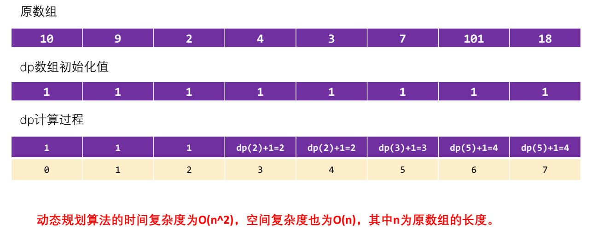

**贪心 + 二分查找的思考过程**

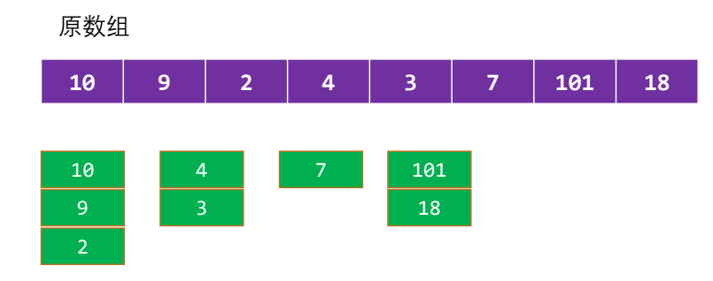

维护一个数组tails,用于记录扫描到的元素应该存放的位置。

扫描原数组中的每个元素num,在tails数组中找是否有比自己更大的值。

- 如果有,那么找到对应位置,并且让num作为该位置的最小值;
- 如果没有,那么直接放到tails数组的尾部;

tails数组的长度,就是最长递增子序列的长度;

为什么这么神奇刚好是数组的长度呢?(了解)

- 情况一:如果是逆序的时候,一定会一直在一个上面加加加
- 情况二:一旦出现了比前面的最小值的值大的,那么就一定会增加一个新的数列,说明在上升的过程
- 情况三:如果之后出现一个比前面数列小的,那么就需要重新计算序列

`贪心算法+二分查找的时间复杂度为O(nlogn),空间复杂度为O(n)`

```ts
function lengthOfLIS(nums: number[]): number {
  const n = nums.length;
  // 记录每个组中的最小值
  const tails: number[] = [];

  // 遍历每一个元素
  for (let i = 0; i < n; i++) {
    const num = nums[i];

    let left = 0;
    let right = tails.length - 1;

    while (left <= right) {
      const mid = Math.floor((left + right) / 2);
      if (num <= tails[mid]) {
        right = mid - 1;
      } else {
        left = mid + 1;
      }
    }

    // 是否找到对应的位置
    if (left === tails.length) {
      // 没有找到能存放的位置
      tails.push(num);
    } else {
      tails[left] = num;
    }
  }

  return tails.length;
}
```


